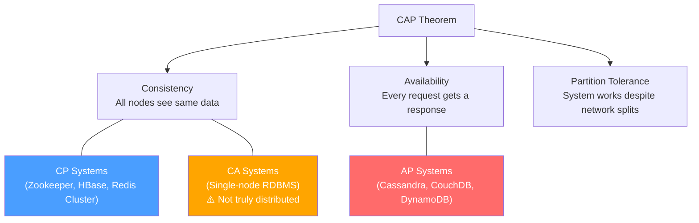

# ⚖️ CAP Theorem

> [!abstract] TL;DR
> A distributed system can only guarantee **two** of three properties: Consistency, Availability, and Partition Tolerance — never all three simultaneously.

---

## Intuition

**Analogy:** Imagine two bank branches sharing the same account database, connected by a network link. When that link breaks (partition), each branch faces a choice: stop accepting transactions until the link is restored (sacrifice Availability, keep Consistency), or keep serving customers with potentially stale balance data (sacrifice Consistency, keep Availability). You can never do both perfectly when the link is down.

---

## The Three Properties

### Consistency (C)

Every read receives the most recent write, or an error. All nodes in the cluster return the same data at the same time — there are no "stale reads."

- If node A writes `x = 5`, any subsequent read from any node must return `5`.
- Equivalent to having a single, always up-to-date copy of the data.
- Sacrificing this means clients may see outdated or conflicting information.

### Availability (A)

Every request receives a non-error response — but without a guarantee that it contains the most recent data. The system remains operational even when nodes fail.

- No request is ever met with a timeout or error purely due to node failures.
- Sacrificing this means some requests may be rejected or time out during failures.
- High-availability systems often return stale data during partitions rather than refusing requests.

### Partition Tolerance (P)

The system continues to operate correctly even when network messages between nodes are dropped, delayed, or reordered.

- Network partitions are inevitable in real distributed deployments — hardware fails, switches go down, data centers lose connectivity.
- Because partitions **cannot be prevented**, P is effectively non-negotiable for any truly distributed system.
- This is why the real choice in practice is always between **C** and **A** during a partition event.

---

## Why You Can't Have All Three

During a network partition, two nodes can no longer communicate. If a write occurs on node A, node B cannot know about it until the partition heals.

- To maintain **Consistency**: node B must refuse reads (or return an error) until it can confirm the latest state from node A → sacrifices **Availability**.
- To maintain **Availability**: node B serves its local data, which may be stale → sacrifices **Consistency**.
- There is no third option during an active partition — you must choose.

Since network partitions always occur in production (even briefly), every distributed system designer must consciously choose the C vs A trade-off.

### Flow



---

## Real-World Positioning

| System | C | A | P | Type | Why |
|--------|---|---|---|------|-----|
| Zookeeper | ✅ | ❌ | ✅ | CP | Leader elections need strong consistency |
| Cassandra | ❌ | ✅ | ✅ | AP | Designed for massive scale, eventual consistency |
| CouchDB | ❌ | ✅ | ✅ | AP | Conflict resolution via versioning |
| HBase | ✅ | ❌ | ✅ | CP | Built on HDFS, strong read/write consistency |
| MySQL (single node) | ✅ | ✅ | ❌ | CA | No partition tolerance by design |

---

## Code Demo

```python
# Simulating eventual consistency (AP system behavior)
import time, threading

class Node:
    def __init__(self, name):
        self.name = name
        self.data = {}
    
    def write(self, key, value):
        self.data[key] = value
        print(f"{self.name}: wrote {key}={value}")
    
    def read(self, key):
        return self.data.get(key, "NOT_FOUND")

# Two nodes, async replication — AP behavior
node_a = Node("NodeA")
node_b = Node("NodeB")

node_a.write("user:1", "Alice")
# Network partition — NodeB doesn't get the update immediately
print(f"NodeB reads: {node_b.read('user:1')}")  # NOT_FOUND (stale)

# Later, replication catches up
time.sleep(0.01)
node_b.write("user:1", "Alice")  # eventual sync
print(f"NodeB reads: {node_b.read('user:1')}")  # Alice
```

---

## Trade-offs

| Choice | Gain | Sacrifice | Best For |
|--------|------|-----------|----------|
| CP | Strong consistency | Some availability | Financial systems, leader election |
| AP | Always available | Eventual consistency | Social media, shopping carts, DNS |
| CA | Both C + A | Partition tolerance | Single-node or same-datacenter setups |

---

## When to Use

**Choose CP when:**
- Data correctness is critical (banking, inventory counts)
- You cannot tolerate stale reads
- Distributed locks or leader election needed

**Choose AP when:**
- User experience > perfect consistency (social feeds, caches)
- You need to survive network splits
- Eventual consistency is acceptable

---

## Common Pitfalls

- **"We need CA in production"** — CA systems aren't truly distributed; they can't survive network partitions, which happen in every real cloud deployment.
- **Treating CAP as binary** — Modern systems (DynamoDB, Cosmos DB) let you tune consistency levels per operation, blurring strict CP/AP lines.
- **Ignoring PACELC** — CAP only models behavior during partitions. PACELC also captures the latency vs consistency trade-off during normal operation.

---

## Related Concepts

- [[_MOC_AvailabilityVsConsistency|↑ Section MOC]]
- [[Availability_vs_Consistency]] — the foundational note this theorem formalizes
- [[Consistency_Patterns]] — concrete patterns (strong, eventual, weak) that correspond to CAP choices
- [[Availability Patterns]] — failover and replication strategies for AP systems
- [[Database_Replication]] — mechanism behind keeping nodes consistent
- [[Databases]] — where CP/AP choice shapes database selection

---

## Review Questions

1. Why is partition tolerance effectively non-negotiable for internet-scale distributed systems?
2. You're designing a shopping cart service. A user adds an item on their phone and immediately checks on their laptop. Would you choose CP or AP, and what's the UX trade-off?
3. What does PACELC add to the CAP Theorem, and why does it matter for real system design decisions?

---

## Sources

- [CAP Theorem — Wikipedia](https://en.wikipedia.org/wiki/CAP_theorem)
- [You Can't Sacrifice Partition Tolerance — Coda Hale](https://codahale.com/you-cant-sacrifice-partition-tolerance/)
- [System Design Primer — CAP Theorem](https://github.com/donnemartin/system-design-primer#cap-theorem)

---

#SystemDesign #DistributedSystems #CAP #Consistency #Availability
