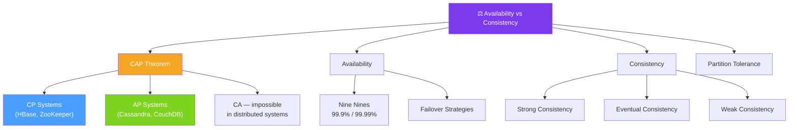

# ⚖ Availability vs Consistency — Map of Content

> [!abstract] What This Section Covers
> The most important trade-off in distributed systems: when a network partition occurs, you must choose between availability (the system keeps responding) and consistency (every node returns the most recent data). This section covers the CAP Theorem formally, explains what CP and AP systems look like in practice, and maps the trade-off space engineers navigate when choosing databases and distributed architectures.

## Concept Map

## Learning Path

1. [[Availability_vs_Consistency]] — The core trade-off, practical examples, and decision framework
2. [[CAP_Theorem]] — Formal statement of CAP, proof intuition, CP vs AP classification, and PACELC extension

## All Notes at a Glance

| Note | Summary | Difficulty |
|------|---------|------------|
| [[Availability_vs_Consistency]] | Explains when availability and consistency conflict and how to decide which to prioritise | Intermediate |
| [[CAP_Theorem]] | Formal theorem: a distributed system can only guarantee two of Consistency, Availability, Partition Tolerance | Intermediate |

## Key Questions This Section Answers

- What does CAP Theorem actually state, and what does it guarantee?
- Why can't a distributed system be both CA (consistent and available) during a partition?
- What is the difference between CP and AP systems, with real database examples?
- When is eventual consistency acceptable versus dangerous (e.g., banking vs social feeds)?
- What is the PACELC extension to CAP and why does it matter for real system choices?
- How does strong consistency differ from linearisability?
- How do you explain this trade-off to a non-technical stakeholder?

## Related Sections

- [[_MOC_SystemDesign_Master|↑ System Design Master MOC]]
- [[_MOC_Introduction|← Introduction]]
- [[_MOC_ConsistencyPatterns|→ Consistency Patterns]]
- [[_MOC_AvailabilityPatterns|→ Availability Patterns]]
- [[_MOC_Databases|→ Databases]]

#MOC #SystemDesign #AvailabilityVsConsistency
