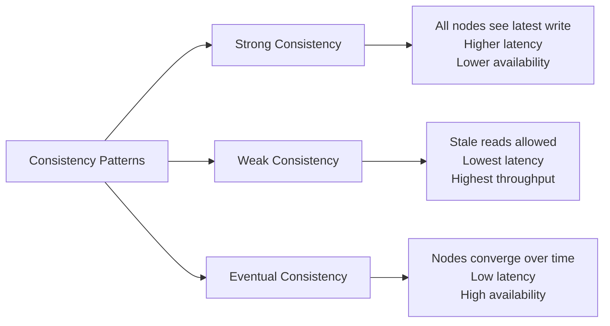

# 🔗 Consistency Patterns

> [!abstract] TL;DR
> Consistency patterns — strong, weak, and eventual — define when and how data updates become visible across distributed nodes, each making different trade-offs between correctness, latency, and availability.

## 🧠 Core Idea

**Consistency patterns** describe how data is stored, synchronized, and made visible to users in a distributed system.

They define **when** and **how** updates become visible across multiple nodes.

Choosing the right consistency pattern is a key **system design decision**, balancing correctness, availability, and performance.

---

## 📖 Definition

Consistency patterns refer to the ways in which data is managed in distributed systems and how that data is made available to users and applications.

There are three primary consistency patterns:

1. **Strong Consistency**
2. **Weak Consistency**
3. **Eventual Consistency**

Each pattern involves trade-offs between **data correctness**, **latency**, and **availability**.

---

## 1️⃣ Strong Consistency

### 🧩 Concept
All clients always see the **most recent write** immediately.

> Every read reflects the latest successful write.

### ⚙️ Characteristics
- Guarantees data correctness
- Requires coordination between nodes
- Higher latency
- May reduce availability during failures

### 📌 Typical Use Cases
- Banking systems
- Financial transactions
- Inventory management

### 💡 Examples
- Traditional relational databases
- Zookeeper
- Google Spanner

---

## 2️⃣ Weak Consistency

### 🧩 Concept
The system does **not guarantee** immediate visibility of writes to all clients.

> Reads may return stale data.

### ⚙️ Characteristics
- Faster response times
- Minimal synchronization
- No strong correctness guarantee

### 📌 Typical Use Cases
- Real-time gaming state
- Live streaming metrics
- Sensor data ingestion

---

## 3️⃣ Eventual Consistency

### 🧩 Concept
If no new updates are made, all replicas will **eventually converge** to the same value.

> Temporary inconsistency is allowed, but long-term consistency is guaranteed.

### ⚙️ Characteristics
- High availability
- Low latency
- Tolerates network partitions
- Data converges over time

### 📌 Typical Use Cases
- Social media feeds
- Product catalogs
- DNS systems

### 💡 Examples
- Cassandra
- DynamoDB
- Amazon S3 (read-after-write for new objects)

---

## ⚖️ Comparison

| Property | Strong | Weak | Eventual |
|----------|--------|------|----------|
| Data Correctness | Immediate | Not guaranteed | Guaranteed over time |
| Latency | High | Low | Low |
| Availability | Lower | High | High |
| Partition Tolerance | Limited | High | High |
| Typical Systems | Banking | Streaming | Social platforms |

---

## 🧠 Trade-off Summary

```
More Consistency → More Coordination → Higher Latency → Lower Availability
More Availability → Less Coordination → Temporary Inconsistency
```

This aligns directly with the [[CAP Theorem]] trade-offs.

---

## Mermaid Diagram



---

## 🖼️ Diagram Placeholder

Add this image into your Obsidian vault:

```
![[consistency-patterns-diagram.png]]
```

---

## 🔗 Related Topics

[[Availability vs Consistency]]  
[[CAP Theorem]]  
[[Replication]]  
[[Quorum Reads and Writes]]  
[[Consensus Algorithms]]  
[[Distributed Systems]]

---

## Related Concepts

- [[_MOC_ConsistencyPatterns|↑ Section MOC]]
- [[Availability_vs_Consistency]] — the foundational trade-off these patterns navigate
- [[CAP_Theorem]] — the theorem that constrains which patterns are achievable
- [[Replication]] — the mechanism through which consistency is propagated across nodes
- [[Database_Replication]] — how databases implement consistency guarantees in practice
- [[Databases]] — where strong vs eventual consistency shapes technology selection
- [[Failover]] — how consistency levels interact with failover behavior

---

## Review Questions

1. A distributed e-commerce cart must show accurate stock counts at checkout to prevent overselling. Which consistency pattern is required, and which database or system would you use to implement it?
2. Your team argues that eventual consistency is "good enough" for a financial transaction ledger. Construct a specific failure scenario that demonstrates why this argument is flawed.
3. How does the global DNS system demonstrate eventual consistency in practice, and what are the consequences for a website operator who changes their server IP address?

---

## 📚 Source

- CS.fyi — Consistency Patterns Guide  
  https://cs.fyi/guide/consistency-patterns-week-strong-eventual

---

## 🏷️ Tags

```
#SystemDesign #Consistency #DistributedSystems #CAPTheorem
```
