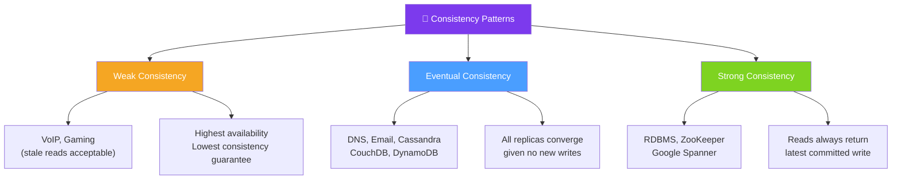

# 🔄 Consistency Patterns — Map of Content

> [!abstract] What This Section Covers
> Consistency patterns describe the guarantees a distributed system makes about the freshness of data reads. This section covers the three primary patterns — weak consistency, eventual consistency, and strong consistency — explaining their latency implications, availability trade-offs, and the real-world systems that adopt each model.

## Concept Map

## Learning Path

1. [[Consistency_Patterns]] — Weak, eventual, and strong consistency explained with trade-offs, use cases, and database examples

## All Notes at a Glance

| Note | Summary | Difficulty |
|------|---------|------------|
| [[Consistency_Patterns]] | Defines weak, eventual, and strong consistency with latency/availability implications and system examples | Intermediate |

## Key Questions This Section Answers

- What are the three main consistency patterns and how do they differ?
- When is eventual consistency acceptable, and when is it a liability?
- What systems require strong consistency — and what do they sacrifice for it?
- How does weak consistency enable ultra-low latency in real-time systems like VoIP?
- How does eventual consistency work in practice (conflict resolution, vector clocks, CRDT)?
- What is the relationship between read-your-writes consistency and eventual consistency?
- How do you reason about consistency guarantees when combining multiple storage systems?

## Related Sections

- [[_MOC_SystemDesign_Master|↑ System Design Master MOC]]
- [[_MOC_AvailabilityVsConsistency|← Availability vs Consistency]]
- [[_MOC_AvailabilityPatterns|→ Availability Patterns]]
- [[_MOC_Databases|→ Databases]]

#MOC #SystemDesign #ConsistencyPatterns
