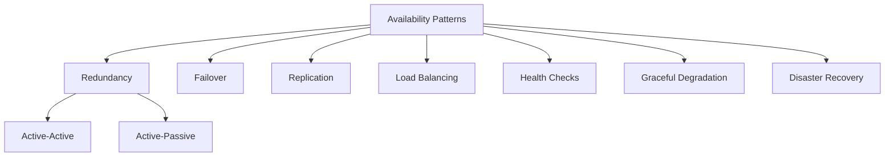

# 🟢 Availability Patterns

> [!abstract] TL;DR
> Availability patterns — including redundancy, failover, replication, and graceful degradation — are architectural approaches that keep systems operational and minimize downtime when failures occur.

## 🧠 Core Idea

**Availability patterns** are established architectural approaches used to ensure a system remains **operational and accessible** to users, even in the presence of failures or unexpected events.

They focus on minimizing downtime and maintaining a consistent level of service by incorporating **redundancy, fault tolerance, and recovery mechanisms** into system design.

> Goal: **Keep the system running even when parts of it fail.**

---

## 📖 Definition

Availability patterns provide structured solutions to address **single points of failure**, improve **uptime**, and ensure **business continuity** in distributed systems.

---

## 🎯 Why Availability Patterns Matter

- Minimize service downtime  
- Improve user trust and experience  
- Meet Service Level Agreements (SLAs)  
- Protect revenue and business continuity  
- Handle unpredictable failures gracefully  

---

## 🧩 Core Availability Patterns

### 1️⃣ Redundancy
Duplicate critical components to remove single points of failure.

- Active-Active Redundancy  
- Active-Passive Redundancy  

**Example:** Multiple application servers behind a [[Load Balancer]]

---

### 2️⃣ Failover
Automatically switch to a standby component when the primary fails.

**Example:** Primary–Replica database with leader election  
**Related:** [[Consensus Algorithms]]

---

### 3️⃣ Replication
Maintain multiple copies of data or services across nodes.

**Related:** [[Consistency Patterns]]

---

### 4️⃣ Load Balancing
Distribute incoming traffic across multiple instances to prevent overload.

---

### 5️⃣ Health Checks & Heartbeats
Continuously monitor system components to detect failures early.

---

### 6️⃣ Graceful Degradation
Provide limited functionality instead of total failure.

---

### 7️⃣ Disaster Recovery
Restore service after catastrophic failures using backups and multi-region deployment.

---

## ⚖️ Trade-off Insight

```
Higher Availability → More Redundancy → Higher Cost & Complexity
```

---

## Mermaid Diagram



---

## 🔗 Related Topics

[[Availability vs Consistency]]  
[[Reliability]]  
[[Load Balancing]]  
[[Failover]]  
[[Replication]]  
[[Disaster Recovery]]

---

## Related Concepts

- [[_MOC_AvailabilityPatterns|↑ Section MOC]]
- [[Availability_vs_Consistency]] — the foundational trade-off availability patterns must navigate
- [[Failover]] — the primary pattern for handling primary component failure
- [[Replication]] — maintaining data copies to support availability under failure
- [[Load_Balancers]] — distribute traffic to eliminate single points of failure
- [[CAP_Theorem]] — the formal constraint on what availability guarantees are possible
- [[Consistency_Patterns]] — how consistency choices interact with availability design

---

## Review Questions

1. A critical payment service goes down for 4 unplanned minutes. Which availability pattern(s) could have prevented this, and what would be the cost and complexity trade-off of implementing each?
2. You're designing a media streaming platform that must maintain 99.99% uptime. Which combination of availability patterns would you recommend, and how do they interact with each other?
3. "Graceful degradation" means providing limited functionality rather than total failure. Design a specific graceful degradation strategy for a social media platform when the primary database becomes unavailable.

---

## 📚 Sources

- https://www.designgurus.io/blog/high-availability-system-design-basics  
- https://dev.to/decoders_lord/system-design-availability-patterns-104i

---

## 🏷️ Tags

#SystemDesign #Availability #Reliability #HighAvailability
