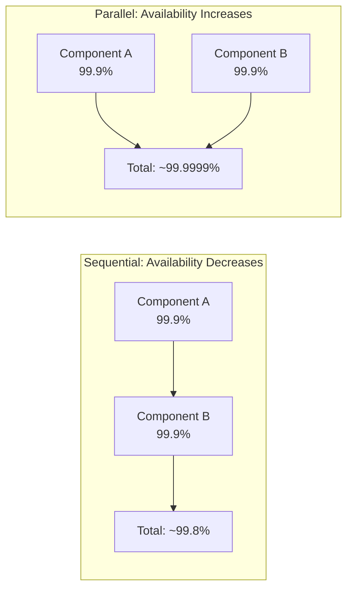

# 📊 Availability in Numbers

> [!abstract] TL;DR
> Availability is measured as a percentage of uptime ("nines"), where each additional nine reduces annual downtime by ~10x — and components in sequence reduce total availability while components in parallel increase it.

## 🧠 Core Idea

**Availability** is the percentage of time a service is operational.  
It is commonly expressed as **"number of 9s"**.

> Example: **99.99% availability** = **four 9s**.

Higher availability means **lower acceptable downtime**.

---

## 📖 Definition

```
Availability = (Total Time − Downtime) / Total Time
```

Availability is tracked using:
- Uptime percentage
- Downtime per year / month / week / day
- Service Level Agreements (SLAs)

---

## 🔹 99.9% Availability — Three 9s

| Duration | Acceptable Downtime |
|-----------|--------------------|
| Per Year | 8h 41m 38s |
| Per Month | 43m 28s |
| Per Week | 10m 4.8s |
| Per Day | 1m 26s |

---

## 🔹 99.99% Availability — Four 9s

| Duration | Acceptable Downtime |
|-----------|--------------------|
| Per Year | 52m 9.8s |
| Per Month | 4m 21s |
| Per Week | 1m 0.5s |
| Per Day | 8.6s |

---

## ⚖️ Why Number of 9s Matter

| Availability | Downtime / Year | Typical Systems |
|--------------|----------------|-----------------|
| 99% | ~3.65 days | Internal tools |
| 99.9% | ~8.7 hours | SaaS applications |
| 99.99% | ~52 minutes | Large-scale web apps |
| 99.999% | ~5 minutes | Mission critical systems |

---

## 🔀 Availability in Sequence

If multiple components must all work:

```
Availability(Total) = Availability(Foo) × Availability(Bar)
```

**Example:**
```
0.999 × 0.999 = 0.998 ≈ 99.8%
```

➡️ Availability **decreases** in sequence.

---

## 🔀 Availability in Parallel

If either component can serve requests:

```
Availability(Total) = 1 − (1 − Availability(Foo)) × (1 − Availability(Bar))
```

**Example:**
```
1 − (0.001 × 0.001) = 0.999999 ≈ 99.9999%
```

➡️ Availability **increases** in parallel.

---

## 🧠 Design Insight

```
Sequence = Higher Failure Risk
Parallel = Higher Availability
```

Modern systems achieve high availability using:
- [[Replication]]
- [[Failover]]
- [[Load Balancing]]
- Multi-region deployments

---

## Mermaid Diagram



---

## 🖼️ Diagram Placeholder

```
![[availability-parallel-vs-sequence.png]]
```

---

## 🔗 Related Topics

[[Availability Patterns]]  
[[Failover]]  
[[Replication]]  
[[Load Balancing]]  
[[Disaster Recovery]]  
[[Reliability]]

---

## Related Concepts

- [[_MOC_AvailabilityPatterns|↑ Section MOC]]
- [[Availability_vs_Consistency]] — the core distributed system trade-off behind SLA targets
- [[Failover]] — the primary mechanism for hitting high availability numbers
- [[Replication]] — data redundancy that underpins availability calculations
- [[Load_Balancers]] — enabling parallel component arrangements to boost availability
- [[CAP_Theorem]] — theoretical limits on what availability levels are achievable

---

## Review Questions

1. Your system has three components in sequence with availabilities of 99.9%, 99.95%, and 99.9%. Calculate the total system availability and the resulting annual downtime in minutes.
2. A startup promises customers "five nines" (99.999%) availability. What is the maximum downtime budget per month, and name two specific architecture decisions this target requires?
3. Two read replicas are added in parallel to a primary database with 99.9% availability. Calculate the theoretical combined read availability and explain why real-world observed availability may be lower.

---

## 📚 Sources

- https://www.enjoyalgorithms.com/blog/availability-system-design-concept  
- https://uptime.is/

---

## 🏷️ Tags

#SystemDesign #Availability #Reliability #HighAvailability #SRE
