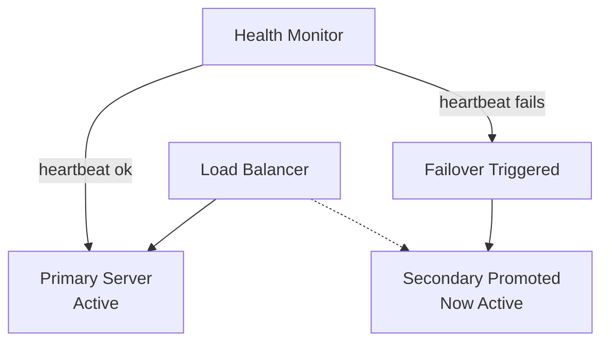

# 🔁 Failover

> [!abstract] TL;DR
> Failover automatically switches traffic to a backup component when the primary fails — active-passive setups minimize cost, while active-active setups minimize downtime at higher complexity.

## 🧠 Core Idea

**Failover** is an availability pattern used to ensure that a system continues to function even when a component fails.

It works by having a **backup (secondary) component** ready to take over when the **primary component** fails — enabling **minimal disruption** and **continuous service**.

> Goal: **Automatically switch to a backup system when failure occurs.**

---

## 📖 Definition

In a failover system:
- A **primary component** handles requests.
- A **secondary (backup) component** stays on standby.
- The primary is continuously **monitored for failures**.
- If failure occurs, the secondary **takes over responsibilities**.

This ensures the system remains available despite component crashes.

---

## 🎯 Why Failover Matters

- Eliminates single points of failure  
- Improves uptime and reliability  
- Ensures business continuity  
- Reduces user-facing downtime  

---

## 🧩 Types of Failover

### 1️⃣ Active-Passive Failover (Master–Slave)

#### 🧠 Concept
- Only the **active (primary)** server handles traffic.
- The **passive (secondary)** server stays on standby.
- **Heartbeats** monitor the primary.
- If heartbeat stops → passive takes over IP and service.

#### 🔥 Standby Modes
- **Hot Standby:** Secondary already running → near-zero downtime.  
- **Cold Standby:** Secondary starts after failure → longer downtime.

#### ⚙️ Characteristics
- Simple to implement  
- Lower cost than active-active  
- Only one server actively processes traffic  

---

### 2️⃣ Active-Active Failover (Master–Master)

#### 🧠 Concept
- Both servers handle traffic simultaneously.
- Load is distributed across both.
- If one fails → the other continues serving traffic.

#### ⚙️ Requirements
- DNS or Load Balancer must know both servers.
- Application must support multi-active state handling.

#### ⚙️ Characteristics
- Higher availability  
- Better performance and load distribution  
- More complex synchronization  

---

### 3️⃣ Hot-Standby

#### 🧠 Concept
- Backup server runs in parallel.
- Continuously synchronized with primary.
- Immediate takeover during failure.

---

## ⚖️ Comparison

| Failover Type | Active Servers | Downtime | Complexity | Cost |
|---------------|----------------|----------|------------|------|
| Active-Passive (Cold) | 1 | Moderate | Low | Low |
| Active-Passive (Hot) | 1 + Ready Backup | Very Low | Medium | Medium |
| Active-Active | 2 | Near Zero | High | High |

---

## ⚠️ Disadvantages of Failover

- Adds **extra hardware costs**  
- Introduces **operational complexity**  
- Potential **data loss** if writes aren’t replicated before failure  
- Requires reliable **monitoring and detection**  

---

## 🏗️ Practical Examples

- Primary–Replica Database Failover  
- Web Servers behind a Load Balancer  
- Leader election in distributed systems  

---

## 🧠 Trade-off Insight

```
Higher Availability → More Redundancy → Higher Cost & Complexity
```

---

## Mermaid Diagram



---

## 🖼️ Diagram Placeholder

Add this image into your Obsidian vault:

```
![[failover-architecture-diagram.png]]
```

---

## 🔗 Related Topics

[[Availability Patterns]]  
[[Load Balancing]]  
[[Replication]]  
[[Consensus Algorithms]]  
[[Disaster Recovery]]  
[[Health Checks]]

---

## Related Concepts

- [[_MOC_AvailabilityPatterns|↑ Section MOC]]
- [[Replication]] — the data synchronization that makes failover viable
- [[Load_Balancers]] — the layer that detects failures and reroutes traffic
- [[Availability_vs_Consistency]] — the tension that shapes active-active vs active-passive choice
- [[CAP_Theorem]] — how failover decisions align with CP vs AP system design
- [[Database_Replication]] — where failover is most commonly applied in practice
- [[Consistency_Patterns]] — how failover events affect consistency guarantees

---

## Review Questions

1. You're running a database with active-passive failover. A network glitch causes the health monitor to incorrectly detect a primary failure and promote the passive (split-brain scenario). What data consistency risks arise, and what mechanisms prevent this?
2. Compare the Recovery Time Objective (RTO) for hot standby versus cold standby failover. In which business scenarios would you accept cold standby despite its longer downtime?
3. An active-active database allows writes to both nodes simultaneously. Describe a specific write conflict scenario that could occur and explain two strategies the system could use to resolve it.

---

## 📚 Source

- Architectural Patterns for High Availability — FileCloud  
  https://www.filecloud.com/blog/architectural-patterns-for-high-availability/

---

## 🏷️ Tags

#SystemDesign #Failover #HighAvailability #Reliability
