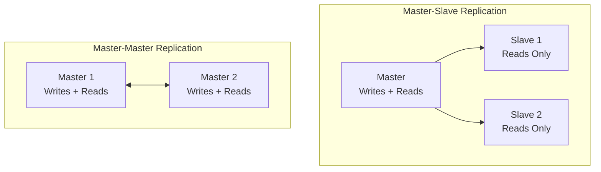

# 🧬 Replication

> [!abstract] TL;DR
> Replication maintains multiple copies of data across nodes — master-slave excels at read scaling while master-master enables multi-region writes, at the cost of conflict resolution complexity.

## 🧠 Core Idea

**Replication** is an availability pattern that involves maintaining **multiple copies of the same data** across different servers or locations.

If one node fails, data can still be retrieved from another replica, ensuring **high availability, fault tolerance, and data durability**.

> Goal: **Avoid data loss and keep systems operational during failures.**

---

## 📖 Definition

Replication ensures that data written to one node is **copied to other nodes**, so the system continues to function even if a server crashes or a network partition occurs.

It is a fundamental building block of:
- Distributed databases
- Microservices
- Cloud storage systems

---

## 🎯 Why Replication Matters

- Prevents data loss  
- Improves system availability  
- Enables failover mechanisms  
- Supports disaster recovery  
- Helps scale read workloads  

---

## 🧩 Types of Replication

### 1️⃣ Master–Slave Replication

#### 🧠 Concept
- One server acts as the **Master** (handles all writes).
- Multiple **Slave** servers replicate data from the master.
- Slaves typically serve **read requests**.

#### ⚙️ Behavior
- If the master fails → a slave can be **promoted** to master.
- Simple and widely used.

#### ✅ Advantages
- Easy to implement  
- Prevents write conflicts  
- Good for read scaling  

#### ❌ Disadvantages
- Master is a single write bottleneck  
- Failover required if master crashes  

#### 💡 Examples
- MySQL replication  
- PostgreSQL streaming replication  

---

### 2️⃣ Master–Master Replication (Multi-Leader)

#### 🧠 Concept
- Multiple servers act as **masters**.
- Each node can accept **reads and writes**.
- Data is synchronized across all masters.

#### ⚙️ Behavior
- If one master fails → others continue serving traffic.
- Requires **conflict resolution** for simultaneous updates.

#### ✅ Advantages
- High availability  
- No single point of write failure  

#### ❌ Disadvantages
- Complex conflict resolution  
- Risk of data inconsistency  

#### 💡 Examples
- Cassandra  
- CouchDB  
- DynamoDB global tables  

---

## ⚖️ Comparison

| Aspect | Master–Slave | Master–Master |
|--------|--------------|---------------|
| Write Nodes | Single | Multiple |
| Read Scaling | High | High |
| Write Scaling | Limited | High |
| Conflict Risk | None | Possible |
| Complexity | Low | High |
| Availability | Medium | Very High |

---

## 🧠 Replication vs Backup

| Replication | Backup |
|-------------|--------|
| Real-time data copying | Periodic snapshots |
| Enables high availability | Enables disaster recovery |
| Prevents downtime | Prevents data loss after catastrophe |

Both are usually used together in production systems.

---

## 🏗️ Replication in System Design

Replication directly supports:
- [[Failover]]  
- [[Availability Patterns]]  
- [[Consistency Patterns]]  
- [[Disaster Recovery]]  

It is also tightly connected to:
- [[CAP Theorem]]  
- [[Quorum Reads and Writes]]  

---

## Mermaid Diagram



---

## 🖼️ Diagram Placeholder

Add an image to your Obsidian vault:

```
![[replication-architecture-diagram.png]]
```

---

## Related Concepts

- [[_MOC_AvailabilityPatterns|↑ Section MOC]]
- [[Failover]] — replication is the prerequisite that makes failover possible
- [[Availability_vs_Consistency]] — replication lag is the root cause of this trade-off
- [[CAP_Theorem]] — replication strategy determines whether a system is CP or AP
- [[Database_Replication]] — the database-specific implementation of this pattern
- [[Database_Sharding]] — complementary technique for scaling writes alongside replication
- [[Consistency_Patterns]] — how replication lag maps to strong, weak, or eventual consistency

---

## Review Questions

1. A master-slave MySQL setup has the master crash before replicating its last 50 writes to any slave. A slave is then promoted to master. What happened to those 50 writes, and how would you design the system to minimize this data loss risk?
2. You're building a global e-commerce platform serving customers in both the US and Europe. Would master-slave or master-master replication better serve this use case, and what consistency challenges would you need to address?
3. Explain how replication relates to the CAP Theorem. When a replica consistently lags behind the master by 500ms, which CAP property are you sacrificing, and under what conditions would you enforce strong consistency instead?

---

## 📚 Source

- System Design Primer — Replication  
  https://github.com/donnemartin/system-design-primer#replication

---

## 🏷️ Tags

#SystemDesign #Replication #DistributedSystems #HighAvailability
