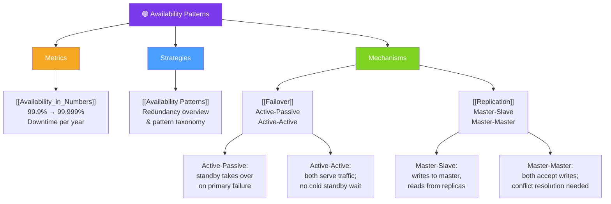

# 🟢 Availability Patterns — Map of Content

> [!abstract] What This Section Covers
> High availability is achieved through redundancy — eliminating single points of failure via failover strategies and replication. This section covers how to quantify availability using nines, the mechanics of active-passive and active-active failover, and how master-slave and master-master replication keep data available across nodes.

## Concept Map

## Learning Path

1. [[Availability_in_Numbers]] — Understand the nines: what 99.9%, 99.99%, and 99.999% mean in hours of downtime per year
2. [[Availability Patterns]] — High-level taxonomy of availability strategies and when to apply each
3. [[Failover]] — Active-passive vs active-active: mechanics, failover time, and cost/complexity trade-offs
4. [[Replication]] — Master-slave vs master-master: read scaling, write conflict resolution, and consistency implications

## All Notes at a Glance

| Note | Summary | Difficulty |
|------|---------|------------|
| [[Availability_in_Numbers]] | Quantifies availability as downtime budgets; the "nines" framework | Beginner |
| [[Availability Patterns]] | Overview of redundancy strategies for achieving high availability | Intermediate |
| [[Failover]] | Active-passive and active-active failover mechanics and trade-offs | Intermediate |
| [[Replication]] | Master-slave and master-master replication for read scaling and fault tolerance | Intermediate |

## Key Questions This Section Answers

- What does "five nines" (99.999%) availability mean in terms of annual downtime?
- What is the difference between active-passive and active-active failover?
- What is "split-brain" in active-active failover and how do you prevent it?
- How does master-slave replication increase read throughput but create a write bottleneck?
- What are the consistency implications of master-master replication?
- How do failover and replication work together to eliminate single points of failure?
- What SLA commitments are realistic at each availability tier?

## Related Sections

- [[_MOC_SystemDesign_Master|↑ System Design Master MOC]]
- [[_MOC_AvailabilityVsConsistency|← Availability vs Consistency]]
- [[_MOC_ConsistencyPatterns|← Consistency Patterns]]
- [[_MOC_Databases|→ Databases]]

#MOC #SystemDesign #AvailabilityPatterns
