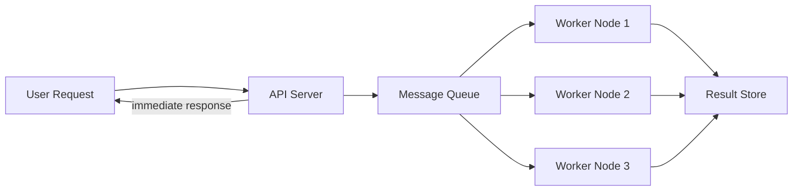

# 🕒 Background Jobs

> [!abstract] TL;DR
> Background jobs offload time-consuming or non-critical tasks from the main request flow, keeping APIs fast and responsive while enabling scalable async processing via queues, schedulers, and worker pools.

## 🧠 Core Idea

**Background jobs** are tasks executed **asynchronously** and **independently of the main execution flow** of a system.

They are typically initiated by the system itself rather than direct user interaction, allowing the main application to remain **fast, responsive, and scalable**.

> Goal: **Offload time-consuming or non-critical work from the main request flow.**

---

## 📖 Definition

Background jobs handle operations that:
- Do not need immediate user response
- May take a long time to complete
- Can be retried safely in case of failure

They commonly run via:
- Job schedulers
- Message queues
- Worker processes

---

## 🎯 Why Background Jobs Matter

- Keep user-facing APIs **low latency**
- Improve **system throughput**
- Enable **asynchronous processing**
- Allow **retries and fault tolerance**
- Support **scalable architectures**

---

## 🧩 Common Use Cases

### 🧹 Maintenance Tasks
- Cleaning old data
- Database backups
- Log rotation
- Generating reports

### 📦 Large Data Processing
- Data import/export
- Batch transformations
- ETL pipelines

### 📩 Notifications & Messaging
- Email notifications
- SMS alerts
- Push notifications

### 🧠 Long-Running Computations
- Machine learning training
- Data analytics
- Video or image processing

---

## 🏗️ Typical Architecture

```
User Request → API Server → Message Queue → Worker Nodes → Result Store
```



---

## 🔀 Implementation Approaches

| Approach | Description | Examples |
|-----------|-------------|----------|
| Job Queue | Tasks stored in queue, processed by workers | RabbitMQ, Kafka, SQS |
| Scheduled Jobs | Run tasks at fixed intervals | Cron, Quartz |
| Event-Driven | Triggered by system events | EventBridge, Pub/Sub |
| Serverless Jobs | Auto-managed execution | AWS Lambda, Azure Functions |

---

## ⚖️ Trade-offs

| Benefit | Challenge |
|----------|-----------|
| Faster user response | Added system complexity |
| Higher throughput | Requires monitoring |
| Easy retries | Risk of duplicate processing |
| Scalable workers | Needs idempotent job design |

---

## 🧠 Design Considerations

- Ensure **idempotency** (safe retries)
- Implement **retry mechanisms**
- Monitor job failures
- Handle **dead-letter queues**
- Define job **priority levels**

---

## 🖼️ Diagram Placeholder

```
![[background-jobs-architecture.png]]
```

---

## 🔗 Related Topics

[[Message Queues]]  
[[Event-Driven Architecture]]  
[[Asynchronous Processing]]  
[[Scalability]]  
[[Load Balancing]]  
[[Microservices Architecture]]

---

## Related Concepts

- [[_MOC_BackgroundJobs|↑ Section MOC]]
- [[Message_Queues]] — the primary delivery mechanism for background job tasks
- [[Task_Queues]] — higher-level abstraction over queues for managing background work
- [[Microservices]] — background jobs are a core pattern in microservice architectures
- [[Load_Balancers]] — distributing background workers to scale processing capacity
- [[Horizontal_Scaling]] — adding more worker nodes to increase background job throughput

---

## Review Questions

1. An image processing service lets users upload photos that get resized and watermarked by a background worker. Due to a network timeout, the same image is processed twice and receives a double watermark. What design principle prevents this, and how would you implement it?
2. Your background job queue has accumulated 50,000 pending jobs with only 5 workers active, causing users to wait hours for email confirmations. What strategies would you use to reduce lag without dropping messages?
3. A background job for bank transaction notifications fails after debiting an account but before sending the notification. How do you guarantee the notification is eventually sent without ever sending it twice?

---

## 📚 Source

- Microsoft Azure Architecture — Background Jobs Best Practices  
  https://learn.microsoft.com/en-us/azure/architecture/best-practices/background-jobs

---

## 🏷️ Tags

#SystemDesign #BackgroundJobs #AsyncProcessing #Scalability
