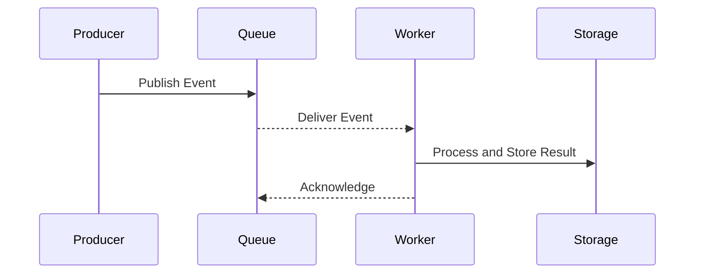

# ⚡ Event-Driven Invocation

> [!abstract] TL;DR
> Event-driven invocation triggers background tasks in response to system events — such as queue messages, storage changes, or API calls — decoupling producers and consumers for scalable async architectures.

## 🧠 Core Idea

**Event-driven invocation** is a pattern where **background tasks are triggered by events** instead of direct user requests.

An **event** signals that something has happened in the system, and a **background worker** reacts to that event to perform further processing.

> Goal: **Decouple event producers from event consumers for scalable and responsive systems.**

---

## 📖 Definition

In event-driven systems, background jobs start execution when a **triggering event** occurs.  
These events can originate from:
- User actions
- Other background jobs
- Data changes
- API calls

The triggering mechanism allows systems to process tasks **asynchronously** and **independently** from the main execution flow.

---

## 🔀 Common Event-Driven Triggers

### 1️⃣ Message Queue Trigger (Asynchronous Message-Based Communication)

**Flow:**
- UI or another job places a **message in a queue**
- Message contains data about an action (e.g., user places an order)
- Background worker **listens to the queue**
- Worker reads the message and processes the job

**Benefits:**
- Loose coupling between services
- Reliable message delivery
- Natural load buffering

**Examples:**
- RabbitMQ
- Kafka
- AWS SQS

---

### 2️⃣ Storage Change Trigger

**Flow:**
- UI or job **saves or updates data** in storage
- Background worker **monitors storage**
- When data changes → worker triggers processing

**Examples:**
- File uploads triggering image processing
- Database updates triggering report generation

---

### 3️⃣ API / Endpoint Trigger

**Flow:**
- UI or another job makes a **request to an endpoint**
- Endpoint invokes the background task
- Data in the request becomes job input

**Examples:**
- Webhook triggers
- REST APIs starting long-running tasks

---

## 🏗️ Typical Architecture

```
Event Producer → Trigger Mechanism → Event Handler / Worker → Background Processing
```

---

## 🎯 Why Event-Driven Invocation Matters

- Enables **asynchronous execution**
- Improves **system responsiveness**
- Supports **high scalability**
- Allows **decoupled microservices**
- Simplifies integration between services

---

## ⚖️ Trade-offs

| Benefit | Challenge |
|----------|-----------|
| Loose coupling | More complex debugging |
| High scalability | Requires reliable event delivery |
| Faster APIs | Needs monitoring and retries |
| Flexible integration | Risk of duplicate event processing |

---

## 🧠 Design Considerations

- Ensure **idempotent event handling**
- Implement **retry mechanisms**
- Use **dead-letter queues**
- Monitor event processing lag
- Define **event schemas** clearly

---

## Mermaid Diagram



---

## 🖼️ Diagram Placeholder

```
![[event-driven-architecture-diagram.png]]
```

---

## 🔗 Related Topics

[[Background Jobs]]  
[[Message Queues]]  
[[Event-Driven Architecture]]  
[[Asynchronous Processing]]  
[[Microservices Architecture]]

---

## Related Concepts

- [[_MOC_BackgroundJobs|↑ Section MOC]]
- [[Message_Queues]] — the backbone of event-driven invocation (Kafka, RabbitMQ, SQS)
- [[Task_Queues]] — higher-level abstraction that wraps event-driven invocation
- [[Microservices]] — event-driven invocation is the glue that decouples microservices
- [[Service_Discovery]] — how event consumers locate and connect to event brokers
- [[Latency_vs_Throughput]] — event-driven patterns trade latency for higher throughput

---

## Review Questions

1. A user uploads a video and your system must trigger transcoding, thumbnail generation, and notification emails. How would you design an event-driven pipeline where these three steps are independent, and what happens when one step fails mid-pipeline?
2. An event is published to a queue but the consumer crashes mid-processing. When the broker re-delivers the event, it is processed a second time. What problem does this create, and what design pattern resolves it?
3. Compare event-driven invocation to synchronous API calls for triggering background work. In what scenarios would you choose each approach, and how do their failure modes differ?

---

## 📚 Source

- Microsoft Azure — Event-driven triggers for background jobs  
  https://learn.microsoft.com/en-us/azure/architecture/best-practices/background-jobs#event-driven-triggers

---

## 🏷️ Tags

#SystemDesign #EventDriven #AsyncProcessing #BackgroundJobs
