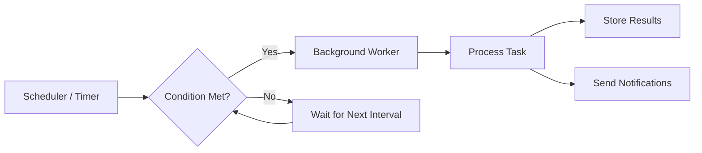

# ⏰ Schedule-Driven Invocation

> [!abstract] TL;DR
> Schedule-driven invocation triggers background tasks at fixed times or intervals — using cron jobs, application timers, or external schedulers — to automate recurring maintenance, batch processing, and reporting tasks.

## 🧠 Core Idea

**Schedule-driven invocation** is a pattern where **background tasks are triggered by timers or schedules** instead of real-time events.

A scheduled trigger starts a background job:
- At fixed time intervals
- After a specific delay
- Or at a particular time of day

> Goal: **Automate recurring or time-based background processing.**

---

## 📖 Definition

In schedule-driven systems, a **timer or scheduler** initiates background tasks without requiring user interaction or system events.

These schedules can run:
- Inside the application
- In the operating system
- Or in external orchestration services

---

## 🔀 Common Schedule-Driven Triggers

### 1️⃣ Local Application Timer

**Flow:**
- A timer runs within the application or OS  
- Invokes background tasks at regular intervals  

**Examples:**
- Cron jobs in Linux  
- Quartz Scheduler in Java  

---

### 2️⃣ External Scheduler Trigger

**Flow:**
- An external scheduler runs separately  
- Sends a request to an API or service  
- That service invokes the background job  

**Examples:**
- Azure Logic Apps  
- AWS EventBridge Scheduler  

---

### 3️⃣ Delayed or One-Time Trigger

**Flow:**
- A separate process sets a timer  
- Executes a background job once after delay or at a fixed time  

**Examples:**
- Email reminders  
- Deferred payment processing  

---

## 🧩 Typical Use Cases

- Batch-processing routines  
  - Updating product recommendations  
  - Generating analytics reports  

- Routine data processing  
  - Updating search indexes  
  - Aggregating daily statistics  

- Data analysis  
  - Daily or weekly reporting  

- Data retention cleanup  
  - Removing expired records  

- Data consistency checks  
  - Verifying database integrity  

---

## 🏗️ Typical Architecture

```
Scheduler / Timer → API or Worker → Background Processing → Storage / Reports
```

---

## 🎯 Why Schedule-Driven Invocation Matters

- Automates recurring system tasks  
- Reduces manual intervention  
- Ensures periodic maintenance  
- Improves system health and reliability  

---

## ⚖️ Trade-offs

| Benefit | Challenge |
|----------|-----------|
| Fully automated jobs | Requires careful schedule management |
| Predictable workloads | Risk of job overlap |
| Simple implementation | Needs failure retries |
| Good for batch work | Not real-time processing |

---

## 🧠 Design Considerations

- Prevent overlapping executions  
- Add retry mechanisms  
- Monitor job execution time  
- Handle partial failures  
- Scale workers for heavy batch loads  

---

## Mermaid Diagram



---

## 🖼️ Diagram Placeholder

```
![[schedule-driven-architecture.png]]
```

---

## 🔗 Related Topics

[[Background Jobs]]  
[[Event-Driven Invocation]]  
[[Message Queues]]  
[[Task Scheduling]]  
[[Asynchronous Processing]]  
[[Microservices Architecture]]

---

## Related Concepts

- [[_MOC_BackgroundJobs|↑ Section MOC]]
- [[Message_Queues]] — scheduled jobs often enqueue work for downstream queue consumers
- [[Task_Queues]] — scheduled triggers commonly feed work into task queues for processing
- [[Microservices]] — schedule-driven invocation coordinates time-based work across services
- [[Latency_vs_Throughput]] — batch scheduling optimizes throughput at the cost of real-time latency

---

## Review Questions

1. A daily report generation job is scheduled to run at midnight, but the previous day's job is still running due to unexpectedly large data. What problem does this overlap create, and what mechanisms would you put in place to prevent it?
2. You're running a cron job on every application server to clean up expired user sessions every hour. How would you redesign this to run safely across a cluster of 10 servers without duplicate execution?
3. A payment system sends monthly invoices via a scheduled job that fails halfway — some customers received invoices and others did not. How would you design the job to be both resumable and idempotent?

---

## 📚 Source

- Microsoft Azure — Schedule-driven triggers for background jobs  
  https://learn.microsoft.com/en-us/azure/architecture/best-practices/background-jobs#schedule-driven-triggers

---

## 🏷️ Tags

#SystemDesign #Scheduling #BackgroundJobs #AsyncProcessing
