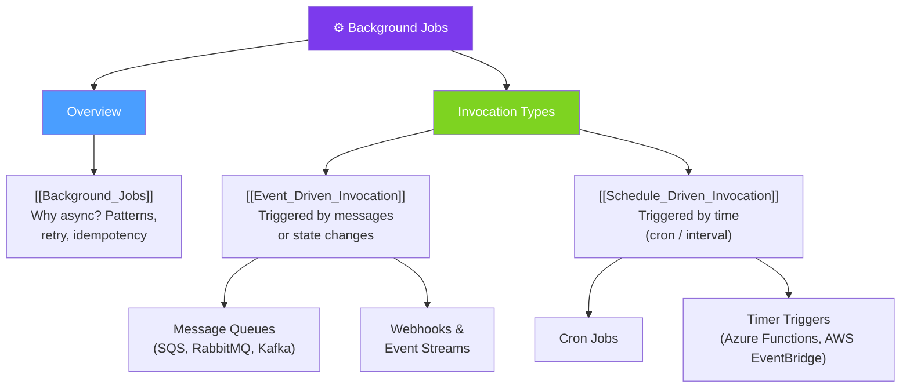

# ⚙ Background Jobs — Map of Content

> [!abstract] What This Section Covers
> Background jobs offload work from the synchronous request-response path to asynchronous processes that run independently. This section covers when and why to use background processing, the two primary invocation models (event-driven and schedule-driven), and the reliability and failure-handling trade-offs each carries.

## Concept Map

## Learning Path

1. [[Background_Jobs]] — The case for async processing, common patterns, retry logic, and idempotency requirements
2. [[Schedule_Driven_Invocation]] — Cron and timer-based invocation: use cases, failure modes, and overlapping-run problems
3. [[Event_Driven_Invocation]] — Message- and event-triggered jobs: queues, consumers, dead-letter queues, and back pressure

## All Notes at a Glance

| Note | Summary | Difficulty |
|------|---------|------------|
| [[Background_Jobs]] | Overview of async background processing: why, when, patterns, and operational concerns | Intermediate |
| [[Event_Driven_Invocation]] | Jobs triggered by events or messages; covers queues, consumers, and reliability guarantees | Intermediate |
| [[Schedule_Driven_Invocation]] | Jobs triggered by time (cron/interval); covers use cases and overlapping-run pitfalls | Beginner |

## Key Questions This Section Answers

- When should work be handled asynchronously instead of synchronously in the request path?
- What is the cost of putting too much into the synchronous path (latency, reliability, coupling)?
- What are the reliability trade-offs between event-driven and schedule-driven invocation?
- How do you ensure a background job is idempotent so retries do not cause duplicate side effects?
- What happens when a scheduled job's execution time exceeds its interval (overlapping runs)?
- How do dead-letter queues help with event-driven job failure handling?
- What is back pressure and how does it protect background job infrastructure from overload?

## Related Sections

- [[_MOC_SystemDesign_Master|↑ System Design Master MOC]]
- [[_MOC_Introduction|← Introduction]]
- [[_MOC_Asynchronism|→ Asynchronism]]
- [[_MOC_EventDriven|→ Event-Driven Architecture]]

#MOC #SystemDesign #BackgroundJobs
