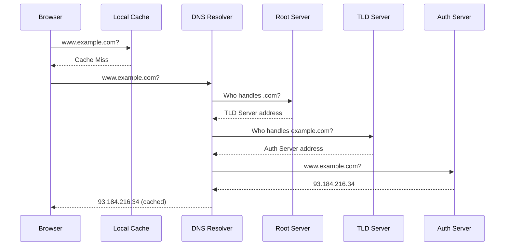

# 🌐 Domain Name System (DNS)

> [!abstract] TL;DR
> DNS translates human-readable domain names into IP addresses through a hierarchical distributed system of resolvers and authoritative servers, with TTL-based caching reducing lookup overhead at every level.

## 🧠 Core Idea

The **Domain Name System (DNS)** translates human-friendly domain names into machine-readable IP addresses.

> Example:  
> `www.example.com` → `93.184.216.34`

Without DNS, users would need to remember IP addresses instead of domain names.

---

## 📖 What DNS Does

- Maps domain names to IP addresses
- Enables users to access websites using readable names
- Provides a distributed and fault-tolerant naming system
- Acts as a critical part of internet infrastructure

---

## 🏗️ DNS Hierarchical Structure

DNS follows a **hierarchical architecture**:

```
Root Servers
   ↓
Top-Level Domain (TLD) Servers (.com, .org, .net)
   ↓
Authoritative Name Servers
   ↓
Local DNS Resolvers (ISP / Router)
   ↓
Browser / OS Cache
```

### Key Points
- **Root servers** know where TLD servers are.
- **TLD servers** know authoritative servers for domains.
- **Authoritative servers** store actual DNS records.
- **Resolvers and caches** speed up repeated lookups.

---

## ⚡ DNS Caching and TTL

To reduce lookup time:
- DNS responses are cached at multiple levels:
  - Browser cache
  - Operating system cache
  - Router / ISP resolver cache

Each DNS record has a **TTL (Time To Live)**:
- Defines how long a record can be cached
- Short TTL → Faster propagation, more DNS queries
- Long TTL → Slower propagation, fewer queries

> DNS propagation delays happen when cached records expire at different times.

---

## 🧾 Common DNS Record Types

| Record Type | Purpose |
|-------------|----------|
| **NS (Name Server)** | Specifies authoritative DNS servers for a domain |
| **A (Address)** | Maps a domain to an IPv4 address |
| **AAAA** | Maps a domain to an IPv6 address |
| **CNAME (Canonical Name)** | Maps one domain to another domain |
| **MX (Mail Exchange)** | Specifies mail servers for a domain |
| **TXT** | Stores arbitrary text (often for verification/security) |

---

## 🔁 Example Resolution Flow

1. Browser checks local cache
2. OS checks system cache
3. Resolver queries root server
4. Root directs to TLD server
5. TLD directs to authoritative server
6. Authoritative server returns IP
7. Result is cached and returned to browser

---

## ☁️ Managed DNS Services

Modern systems use managed DNS providers for scalability and reliability:

- **Cloudflare DNS**
- **AWS Route 53**
- **Google Cloud DNS**
- **Azure DNS**

These services provide:
- Global Anycast routing
- Built-in redundancy
- DDoS protection
- Fast propagation

---

## 🚦 Intelligent DNS Routing Methods

### 🎯 Weighted Round Robin
- Distributes traffic based on weight
- Supports:
  - Load balancing
  - A/B testing
  - Gradual rollouts
  - Maintenance avoidance

---

### ⏱️ Latency-Based Routing
- Routes users to the **lowest-latency server**
- Improves response time globally

---

### 🌍 Geo-Based Routing
- Routes traffic based on **user geographic location**
- Helps meet compliance and localization needs

---

## 🧠 Why DNS Matters in System Design

- First step in every web request
- Affects latency and availability
- Enables global traffic management
- Supports disaster recovery failover
- Critical for scalability

---

## Mermaid Diagram



---

## 🖼️ Diagram Placeholder

```
![[dns-resolution-flow.png]]
```

---

## 🔗 Related Topics

[[Load Balancing]]  
[[CDN]]  
[[High Availability]]  
[[Failover]]  
[[Networking Fundamentals]]

---

## Related Concepts

- [[_MOC_DNS|↑ Section MOC]]
- [[Content_Delivery_Network]] — CDNs rely on DNS for routing users to the nearest edge server
- [[Load_Balancers]] — DNS-level load balancing (weighted round robin) complements server-level LBs
- [[Failover]] — DNS TTL and health checks are key to DNS-based failover strategies
- [[HTTP]] — DNS is the prerequisite to every HTTP connection
- [[TCP]] — DNS lookups precede TCP handshakes for all domain-based connections

---

## Review Questions

1. You update your website's DNS A record to point to a new server IP address. Some users continue to reach the old server for several hours. Explain exactly why this happens and identify which DNS concept controls the duration.
2. A company uses latency-based DNS routing across three regions (US, EU, Asia). During a full EU region outage, what mechanism ensures users are routed to the next-best region, and how long before that rerouting takes effect?
3. An attacker intercepts DNS responses to redirect users to a malicious server (DNS cache poisoning). What security extension was designed to prevent this attack, and how does it cryptographically verify DNS responses?

---

## 📚 Sources

- Cloudflare — What is DNS  
  https://www.cloudflare.com/learning/dns/what-is-dns/

- System Design Primer — DNS  
  https://github.com/donnemartin/system-design-primer#domain-name-system

---

## 🏷️ Tags

#SystemDesign #DNS #Networking #Internet
