# 🌐 DNS — Map of Content

> [!abstract] What This Section Covers
> The Domain Name System (DNS) is the distributed, hierarchical naming infrastructure that translates human-readable domain names into IP addresses. This section covers how DNS resolution works step by step (from browser cache to root nameserver), the key record types engineers need to know, and how DNS is used architecturally for routing, failover, and traffic management.

## Concept Map

```mermaid
graph TD
    CENTER["🌐 Domain Name System (DNS)"]

    CENTER --> RESOLUTION["Resolution Process"]
    CENTER --> RECORDS["Record Types"]
    CENTER --> ARCH["Architectural Uses"]

    RESOLUTION --> BrowserCache["1. Browser Cache"]
    RESOLUTION --> OSCache["2. OS / Stub Resolver"]
    RESOLUTION --> RecursiveResolver["3. Recursive Resolver\n(ISP / 8.8.8.8)"]
    RESOLUTION --> RootNS["4. Root Nameserver\n(13 root clusters)"]
    RESOLUTION --> TLD["5. TLD Nameserver\n(.com, .org)"]
    RESOLUTION --> AuthNS["6. Authoritative Nameserver\n(returns final answer)"]

    RECORDS --> A["A — IPv4 address"]
    RECORDS --> AAAA["AAAA — IPv6 address"]
    RECORDS --> CNAME["CNAME — canonical name alias"]
    RECORDS --> MX["MX — mail exchange"]
    RECORDS --> NS["NS — nameserver delegation"]
    RECORDS --> TTL["TTL — controls cache lifetime"]

    ARCH --> GeoDNS["GeoDNS / Traffic Routing"]
    ARCH --> DNSFailover["DNS-based Failover"]
    ARCH --> LoadBalance["DNS Round-Robin\nLoad Balancing"]

    style CENTER fill:#7c3aed,color:#fff
    style RESOLUTION fill:#4a9eff,color:#fff
    style RECORDS fill:#7ed321,color:#fff
    style ARCH fill:#f5a623,color:#fff
```

## Learning Path

1. [[Domain_Name_System]] — Full DNS anatomy: resolution hierarchy, record types, TTL caching, and architectural use in load balancing and failover

## All Notes at a Glance

| Note | Summary | Difficulty |
|------|---------|------------|
| [[Domain_Name_System]] | How DNS resolves names to IPs, the record types engineers use, and DNS's role in routing and failover | Intermediate |

## Key Questions This Section Answers

- What are the steps in a full DNS resolution from browser to authoritative nameserver?
- What is the difference between a recursive resolver and an authoritative nameserver?
- What do A, AAAA, CNAME, MX, and NS records do?
- How does TTL affect DNS propagation time and cache staleness?
- How does GeoDNS route users to the closest data centre?
- How is DNS used for failover (e.g., when a primary IP becomes unavailable)?
- What are the limitations of DNS round-robin as a load balancing strategy?
- What is DNS poisoning and how is DNSSEC a mitigation?

## Related Sections

- [[_MOC_SystemDesign_Master|↑ System Design Master MOC]]
- [[_MOC_CDNs|→ CDNs]]
- [[_MOC_LoadBalancers|→ Load Balancers]]

#MOC #SystemDesign #DNS
