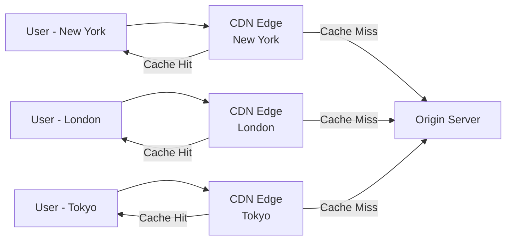

# 🚀 Content Delivery Network (CDN)

> [!abstract] TL;DR
> A CDN is a globally distributed network of edge servers that caches and serves content from locations near users, reducing latency, offloading origin servers, and improving availability at scale.

## 🧠 Core Idea

A **Content Delivery Network (CDN)** is a **globally distributed network of proxy servers** that serve content from locations **closer to end users**.

> Instead of fetching content from the origin server every time, users receive content from a nearby CDN edge server.

This dramatically improves **performance, scalability, and availability**.

---

## 📖 Definition

A CDN caches and delivers web content such as:

- HTML, CSS, JavaScript  
- Images and videos  
- Software downloads  
- API responses (in advanced CDNs)

Although CDNs primarily serve **static content**, modern CDNs like **Amazon CloudFront** also support **dynamic content** acceleration.

---

## 🏗️ How CDN Works

```
User → DNS Resolution → Nearest CDN Edge Server → (Cache Hit)
                             ↓ (Cache Miss)
                        Origin Server → CDN Cache → User
```

---

## ⚡ Why CDNs Improve Performance

### 1️⃣ Reduced Latency
- Content served from data centers **geographically close** to users.
- Shorter network travel distance → faster load times.

### 2️⃣ Reduced Load on Origin Servers
- CDN handles most static requests.
- Origin servers focus on dynamic and core logic.

---

## 🎯 Key Benefits

- Faster page load times  
- Lower latency globally  
- Reduced bandwidth costs  
- Protection against traffic spikes  
- Improved availability  
- Built-in DDoS mitigation  

---

## 🔄 Push vs Pull CDNs

### 📤 Push CDN
- Content is **uploaded (pushed)** to CDN in advance.
- Best for large static assets.

### 📥 Pull CDN
- CDN **pulls content from origin** on first request.
- Automatically caches for future requests.
- Most common CDN pattern.

---

## 🌍 Popular CDN Providers

- Cloudflare  
- AWS CloudFront  
- Akamai  
- Google Cloud CDN  
- Azure CDN  

---

## 🧠 CDN in System Design

CDNs are critical for:

- [[Scalability]]  
- [[Performance Optimization]]  
- [[Load Balancing]]  
- [[High Availability]]  
- [[Disaster Recovery]]  

---

## Mermaid Diagram



---

## 🖼️ Diagram Placeholder

```
![[cdn-architecture-diagram.png]]
```

---

## 🔗 Related Topics

[[Domain Name System (DNS)]]  
[[Load Balancing]]  
[[Caching]]  
[[Reverse Proxy]]  
[[Web Performance]]

---

## Related Concepts

- [[_MOC_CDNs|↑ Section MOC]]
- [[Domain_Name_System]] — DNS routes users to the nearest CDN edge server
- [[Load_Balancers]] — CDN and load balancers together form the traffic distribution layer
- [[Caching]] — CDN is essentially a globally distributed caching layer
- [[Push_vs_Pull_CDNs]] — the two models for how content reaches CDN edge servers
- [[Performance_vs_Scalability]] — CDN directly addresses both dimensions simultaneously

---

## Review Questions

1. A video streaming platform serves 1TB of content daily to a global audience, currently all from a single origin server. Estimate the latency improvement for a user in Tokyo vs the origin in New York, and calculate bandwidth savings if a CDN achieves a 90% cache hit rate.
2. Your CDN is serving a JavaScript bundle containing a critical bug. You deploy a fix to the origin server but users continue receiving the broken version for 24 hours. What CDN mechanism caused this, and how would you have designed the deployment process to allow instant invalidation?
3. Describe three categories of content for which you would NOT use a CDN, and explain the alternative delivery strategy you would use for each.

---

## 📚 Sources

- System Design Primer — CDN  
  https://github.com/donnemartin/system-design-primer#content-delivery-network

- Wikipedia — Content Delivery Network  
  https://en.wikipedia.org/wiki/Content_delivery_network

- Push vs Pull CDNs  
  http://www.travelblogadvice.com/technical/the-differences-between-push-and-pull-cdns/

---

## 🏷️ Tags

#SystemDesign #CDN #Networking #Performance #Scalability
