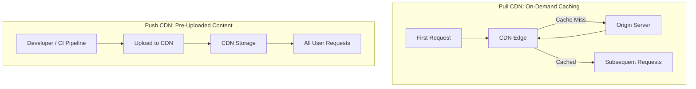

# 📦 Push vs Pull CDNs

> [!abstract] TL;DR
> Pull CDNs fetch content from origin on first request and cache automatically (ideal for high-traffic sites), while Push CDNs require pre-uploading content (ideal for low-traffic or rarely-changed assets) — most large systems use a hybrid of both.

## 🧠 Core Idea

**Content Delivery Networks (CDNs)** cache content closer to users.  
There are two main ways CDNs receive content:

- **Pull CDNs** → CDN fetches content from origin when requested.
- **Push CDNs** → Origin server uploads content to CDN in advance.

Choosing between them depends on **traffic patterns, content update frequency, and storage cost**.

---

## 📥 Pull CDNs

### 🧩 Concept
A **Pull CDN** retrieves content from your origin server **only when the first user requests it**.

You keep content on your origin server and rewrite URLs to point to the CDN.  
The first request is slower (cache miss), but subsequent requests are fast (cache hit).

---

### ⚙️ How It Works

```
User → CDN Edge → (Cache Miss) → Origin Server → CDN Cache → User
```

---

### ⏳ Time-To-Live (TTL)

- TTL determines how long content remains cached.
- When TTL expires → CDN pulls content again.
- Can cause redundant traffic if content hasn’t changed.

---

### ✅ Advantages

- Minimal storage usage on CDN  
- No manual content uploads  
- Easy to set up  
- Works well for **high-traffic sites**  

---

### ❌ Disadvantages

- Slower first request (cache miss)  
- Possible redundant pulls after TTL expiry  
- Higher origin server load on cache misses  

---

### 📌 Best Use Cases

- News sites  
- Social media platforms  
- Frequently accessed content  
- Large-scale websites with heavy traffic  

---

## 📤 Push CDNs

### 🧩 Concept
A **Push CDN** requires you to **upload content directly** to the CDN whenever it changes.

You take responsibility for:
- Uploading content
- Managing updates
- Setting expiration rules

Once uploaded, content is served directly from CDN without fetching from origin.

---

### ⚙️ How It Works

```
Origin Server → Upload Content → CDN Storage → User
```

---

### ✅ Advantages

- No cache-miss latency  
- Minimal origin server load  
- No redundant traffic  
- Predictable CDN behavior  

---

### ❌ Disadvantages

- Requires manual or automated upload pipeline  
- Higher storage usage on CDN  
- Less flexible for frequently changing content  

---

### 📌 Best Use Cases

- Video streaming libraries  
- Static asset hosting  
- Low-traffic websites  
- Rarely updated content  

---

## ⚖️ Pull vs Push Comparison

| Aspect | Pull CDN | Push CDN |
|--------|----------|----------|
| Content Loading | On first request | Pre-uploaded |
| First Request Latency | Higher | None |
| CDN Storage Usage | Low | High |
| Origin Server Load | Medium | Low |
| Setup Complexity | Low | Medium |
| Best For | High traffic sites | Low traffic / static sites |

---

## 🧠 Design Insight

```
High Traffic + Frequently Accessed Content → Pull CDN
Low Traffic + Rarely Updated Content → Push CDN
```

Many real-world systems use **hybrid models** combining both.

---

## Mermaid Diagram



---

## 🖼️ Diagram Placeholder

```
![[push-vs-pull-cdn.png]]
```

---

## 🔗 Related Topics

[[Content Delivery Network (CDN)]]  
[[Caching]]  
[[Domain Name System (DNS)]]  
[[Web Performance]]  
[[Scalability]]

---

## Related Concepts

- [[_MOC_CDNs|↑ Section MOC]]
- [[Content_Delivery_Network]] — the broader CDN concept these two models implement
- [[Domain_Name_System]] — DNS directs users to CDN edges regardless of push or pull model
- [[Caching]] — both CDN models are specialized caching strategies at global scale
- [[Load_Balancers]] — CDN edges act as a distributed load balancing layer in front of origin
- [[Performance_vs_Scalability]] — choosing push vs pull directly impacts both dimensions

---

## Review Questions

1. A news website publishes 200 articles per day with associated images and receives 5 million page views daily. Would you use a Push or Pull CDN for article images? Justify your answer by weighing the specific trade-offs.
2. A software company distributes a 2GB installer that is updated only once per quarter but downloaded by 100,000 users per release cycle. Which CDN model is more cost-effective, and why does traffic volume matter less than update frequency in this decision?
3. You run a hybrid CDN setup: static assets use Push CDN, user-generated content uses Pull CDN. A cache poisoning attack succeeds on the Pull CDN layer. How does each model's architecture affect your ability to detect, isolate, and remediate the attack?

---

## 📚 Sources

- System Design Primer — CDN  
  https://github.com/donnemartin/system-design-primer#content-delivery-network  

- Wikipedia — Content Delivery Network  
  https://en.wikipedia.org/wiki/Content_delivery_network  

- Push vs Pull CDNs  
  http://www.travelblogadvice.com/technical/the-differences-between-push-and-pull-cdns/

---

## 🏷️ Tags

#SystemDesign #CDN #Caching #Networking #Performance
