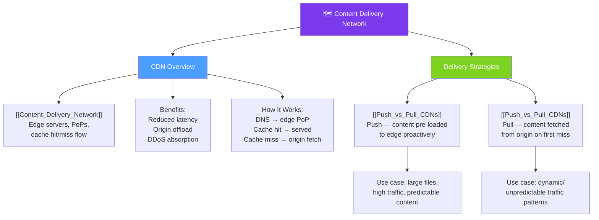

# 🗺 CDNs — Map of Content

> [!abstract] What This Section Covers
> A Content Delivery Network (CDN) is a globally distributed set of edge servers that cache content close to users, dramatically reducing latency and offloading traffic from origin servers. This section covers how CDNs work, the distinction between push and pull CDN strategies, and when each model is the right architectural choice.

## Concept Map

## Learning Path

1. [[Content_Delivery_Network]] — What a CDN is, how edge caching works, and the impact on latency and origin load
2. [[Push_vs_Pull_CDNs]] — The two CDN update strategies: when to pre-load content vs let the edge fetch on demand

## All Notes at a Glance

| Note | Summary | Difficulty |
|------|---------|------------|
| [[Content_Delivery_Network]] | Overview of CDN architecture, edge servers, PoPs, cache hit/miss flow, and use cases | Beginner |
| [[Push_vs_Pull_CDNs]] | Compares push CDNs (pre-loaded content) and pull CDNs (lazy edge caching) with trade-offs | Intermediate |

## Key Questions This Section Answers

- How does a CDN reduce latency for geographically distributed users?
- What is a Point of Presence (PoP) and how does DNS route users to the nearest one?
- What happens during a CDN cache miss — how does the edge fetch from origin?
- What is the difference between a push CDN and a pull CDN?
- When should you use a push CDN over a pull CDN?
- What types of content are CDN-appropriate (static assets, video, API responses)?
- How does a CDN provide DDoS protection and absorb traffic spikes?
- What is cache invalidation in the context of a CDN, and why is it tricky?

## Related Sections

- [[_MOC_SystemDesign_Master|↑ System Design Master MOC]]
- [[_MOC_DNS|← DNS]]
- [[_MOC_LoadBalancers|→ Load Balancers]]
- [[_MOC_Caching|→ Caching]]

#MOC #SystemDesign #CDNs
