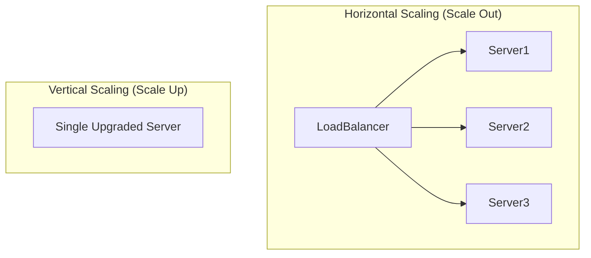

# 📈 Horizontal Scaling

> [!abstract] TL;DR
> **Horizontal scaling** adds more machines to handle increased load rather than upgrading a single machine, enabling nearly unlimited scalability when servers are made stateless.

## 🧠 Core Idea

**Horizontal Scaling (Scaling Out)** means increasing system capacity by **adding more machines** rather than upgrading a single machine.

Load balancers play a key role in horizontal scaling by distributing traffic across multiple servers, improving **performance, availability, and fault tolerance**.

> Opposite approach: **Vertical Scaling (Scaling Up)** — upgrading a single server with more powerful hardware.

---

## 📖 Definition

- **Horizontal Scaling:** Add more servers to handle increased load.
- **Vertical Scaling:** Add more CPU, RAM, or storage to a single server.

Modern cloud architectures prefer horizontal scaling because it is **cost-efficient, flexible, and resilient**.

---

## ⚖️ Horizontal vs Vertical Scaling

| Aspect | Horizontal Scaling | Vertical Scaling |
|--------|--------------------|------------------|
| Method | Add more machines | Upgrade single machine |
| Cost | Uses commodity hardware | Expensive high-end hardware |
| Availability | High (no single point of failure) | Lower (single machine risk) |
| Scalability Limit | Nearly unlimited | Hardware limits |
| Complexity | Higher | Lower |
| Fault Tolerance | High | Low |

---

## 🎯 Why Horizontal Scaling Matters

- Improves system **availability**
- Handles **traffic spikes**
- Prevents **single points of failure**
- Cost-efficient with commodity hardware
- Easier to hire engineers familiar with standard systems

---

## 🧩 Role of Load Balancers

```
Clients → Load Balancer → Multiple Application Servers
```

Load balancers distribute requests across scaled-out servers, enabling seamless horizontal scaling.

---

## ⚠️ Disadvantages of Horizontal Scaling

### 🔹 Increased Complexity
- Requires cloning and managing many servers
- Needs automation and orchestration

### 🔹 Stateless Server Requirement
- Servers should not store user state (sessions, profile data)
- Any server must handle any request

### 🔹 External Session Storage
Sessions must be stored in shared systems:
- SQL / NoSQL Databases
- Redis / Memcached (distributed cache)

### 🔹 Downstream Bottlenecks
As application servers scale:
- Databases
- Caches
- Message queues

must handle more simultaneous connections.

---

## 🧠 Design Considerations

- Make application servers **stateless**
- Use **centralized session stores**
- Scale databases with **replication / sharding**
- Add **caching layers**
- Implement **auto-scaling**

---

## 🖼️ Diagram



---

## 🔗 Related Topics

[[Load Balancers]]  
[[Scalability]]  
[[Vertical Scaling]]  
[[Caching]]  
[[Database Replication]]  
[[Database Sharding]]

---

## Related Concepts

- [[_MOC_LoadBalancers|↑ Section MOC]]
- [[Load Balancers]]
- [[Database Sharding]]
- [[Microservices]]
- [[Service Discovery]]
- [[Caching]]

---

## Review Questions

1. What is the difference between horizontal scaling and vertical scaling?
2. Why do stateless services scale horizontally more easily than stateful ones?
3. What role does a load balancer play when horizontally scaling web servers?

---

## 🏷️ Tags

#SystemDesign #Scalability #HorizontalScaling #Availability #Performance
