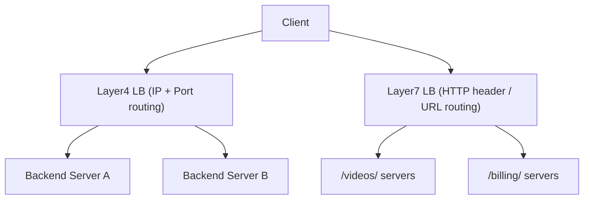

# 🧭 Layer 4 vs Layer 7 Load Balancing

> [!abstract] TL;DR
> **Layer 4** load balancers route based on IP/port metadata (fast, low overhead), while **Layer 7** load balancers inspect HTTP headers, URLs, and cookies for intelligent content-based routing.

## 🧠 Core Idea

Load balancers can operate at different layers of the network stack.  
The two most important types are:

- **Layer 4 Load Balancers** → Operate at the **Transport Layer**
- **Layer 7 Load Balancers** → Operate at the **Application Layer**

> Higher layer = more intelligence and flexibility, but slightly more overhead.

---

## 📖 Layer 4 Load Balancing (Transport Layer)

### 🧩 Concept

Layer 4 load balancers make routing decisions using **transport-level information**, such as:

- Source IP address  
- Destination IP address  
- Source and destination ports  

They **do not inspect packet contents**. Instead, they forward packets using **Network Address Translation (NAT)**.

---

### ⚙️ How It Works

```
Client → L4 Load Balancer → Selected Server
```
Routing decision is based purely on IP and port metadata.

---

### ✅ Advantages

- Very fast and efficient  
- Low CPU and memory usage  
- Minimal latency overhead  

---

### ❌ Disadvantages

- No content-based routing  
- Cannot inspect HTTP headers, cookies, or payloads  

---

### 📌 Common Use Cases

- High-throughput systems  
- TCP/UDP traffic balancing  
- Simple microservice routing  

---

## 📖 Layer 7 Load Balancing (Application Layer)

### 🧩 Concept

Layer 7 load balancers inspect **application-level data**, such as:

- HTTP headers  
- URLs and paths  
- Cookies  
- Request payloads  

They **terminate incoming connections**, read the message, make a routing decision, and open a new connection to the selected backend server.

---

### ⚙️ How It Works

```
Client → L7 Load Balancer
       → Inspect HTTP Request
       → Route to Appropriate Backend
       → Server Response → Client
```

---

### 🎯 Example

A Layer 7 load balancer can:

- Route **/videos/** requests → Video servers  
- Route **/billing/** requests → Security-hardened servers  
- Route mobile users → Mobile-optimized servers  

---

### ✅ Advantages

- Content-based routing  
- SSL termination  
- Session persistence  
- Fine-grained traffic control  

---

### ❌ Disadvantages

- Higher CPU usage  
- Slightly more latency  
- More complex to configure  

---

## ⚖️ Layer 4 vs Layer 7 Comparison

| Aspect | Layer 4 | Layer 7 |
|--------|---------|---------|
| OSI Layer | Transport | Application |
| Inspects Payload | ❌ | ✅ |
| Routing Basis | IP & Port | Headers, Cookies, URLs |
| Performance | Very High | High |
| Flexibility | Low | Very High |
| Complexity | Low | Medium |
| SSL Termination | ❌ | ✅ |

---

## 🧠 Design Insight

```
Need speed and simplicity → Layer 4
Need intelligent routing → Layer 7
Modern systems → Often use both together
```

---

## 🖼️ Diagram



---

## 🔗 Related Topics

[[Load Balancers]]  
[[Load Balancing Algorithms]]  
[[Load Balancer vs Reverse Proxy]]  
[[API Gateway]]  
[[Networking Fundamentals]]

---

## 📚 Source

- F5 — Layer 4 Load Balancing  
  https://www.f5.com/glossary/layer-4-load-balancing

---

## Related Concepts

- [[_MOC_LoadBalancers|↑ Section MOC]]
- [[Load Balancers]]
- [[Load Balancing Algorithms]]
- [[Microservices]]
- [[LoadBalancer vs ReverseProxy]]
- [[Application Layer]]

---

## Review Questions

1. At which OSI layers do Layer 4 and Layer 7 load balancers operate?
2. In what scenario would you prefer a Layer 7 load balancer over a Layer 4 load balancer?
3. What is the performance trade-off between Layer 4 and Layer 7 load balancing?

---

## 🏷️ Tags

#SystemDesign #LoadBalancing #Networking #Performance
