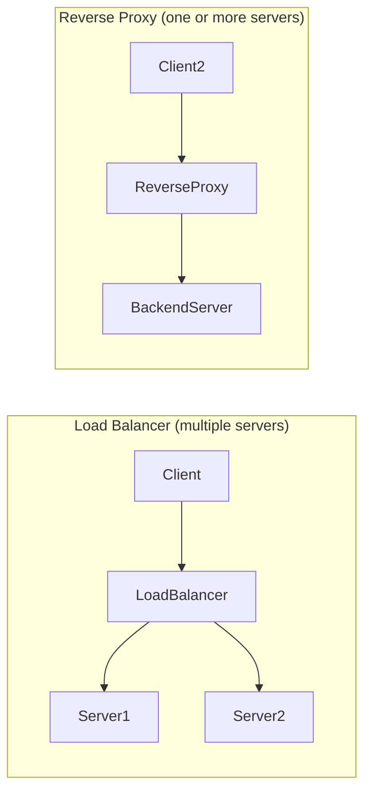

# ⚖️ Load Balancer vs Reverse Proxy

> [!abstract] TL;DR
> A **load balancer** distributes traffic across multiple servers, while a **reverse proxy** optimizes and controls requests in front of one or more servers. Tools like NGINX and HAProxy do both.

## 🧠 Core Idea

Both **Load Balancers** and **Reverse Proxies** sit between clients and backend servers, but they solve **different problems** in system design.

> **Load Balancer** → Distributes traffic across multiple backend servers.  
> **Reverse Proxy** → Acts as an intermediary in front of one or more servers to manage and optimize requests.

Modern tools like **NGINX** and **HAProxy** can function as **both**.

---

## 📖 Load Balancer

### 🧩 Purpose
- Routes traffic across **multiple servers** performing the same function.
- Prevents server overload.
- Enables **horizontal scaling**.

### 🏗️ Typical Use
```
Client → Load Balancer → Multiple Backend Servers
```

### 🎯 Key Benefits
- Distributes workload
- Improves availability
- Prevents single server bottlenecks

---

## 📖 Reverse Proxy

### 🧩 Purpose
- Acts as a **gateway** between clients and backend server(s).
- Useful **even with a single backend server**.
- Adds extra capabilities in front of the application.

### 🏗️ Typical Use
```
Client → Reverse Proxy → Backend Server(s)
```

### 🎯 Key Benefits
- SSL termination
- Request routing
- Caching responses
- Compression
- Security filtering
- Hides backend server details

---

## 🔀 Key Difference

| Aspect | Load Balancer | Reverse Proxy |
|--------|--------------|---------------|
| Main Goal | Distribute traffic | Manage and optimize traffic |
| Backend Servers | Multiple | One or more |
| Primary Benefit | Scalability | Performance & Security |
| Works with Single Server | ❌ | ✅ |
| Example Tools | HAProxy, NGINX | NGINX, Apache, Envoy |

---

## ⚙️ Combined Usage

In real-world architectures:

```
Client → Reverse Proxy / Load Balancer → Backend Servers
```

Tools like **NGINX** and **HAProxy** perform:
- Layer 7 reverse proxying
- Load balancing
- SSL termination
- Health checks

---

## ⚠️ Disadvantages of Reverse Proxy

- Adds architectural complexity  
- A single reverse proxy is a **single point of failure**  
- Multiple reverse proxies require **failover configuration**  
- Additional latency (small but present)

---

## 🧠 Design Insight

```
Need to scale traffic → Use Load Balancer
Need to optimize/control traffic → Use Reverse Proxy
Often → Use both together
```

---

## 🖼️ Diagram



---

## 🔗 Related Topics

[[Load Balancers]]  
[[Reverse Proxy]]  
[[API Gateway]]  
[[Content Delivery Network (CDN)]]  
[[High Availability]]

---

## 📚 Sources

- F5 — Reverse Proxy Glossary  
  https://www.f5.com/glossary/reverse-proxy

- Wikipedia — Reverse Proxy  
  https://en.wikipedia.org/wiki/Reverse_proxy

- NGINX Overview  
  https://www.f5.com/products/nginx#overview

- HAProxy Architecture  
  https://www.haproxy.org/download/1.2/doc/architecture.txt

---

## Related Concepts

- [[_MOC_LoadBalancers|↑ Section MOC]]
- [[Load Balancers]]
- [[CDN Caching]]
- [[Web Server Caching]]
- [[Application Layer]]
- [[Microservices]]

---

## Review Questions

1. What is the key difference between a load balancer and a reverse proxy?
2. Can a reverse proxy be used with only one backend server? Explain.
3. Name two features a reverse proxy provides beyond basic traffic distribution.

---

## 🏷️ Tags

#SystemDesign #LoadBalancing #ReverseProxy #Networking
