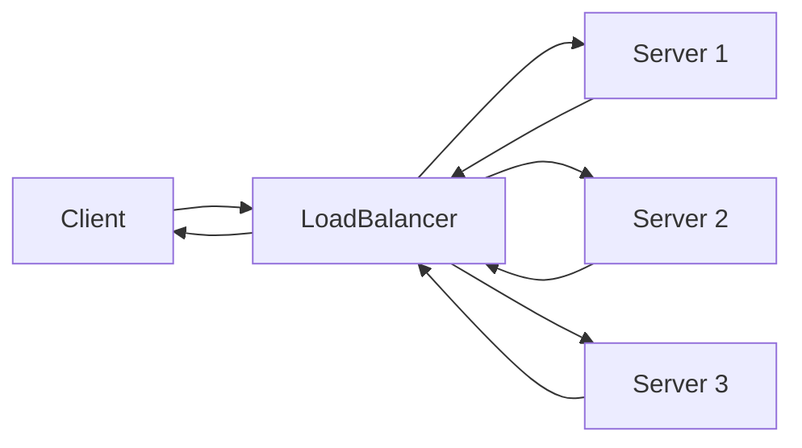

# ⚖️ Load Balancers

> [!abstract] TL;DR
> A **load balancer** distributes incoming client requests across multiple backend servers, preventing overload, enabling horizontal scaling, and eliminating single points of failure.

## 🧠 Core Idea

A **Load Balancer** distributes incoming client requests across multiple computing resources such as **application servers, databases, or services**.

It ensures no single server becomes overloaded and helps maintain **high availability, scalability, and fault tolerance**.

> Goal: **Distribute traffic efficiently while keeping systems reliable.**

---

## 📖 Definition

A load balancer sits between **clients** and **backend servers**:

```
Client → Load Balancer → Backend Servers → Load Balancer → Client
```

The load balancer:
- Receives client requests  
- Chooses an appropriate backend resource  
- Forwards the request  
- Returns the response to the client  

---

## 🎯 Why Load Balancers Matter

- Prevent requests from reaching unhealthy servers  
- Prevent overloading backend resources  
- Help eliminate single points of failure  
- Enable horizontal scaling  

---

## 🧩 Types of Load Balancers

### 🖥️ Hardware Load Balancers
- Dedicated physical appliances  
- High performance, expensive  
- Used in enterprise data centers  

### 💻 Software Load Balancers
- Run on standard servers  
- Flexible and cost-effective  
- Examples: **HAProxy, NGINX, Envoy**  

---

## ⚙️ Load Balancing Algorithms

| Algorithm | Description |
|------------|-------------|
| Round Robin | Requests distributed sequentially |
| Weighted Round Robin | Servers get traffic based on capacity |
| Least Connections | Routes to least busy server |
| IP Hash | Routes based on client IP |
| Random | Random selection |

---

## 🚀 Additional Benefits

### 🔐 SSL Termination
- Load balancer decrypts HTTPS requests  
- Backend servers handle plain HTTP  
- Reduces CPU load on backend  
- Centralized certificate management  

### 🪪 Session Persistence (Sticky Sessions)
- Routes same client to same backend  
- Useful when app sessions are stored locally  

### 🩺 Health Checks
- Continuously monitors backend servers  
- Stops routing to unhealthy instances  

---

## ⚠️ Disadvantages

- Can become a **performance bottleneck**  
- Adds **system complexity**  
- A single load balancer can be a **single point of failure**  
- Redundant load balancers increase complexity  

---

## 🧠 Design Insight

```
No Load Balancer → Single Server Overload Risk
Load Balancer → Scalable + Fault-Tolerant Architecture
```

---

## 🖼️ Diagram



---

## 🔗 Related Topics

[[Domain Name System (DNS)]]  
[[Content Delivery Network (CDN)]]  
[[Caching]]  
[[Failover]]  
[[High Availability]]  
[[Scalability]]

---

## 📚 Sources

- CS.fyi — Scalability for Dummies  
  https://cs.fyi/guide/scalability-for-dummies

- NGINX Load Balancing  
  https://www.f5.com/products/nginx

- HAProxy Architecture  
  https://www.haproxy.org/download/1.2/doc/architecture.txt

---

## Related Concepts

- [[_MOC_LoadBalancers|↑ Section MOC]]
- [[Horizontal Scaling]]
- [[Load Balancing Algorithms]]
- [[Layer4 vs Layer7 LoadBalancing]]
- [[LoadBalancer vs ReverseProxy]]
- [[CDN Caching]]

---

## Review Questions

1. What is the primary purpose of a load balancer in a distributed system?
2. How does a load balancer differ from a reverse proxy?
3. What happens to request routing if one of the backend servers behind a load balancer fails?

---

## 🏷️ Tags

#SystemDesign #LoadBalancing #Scalability #Availability #Networking
