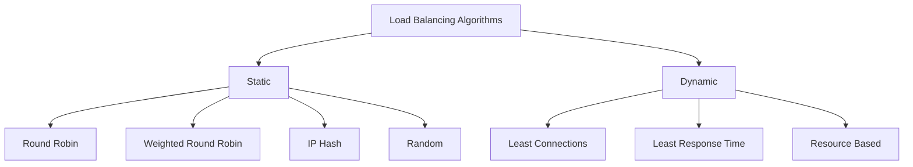

# ⚙️ Load Balancing Algorithms

> [!abstract] TL;DR
> Load balancing algorithms decide which backend server handles each request. **Static** algorithms (Round Robin, IP Hash) ignore server state; **dynamic** algorithms (Least Connections) adapt in real time to current load.

## 🧠 Core Idea

A **Load Balancer** prevents any single server from becoming overloaded by distributing incoming network traffic across multiple backend servers.

A **Load Balancing Algorithm** is the **set of predefined rules** a load balancer uses to decide **which server should handle each request**.

> Goal: **Distribute traffic efficiently for scalability, availability, and performance.**

---

## 📖 Definition

Load balancing algorithms determine how requests are routed to servers.  
They fall into two main categories:

- **Static Load Balancing**
- **Dynamic Load Balancing**

---

## 🧩 Static Load Balancing

### 🧠 Concept
Static algorithms distribute traffic **without considering the current state** of servers.

They assume all servers have equal capacity.

---

### ⚙️ Common Static Algorithms

#### 🔹 Round Robin
- Requests are distributed sequentially.
- Simple and widely used.

```
Server1 → Server2 → Server3 → repeat
```

---

#### 🔹 Weighted Round Robin
- Servers receive traffic based on assigned weights.
- Useful when servers have different capacities.

---

#### 🔹 Random
- Requests are sent to random servers.
- Simple, avoids predictable patterns.

---

#### 🔹 IP Hash
- Routes requests based on client IP.
- Ensures session persistence.

---

### ✅ Advantages
- Simple to implement  
- Low overhead  

### ❌ Disadvantages
- Ignores real-time server load  
- Can overload slow servers  

---

## 🧩 Dynamic Load Balancing

### 🧠 Concept
Dynamic algorithms distribute traffic **based on real-time server conditions** such as:
- Current load
- Response time
- Active connections
- Health status

---

### ⚙️ Common Dynamic Algorithms

#### 🔹 Least Connections
- Sends traffic to server with fewest active connections.

#### 🔹 Least Response Time
- Chooses server responding fastest.

#### 🔹 Resource-Based
- Routes based on CPU, memory, or queue length metrics.

---

### ✅ Advantages
- Better performance under varying load  
- Prevents server overload  

### ❌ Disadvantages
- Requires monitoring infrastructure  
- Slightly higher complexity  

---

## ⚖️ Static vs Dynamic Comparison

| Aspect | Static | Dynamic |
|--------|--------|---------|
| Considers Server State | ❌ | ✅ |
| Implementation Complexity | Low | Medium |
| Overhead | Low | Medium |
| Performance Under Load | Moderate | High |
| Best For | Uniform servers | Variable workloads |

---

## 🧠 Design Insight

```
Small Uniform Cluster → Static Algorithms
Large Variable Traffic → Dynamic Algorithms
```

Modern production systems often use **hybrid approaches** combining both.

---

## 🖼️ Diagram



---

## 🔗 Related Topics

[[Load Balancers]]  
[[Load Balancer vs Reverse Proxy]]  
[[Scalability]]  
[[High Availability]]  
[[Networking Fundamentals]]

---

## 📚 Source

- Cloudflare — Types of Load Balancing Algorithms  
  https://www.cloudflare.com/learning/performance/types-of-load-balancing-algorithms/

---

## Related Concepts

- [[_MOC_LoadBalancers|↑ Section MOC]]
- [[Load Balancers]]
- [[Layer4 vs Layer7 LoadBalancing]]
- [[Horizontal Scaling]]
- [[Service Discovery]]
- [[Microservices]]

---

## Review Questions

1. What is the difference between Round Robin and Weighted Round Robin algorithms?
2. In which scenario would Least Connections outperform Round Robin?
3. Why might IP Hash be used, and what is its main limitation?

---

## 🏷️ Tags

#SystemDesign #LoadBalancing #Networking #Scalability
