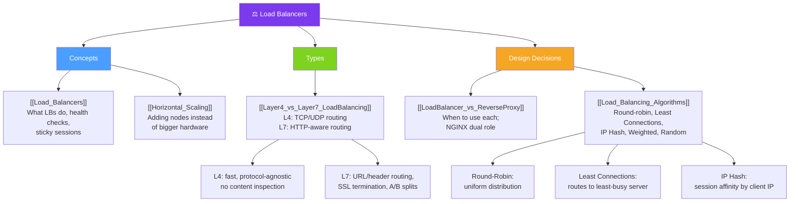

# ⚖ Load Balancers — Map of Content

> [!abstract] What This Section Covers
> Load balancers distribute incoming traffic across multiple server instances to prevent any single server from becoming a bottleneck, enabling horizontal scaling and high availability. This section covers the core concepts (horizontal scaling, L4 vs L7), the decision between load balancers and reverse proxies, and the algorithms that control how traffic is distributed.

## Concept Map

## Learning Path

1. [[Load_Balancers]] — What load balancers do, health checks, sticky sessions, and single-point-of-failure concerns
2. [[Horizontal_Scaling]] — Why horizontal scaling is the foundation of modern distributed systems
3. [[Layer4_vs_Layer7_LoadBalancing]] — What each layer can see and route on; when to use each
4. [[LoadBalancer_vs_ReverseProxy]] — Conceptual overlap and practical differences; when NGINX is the right answer
5. [[Load_Balancing_Algorithms]] — Round-robin, least connections, IP hash, weighted, random — trade-offs and use cases

## All Notes at a Glance

| Note | Summary | Difficulty |
|------|---------|------------|
| [[Load_Balancers]] | Core load balancer concepts: traffic distribution, health checks, sticky sessions | Beginner |
| [[Horizontal_Scaling]] | Adding more instances (scale out) vs scaling up a single machine | Beginner |
| [[Layer4_vs_Layer7_LoadBalancing]] | L4 operates on TCP/UDP; L7 can inspect HTTP headers, URLs, and cookies | Intermediate |
| [[LoadBalancer_vs_ReverseProxy]] | Conceptual difference; reverse proxies add caching, SSL termination, compression | Beginner |
| [[Load_Balancing_Algorithms]] | Algorithms for distributing traffic: round-robin, least connections, IP hash, weighted | Intermediate |

## Key Questions This Section Answers

- What is a load balancer and what problems does it solve?
- What is the difference between L4 and L7 load balancing — what can each see and route on?
- When does an L7 load balancer enable routing decisions an L4 cannot make?
- What is the difference between a load balancer and a reverse proxy?
- Can NGINX serve as both? When should you use each?
- What are sticky sessions and why do they complicate horizontal scaling?
- When is round-robin sufficient, and when do you need least-connections or IP hash?
- How do health checks prevent a load balancer from routing to a dead instance?

## Related Sections

- [[_MOC_SystemDesign_Master|↑ System Design Master MOC]]
- [[_MOC_CDNs|← CDNs]]
- [[_MOC_ApplicationLayer|→ Application Layer]]
- [[_MOC_API_Gateway|→ API Gateway]]

#MOC #SystemDesign #LoadBalancers
