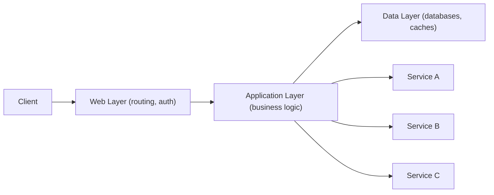

# 🧩 Application Layer (Platform Layer)

> [!abstract] TL;DR
> The **Application Layer** separates business logic from the web layer, allowing each tier to be scaled and configured independently — naturally leading to microservices architecture.

## 🧠 Core Idea

The **Application Layer** (also called the **Platform Layer**) sits between the web layer and the data layer.

Separating the **Web Layer** from the **Application Layer** allows both layers to be **scaled and configured independently**, leading to better **scalability, maintainability, and service autonomy**.

> Example: Adding a new API may require more **application servers**, but not necessarily more **web servers**.

---

## 📖 Definition

In modern system design:

```
Client → Web Layer → Application Layer → Data Layer
```

- **Web Layer** handles HTTP requests, routing, authentication, and request validation.  
- **Application Layer** contains core business logic and service orchestration.  
- **Data Layer** manages persistence and storage.

---

## 🎯 Why Application Layer Matters

- Enables independent scaling of web and application tiers  
- Encourages clean separation of concerns  
- Improves maintainability  
- Supports service reusability  
- Enables rapid feature development  

---

## 🏗️ Architectural Principle

### 🔹 Single Responsibility Principle
- Each service has one focused responsibility  
- Services are small and autonomous  
- Easier to develop, test, and deploy  

### 🔹 Small Teams, Small Services
- Teams own individual services  
- Faster iteration and innovation  
- Easier to plan for rapid growth  

This philosophy naturally leads to **Microservices Architecture**.

---

## ⚙️ Application Layer in Microservices

- Each microservice represents a unit of business logic  
- Services communicate via APIs or messaging  
- Services can be deployed and scaled independently  

---

## ⚠️ Disadvantages

### 🔸 Architectural Complexity
- Loosely coupled services require new design patterns  
- Needs service discovery, API gateways, observability  

### 🔸 Operational Complexity
- More deployments to manage  
- Requires container orchestration (e.g., Kubernetes)  

### 🔸 Process Changes
- DevOps and CI/CD pipelines become essential  
- Monitoring and tracing required across services  

---

## 🧠 Design Insight

```
Monolith → Simple to start
Application Layer + Microservices → Scalable for growth
```

Many systems start as monoliths and evolve into layered or microservice architectures over time.

---

## 🖼️ Diagram



---

## 🔗 Related Topics

[[Web Layer]]  
[[Microservices Architecture]]  
[[API Gateway]]  
[[Service Discovery]]  
[[Scalability]]  
[[DevOps]]

---

## 📚 Source

- Introduction to Architecting Systems for Scale  
  https://lethain.com/introduction-to-architecting-systems-for-scale/#platform_layer

---

## Related Concepts

- [[_MOC_ApplicationLayer|↑ Section MOC]]
- [[Load Balancers]]
- [[Microservices]]
- [[Service Discovery]]
- [[Caching]]
- [[Databases]]

---

## Review Questions

1. What is the primary responsibility of the application layer in a web architecture?
2. How does separating the application layer from the web layer improve scalability?
3. What are two common platforms used for application layer message queuing?

---

## 🏷️ Tags

#SystemDesign #ApplicationLayer #Microservices #Architecture #Scalability
