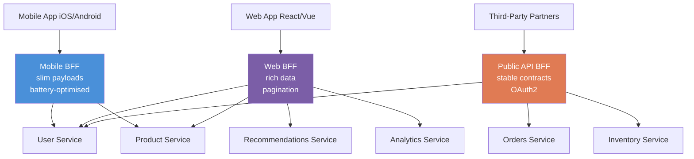

# 📱 Backend for Frontend (BFF) Pattern

> [!abstract] TL;DR
> The BFF pattern creates a dedicated API backend for each client type (mobile, web, third-party). Instead of one general-purpose API that must satisfy all clients, each client gets a thin API layer owned by the frontend team that aggregates, filters, and transforms data from downstream microservices to match that client's exact needs — right-sized payloads, right-shaped data, optimal performance per client.

## Intuition — Analogy First

Imagine a restaurant serving three types of guests: a family with young children, a business lunch group, and a catering company. If there's only one menu and one ordering process, it must accommodate everyone — it becomes bloated and awkward for each group.

Better: have a **separate concierge** for each type of guest:
- The family concierge knows to suggest the kids' menu, split bills, and avoid wine recommendations
- The business concierge presents premium options quickly, handles expense receipts
- The catering concierge provides bulk ordering, delivery logistics, and invoice formats

All three concierges go to the same kitchen (downstream microservices) but present a perfectly tailored interface for their specific client.

The kitchen (services) stays the same. The concierges (BFFs) are the client-specific layer.

## How It Works

Without BFF, a single general API must handle conflicting requirements:
- Mobile clients want small payloads (limited bandwidth, battery life)
- Web clients want rich data (more powerful, faster network)
- Third-party integrators want stable, versioned, documented APIs
- TV/smart device clients want pre-aggregated data (limited processing power)

Serving all these from one API causes: over-fetching (web gets mobile's slim data), under-fetching (mobile gets web's fat payloads and discards 80%), versioning hell (breaking change for mobile breaks web), and API designed by committee (no clear owner).

**BFF solves this by:**
1. Creating a dedicated API service per client type
2. Each BFF is owned and deployed by the frontend team for that client
3. BFFs call multiple downstream microservices and aggregate/transform the response
4. Each BFF shapes the exact payload the client needs — no more, no less
5. BFFs can handle client-specific auth flows, caching strategies, and error handling

**What each BFF does:**

*Mobile BFF:* Calls User Service + Product Service, merges the results, strips fields the mobile app doesn't render, compresses the response, handles push notification token registration, implements mobile-specific auth flow (biometric, device fingerprint).

*Web BFF:* Calls 4-5 downstream services, aggregates a rich data model the React app needs in one call (avoiding waterfall requests), handles pagination differently, includes analytics tracking IDs in responses.

*Public API BFF (for third-parties):* Strict semantic versioning, OAuth 2.0 scopes, rate limiting per API key, stable long-term contracts, comprehensive OpenAPI documentation. May deliberately expose only a subset of internal capabilities.

**BFF vs API Gateway:**
An API Gateway is infrastructure-level (routing, auth, rate limiting, SSL termination). A BFF is application-level (business logic, data aggregation, transformation). You typically have both: an API Gateway in front of all BFFs for cross-cutting concerns, and BFFs behind it for client-specific logic.

## Real-World Systems

| Company | BFF Usage |
|---|---|
| **Netflix** | Separate BFFs for each device type: TV (large payload, 4K metadata), mobile (slim, offline-ready), web (rich, social features). Each device team owns their BFF. |
| **SoundCloud** | Pioneered the BFF pattern (Phil Calçado, 2015). Moved from a single API to client-specific BFFs to let mobile and web teams move independently. |
| **Spotify** | Per-platform BFFs for their desktop, mobile, and web players — each has different audio quality, caching, and offline sync requirements. |
| **Amazon** | The product detail page (PDP) is assembled by a BFF-like "page assembler" that calls ~100 downstream services and returns exactly what the client needs to render. |
| **Twitter/X** | Separate BFFs for TweetDeck (power users, high data density), mobile (minimal payload), and the web client. |

## Trade-offs

| Dimension | Pros | Cons |
|---|---|---|
| **Performance** | Right-sized payloads — mobile gets only what it needs | Extra network hop (client → BFF → services) |
| **Team autonomy** | Frontend team owns their BFF — no cross-team negotiation | Multiple BFFs to maintain; logic duplication across BFFs |
| **Flexibility** | Each BFF evolves independently at client cadence | Shared logic (auth, common transformations) tempts copy-paste |
| **Security** | BFF can enforce client-specific auth and token scopes | Each BFF is a separate attack surface to secure |
| **Debugging** | Clear ownership — mobile BFF owner debugs mobile issues | Distributed tracing needed across BFF + downstream services |
| **Complexity** | Downstream services remain clean (no client-specific logic) | More services to deploy, monitor, and scale |

## When to Use vs Avoid

**Use when:**
- Multiple significantly different client types with different data needs (mobile vs web vs TV vs partner API)
- Frontend teams are blocked by backend API changes (BFF gives them autonomy)
- Clients are over-fetching or under-fetching from a shared API
- Different clients need different auth flows or security models
- Organisation has separate frontend teams per platform (natural ownership model)

**Avoid when:**
- Single client type — BFF adds complexity with no benefit
- Simple CRUD application where all clients need the same data
- Small team where maintaining multiple BFFs creates more overhead than the API inconsistency it solves
- If clients only differ in minor ways — API versioning or GraphQL may be simpler solutions

## Common Pitfalls

1. **BFF becomes a business logic layer** — BFFs should aggregate and transform; they should NOT contain business rules (discount calculations, inventory rules). Business logic belongs in downstream services. BFFs that hold business logic become impossible to share across platforms.
2. **Logic duplication across BFFs** — Mobile BFF and Web BFF both implement the same user authentication transformation. Extract shared logic into a dedicated service or shared library, not into each BFF independently.
3. **BFF owned by backend team** — defeats the purpose. The BFF's value is that the frontend team moves at frontend speed without backend team bottlenecks. If the backend team owns the BFF, you've just renamed the old API.
4. **Too many BFFs** — one per client type is sensible; one per feature or one per page becomes unmaintainable. Group clients by meaningful differences (mobile vs web vs partner), not by minor variations.
5. **Synchronous fan-out in BFF** — BFF calling 5 services sequentially adds 5x the latency. Always fan out calls in parallel. If services are independent, use `Promise.all()` / async parallel calls to aggregate concurrently.
6. **Not caching in the BFF** — the BFF sits close to clients and knows their caching patterns. Caching aggregated responses at the BFF layer (Redis) can dramatically reduce downstream service load.

## Related Concepts

- [[_MOC_Application_Layer|↑ Section MOC]]
- [[API_Gateway]] — infrastructure layer in front of BFFs; handles SSL, routing, rate limiting
- [[Microservices]] — the downstream services that BFFs aggregate from
- [[Service_Discovery]] — BFFs use service discovery to locate downstream microservices
- [[Monolith_vs_Microservices]] — BFF pattern is most relevant once you've adopted microservices
- [[GraphQL]] — an alternative to BFF; a single flexible API where clients request exactly the shape they need (though BFF + GraphQL is also common)

## Review Questions

1. **A mobile app is receiving 80KB JSON payloads from your API, but only renders 12KB of data. What pattern addresses this, and how would you implement it?**
   *BFF Pattern. Create a Mobile BFF that calls the same downstream services but projects/trims the response to only the fields the mobile app uses. The mobile team owns this BFF and can evolve it independently. Alternatively, GraphQL lets clients specify exactly the fields they need — same result without a separate service.*

2. **What is the difference between an API Gateway and a BFF? Can you use both together?**
   *API Gateway = infrastructure concerns (SSL termination, auth, rate limiting, routing) — typically one instance. BFF = application concerns (data aggregation, transformation, client-specific logic) — one per client type. They complement each other: API Gateway handles cross-cutting concerns for all traffic, then routes to the appropriate BFF for client-specific handling.*

3. **SoundCloud pioneered BFF. What problem were they solving, and why did BFF emerge as the solution?**
   *SoundCloud had one general API. Mobile team needed to make 3-4 API calls to get one screen's data (under-fetching), while also receiving data it didn't need (over-fetching). The mobile team was constantly blocked by backend team API changes. BFF gave mobile its own backend layer — the mobile team could aggregate and shape data independently, unblocking parallel development.*

## Sources

- [Pattern: Backends For Frontends — Sam Newman](https://samnewman.io/patterns/architectural/bff/)
- [SoundCloud's BFF Blog Post — Phil Calçado (2015)](https://philcalcado.com/2015/09/18/the_back_end_for_front_end_pattern_bff.html)
- [Netflix BFF at Scale — Netflix Tech Blog](https://netflixtechblog.com/)
- Building Microservices — Sam Newman (O'Reilly), Chapter 13
- [BFF vs GraphQL — ThoughtWorks Technology Radar](https://www.thoughtworks.com/radar)

#SystemDesign #BFF #BackendForFrontend #APIDesign #Microservices #MobileBackend
