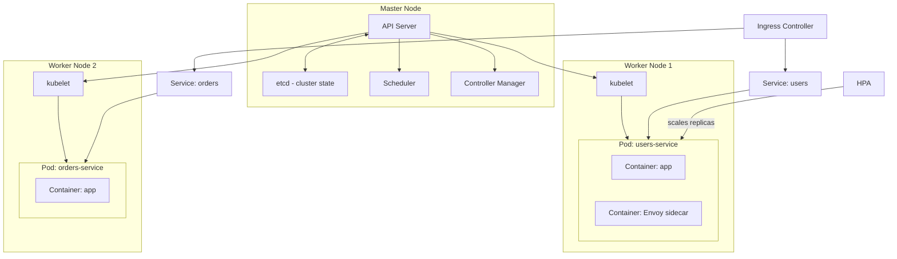

# ☸️ Kubernetes for System Design

> [!abstract] TL;DR
> Kubernetes (K8s) is the industry-standard container orchestration platform. In system design interviews you don't need to know `kubectl` commands — you need to understand the concepts: Pods, Deployments, Services, Ingress, HPA (autoscaling), and Persistent Volumes. K8s gives you auto-healing, rolling deploys, service discovery via DNS, and horizontal scaling as primitives.

## Intuition — Analogy First

Kubernetes is like a **smart airport operations system** for your containers:

- **Containers = planes** that need to be scheduled, monitored, and rerouted if something goes wrong
- **Pods = flight slots** — each plane (container) gets assigned a slot (pod) with guaranteed resources
- **Nodes = terminals** — the actual physical infrastructure where planes land
- **Deployments = flight schedules** — define how many flights (replicas) to run and how to update them
- **Services = gates** — passengers (network traffic) always go to the same gate number (Service DNS name), even if the planes behind it change
- **Ingress = the main terminal entrance** — one front door that routes passengers to the right gate based on their destination
- **HPA = dynamic scheduling** — if demand surges, the airport automatically opens more slots (scales pods)

The control tower (master node) keeps everything running — if a plane breaks down, another is automatically dispatched.

## How It Works

**Core Concepts:**

**Pod** — the smallest deployable unit. Contains 1+ containers that share a network namespace (localhost) and filesystem. Ephemeral by design: pods are killed and replaced, not patched in-place. A single Pod = one instance of your service.

**Deployment** — manages a set of identical Pods. Defines desired replica count, container image, resource limits. Handles rolling updates (replace pods one at a time, with health checks) and rollbacks. You almost never create Pods directly — you create Deployments.

**Service** — gives Pods a stable DNS name and virtual IP that doesn't change even as Pods are replaced. Types:
  - `ClusterIP`: only reachable within the cluster (default, east-west traffic)
  - `NodePort`: exposes on a port of every node (for bare-metal)
  - `LoadBalancer`: provisions a cloud load balancer (AWS ELB, GCP LB) automatically

**Ingress** — HTTP/HTTPS routing layer sitting in front of Services. Routes `api.example.com/users` → users-service, `api.example.com/orders` → orders-service. Requires an Ingress Controller (Nginx, Traefik) running in the cluster.

**ConfigMap / Secret** — externalize configuration from container images. ConfigMap for non-sensitive config (feature flags, URLs), Secret for passwords and API keys (base64 encoded, integrate with Vault).

**Persistent Volume (PV) / PVC** — Pods are stateless by default; storage dies with the pod. PVs attach cloud storage (AWS EBS, EFS, GCP PD) to pods that survive pod restarts. Needed for stateful services (databases, message queues).

**HPA (Horizontal Pod Autoscaler)** — automatically scales Deployment replicas based on CPU utilization, memory, or custom metrics (Kafka consumer lag, request queue depth). Scale-out is fast (seconds); scale-in has a cooldown to prevent flapping.

**Namespace** — logical isolation boundary within a cluster. Separate namespaces for `production`, `staging`, `dev`. Resource quotas and network policies apply per namespace.

**Rolling Update flow:** You push a new image tag to the Deployment. K8s starts new Pods with the new image, waits for them to pass readiness checks, then terminates old Pods one at a time. Zero-downtime deploy by default.

**Auto-healing:** If a node dies, the Controller Manager detects that desired replica count is not met and schedules new Pods on healthy nodes automatically.

## Real-World Systems

| Company | Usage |
|---|---|
| **Spotify** | Runs 240+ microservices on K8s; migrated from Helios (their own system) to K8s in 2018 |
| **Airbnb** | Uses K8s with Argo Workflows for ML pipeline orchestration and microservice deployments |
| **Pinterest** | Migrated to K8s for better resource utilisation — reduced compute costs by 30% |
| **GitHub** | Runs GitHub.com itself on K8s (Kubernetes was initially built by Google for their internal Borg system) |
| **Shopify** | Uses K8s for flash sale traffic — HPA scales from baseline to 10x in seconds |

## Trade-offs

| Dimension | Pros | Cons |
|---|---|---|
| **Scaling** | HPA auto-scales pods; cluster autoscaler scales nodes | Scaling is not instant — cold starts and resource provisioning take time |
| **Reliability** | Auto-healing, rolling deploys, health checks built-in | Complex failure modes: node pressure, OOMKills, PV attachment failures |
| **Portability** | Same manifests work on AWS/GCP/Azure/on-prem | Cloud-specific features (EBS, GCP PD) still create vendor coupling |
| **Ops overhead** | Managed K8s (EKS, GKE) reduces burden | Still needs expertise for networking, RBAC, storage, monitoring |
| **Resource efficiency** | Bin-packing containers onto nodes improves utilisation | Control plane overhead; small clusters waste money on master nodes |
| **Networking** | Service discovery via DNS, CNI plugins for networking | K8s networking is complex; debugging connectivity issues is non-trivial |

## When to Use vs Avoid

**Use when:**
- Running microservices that need independent scaling and deployment
- You need zero-downtime rolling deploys as a standard feature
- Mix of stateless services + stateful workloads (databases on PVs)
- Traffic patterns require auto-scaling (e.g., diurnal load patterns, flash sales)
- Team size justifies the operational investment (usually 3+ backend engineers)

**Avoid when:**
- Small teams (< 3 engineers) — managed platforms like Heroku, Fly.io, or ECS are simpler
- Single-service applications — K8s overhead is not worth it
- Extremely latency-sensitive workloads where pod scheduling jitter is unacceptable
- You don't need containerization — VMs or serverless may be simpler

## Common Pitfalls

1. **Missing resource requests/limits** — without `resources.requests` and `resources.limits`, the scheduler can't bin-pack efficiently and nodes become over-committed, causing OOMKills.
2. **No readiness/liveness probes** — without these, Services route traffic to Pods that aren't ready, causing errors during rolling deploys.
3. **Running databases in K8s without understanding stateful sets** — regular Deployments don't maintain stable network identity across restarts. StatefulSets are required for clustered databases (Kafka, Cassandra, Elasticsearch).
4. **Ignoring pod disruption budgets (PDB)** — without a PDB, K8s can evict all replicas of a Deployment simultaneously during a node drain, causing downtime.
5. **Storing secrets in ConfigMaps** — ConfigMaps are not encrypted at rest by default. Use Secrets (with envelope encryption enabled) or integrate with HashiCorp Vault / AWS Secrets Manager.
6. **Assuming HPA reacts instantly** — HPA has a default 15-second scrape interval and stabilization windows. For bursty workloads, pre-scaling or KEDA (event-driven autoscaler) may be needed.

## Related Concepts

- [[_MOC_Application_Layer|↑ Section MOC]]
- [[Service_Mesh]] — Istio/Linkerd are deployed as Kubernetes operators, using the sidecar pattern
- [[Microservices]] — K8s is the standard runtime for microservices architectures
- [[Service_Discovery]] — K8s CoreDNS provides built-in DNS-based service discovery
- [[Sidecar_Pattern]] — Kubernetes Pods natively support sidecar containers sharing network namespace
- [[Serverless_Architecture]] — Knative runs serverless workloads on top of K8s as an alternative deployment model

## Review Questions

1. **What is the difference between a Kubernetes Service and an Ingress? When do you use each?**
   *Service provides stable DNS + VIP for Pod-to-Pod communication within the cluster (or external via LoadBalancer type). Ingress provides HTTP/HTTPS routing at the URL path level to different Services — it's for edge routing. Use Service for all inter-service communication; use Ingress to expose HTTP services externally.*

2. **Your service handles Black Friday traffic 50x normal load. How would you configure K8s to handle this?**
   *HPA on CPU/request-rate metric to auto-scale pods; Cluster Autoscaler to scale nodes when pods are unschedulable; PodDisruptionBudget to ensure minimum replicas stay up; pre-warm by manually scaling before the event; consider Karpenter (AWS) for faster node provisioning.*

3. **Why are Pods considered ephemeral, and what implications does this have for stateful services?**
   *Pods can be killed and rescheduled anytime — node failure, eviction, rolling update. Their local disk is lost. Stateful services (DBs) need Persistent Volumes (network storage that survives pod death) and StatefulSets (stable pod identity and ordered startup/shutdown) rather than regular Deployments.*

## Sources

- [Kubernetes Official Documentation](https://kubernetes.io/docs/concepts/)
- [Kubernetes Patterns — Bilgin Ibryam & Roland Huss](https://k8spatterns.io/)
- [Spotify's K8s migration blog](https://engineering.atspotify.com/2018/09/introducing-backstage/)
- [Kelsey Hightower's Kubernetes the Hard Way](https://github.com/kelseyhightower/kubernetes-the-hard-way)
- Production Kubernetes — Josh Rosso et al.

#SystemDesign #Kubernetes #K8s #ContainerOrchestration #Microservices #Scaling #Infrastructure
