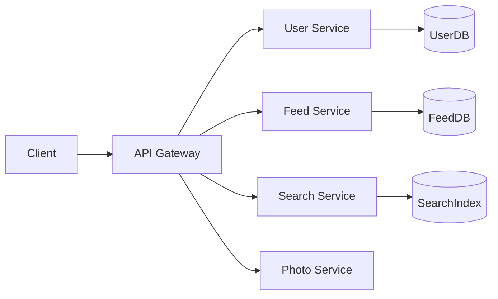

# 🧩 Microservices

> [!abstract] TL;DR
> **Microservices** decompose an application into small, independently deployable services that each own a specific business capability and communicate via APIs or messaging queues.

## 🧠 Core Idea

**Microservices** are a system architecture style where an application is built as a **suite of small, independently deployable, modular services**.

Each service:
- Runs as its **own process**
- Owns a **specific business capability**
- Communicates via **lightweight APIs or messaging**

> Goal: **Build systems that scale, evolve, and deploy independently.**

---

## 📖 Definition

Microservices can be described as:

> A collection of loosely coupled services that are independently deployable and communicate through well-defined interfaces to achieve business goals.

This concept directly evolves from the **Application Layer (Platform Layer)** separation.

---

## 🏗️ Example (Pinterest)

Pinterest could be decomposed into microservices such as:

- User Profile Service  
- Follower Service  
- Feed Service  
- Search Service  
- Photo Upload Service  

Each service:
- Has its own database  
- Can be scaled independently  
- Can be deployed without affecting others  

---

## 🎯 Why Microservices Matter

- Independent deployment  
- Horizontal scalability  
- Faster development cycles  
- Fault isolation  
- Technology flexibility per service  

---

## ⚙️ Key Characteristics

- Single Responsibility per service  
- Decentralized data management  
- API or message-based communication  
- Automated deployment pipelines  
- Service discovery mechanisms  

---

## 🧩 Typical Microservices Architecture

```
Client → API Gateway → Microservices → Databases / Caches
                  ↓
            Service Discovery
```

---

## ✅ Advantages

- High scalability  
- Faster feature delivery  
- Easier maintenance  
- Fault isolation  
- Teams work independently  

---

## ⚠️ Disadvantages

- Increased operational complexity  
- Requires DevOps & CI/CD maturity  
- Needs monitoring and distributed tracing  
- Network latency between services  
- Data consistency challenges  

---

## 🧠 Design Insight

```
Monolith → Simple Start
Microservices → Scalable Growth
```

Most large systems begin as monoliths and evolve into microservices when scale demands it.

---

## 🖼️ Diagram



---

## 🔗 Related Topics

[[Application Layer]]  
[[API Gateway]]  
[[Service Discovery]]  
[[Event-Driven Architecture]]  
[[Scalability]]  
[[Distributed Systems]]

---

## 📚 Sources

- AWS — What are Microservices  
  https://aws.amazon.com/microservices/

- Wikipedia — Microservices  
  https://en.wikipedia.org/wiki/Microservices

- Martin Fowler — Microservices  
  https://martinfowler.com/articles/microservices.html

---

## Related Concepts

- [[_MOC_ApplicationLayer|↑ Section MOC]]
- [[Application Layer]]
- [[Service Discovery]]
- [[Load Balancers]]
- [[Databases]]
- [[Caching]]

---

## Review Questions

1. What is the core principle behind microservices architecture?
2. How does an API gateway simplify client communication in a microservices system?
3. What are two common challenges when transitioning from a monolith to microservices?

---

## 🏷️ Tags

#SystemDesign #Microservices #Architecture #Scalability
