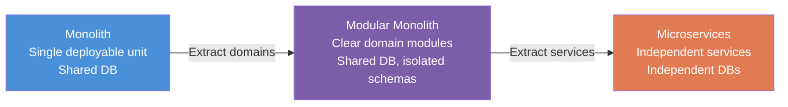

# 🏗️ Monolith vs Microservices

> [!abstract] TL;DR
> Monolith vs microservices is not a binary choice — it's a spectrum. Start with a well-structured monolith (the "Majestic Monolith"). Microservices add independent scaling and deployment but at the cost of distributed systems complexity. The right choice depends on team size, domain complexity, and scaling needs — not on what's trendy. Shopify and Stack Overflow serve millions of users on a monolith.

## Intuition — Analogy First

**Monolith = a Swiss Army knife.** One tool, does everything. Simple to carry, easy to use. Effective up to a point. But if you need a professional chef's knife and a proper saw simultaneously, you're stuck.

**Microservices = a professional kitchen.** Every chef (team) has specialised tools and full autonomy over their station (service). The kitchen scales — hire more sushi chefs without affecting the pastry station. But now you need a kitchen manager (orchestration), standardised communication protocols, and significantly more coordination overhead.

**Modular Monolith = a well-organised toolbox.** Each tool lives in its labelled compartment (module with clear domain boundaries). Still one toolbox to carry, but the internals are clean enough that you could eventually give each compartment to a specialist — extracting to microservices later without a complete rewrite.

The key insight: **Conway's Law** — your architecture will mirror your org structure. 5 engineers on one team = one deployable unit makes sense. 5 teams of 20 engineers = independent deployable units per team makes sense.

## How It Works

**The Spectrum:**

**Monolith characteristics:**
- Single deployable artifact (one JAR, one Docker image, one process)
- Shared database — all modules read/write to the same DB
- In-process function calls between modules (no network overhead)
- Single shared memory space — easy to share data structures
- One codebase — atomic refactoring, easy IDE navigation, one build pipeline

**Microservices characteristics:**
- Each service deploys independently (separate CI/CD pipelines, separate Docker images)
- Database per service — no shared data store; each service owns its data
- Network calls between services (HTTP, gRPC, message queues)
- Independent tech stacks possible (polyglot)
- Team autonomy — the payments team deploys without coordinating with the user team

**Modular Monolith (the sweet spot):**
- Single deployable unit (still a monolith operationally)
- Clear module boundaries enforced by code: each module has a public API (interfaces), no cross-module direct DB access
- Separate DB schemas per module (even if same DB server)
- Modules communicate via well-defined interfaces (not direct function calls to implementation details)
- The payoff: when it's time to extract a module to a microservice, the boundaries are already defined

**The Distributed Systems Tax you pay with microservices:**

| Problem | Monolith | Microservices |
|---|---|---|
| Data consistency | ACID transactions across entire domain | Eventual consistency, Saga pattern, distributed transactions |
| Testing | Unit + integration tests in one repo | Service contracts, consumer-driven contract testing, integration environment |
| Local development | `./run.sh` and you're done | Run 10+ services locally (docker-compose, minikube) |
| Debugging | Single log stream, stack traces | Distributed tracing required (Jaeger, Zipkin, Datadog) |
| Latency | In-process function call (nanoseconds) | Network call (1–50ms), with retries and timeouts |
| Deployment | One deploy pipeline | One pipeline per service; orchestrated releases for breaking changes |

## Real-World Systems

| Company | Architecture | Notes |
|---|---|---|
| **Shopify** | Modular Rails monolith | Serves millions of merchants; uses "component boundaries" — actively resists microservices fragmentation |
| **Stack Overflow** | Monolith (ASP.NET) | 9 servers handle ~1.3B page views/month; famous example of monolith at scale |
| **Amazon** | Migrated to microservices 2001–2010 | Forced by the 2-pizza team rule and inability to deploy independently |
| **Netflix** | Migrated to microservices 2009–2016 | Moved from DVD monolith to streaming microservices; created Hystrix, Eureka in the process |
| **Basecamp/HEY** | Modular Rails monolith | DHH (Rails creator) famously advocates for majestic monoliths |
| **Uber** | Migrated, then partially reversed | Went from monolith → microservices (2000+ services) → now consolidating some services due to complexity |

## Trade-offs

| Dimension | Monolith | Microservices |
|---|---|---|
| **Scaling** | Scale entire app — wasteful if one component is the bottleneck | Scale individual services independently |
| **Deployment** | Deploy the whole app for any change | Deploy one service independently — faster, lower risk |
| **Development velocity (early)** | Faster — no API contracts, no inter-service complexity | Slower — contract design, mock services, distributed tracing from day one |
| **Development velocity (at scale)** | Slower — large codebases, long build times, team coordination overhead | Faster — teams operate independently |
| **Operational complexity** | Low — one process to monitor and debug | High — service mesh, distributed tracing, multiple DB clusters |
| **Data consistency** | Easy — ACID transactions across the whole domain | Hard — eventual consistency, Saga pattern |
| **Technology flexibility** | Low — one stack | High — polyglot possible |
| **Fault isolation** | Low — one bug can take down everything | High — one service crashing doesn't kill others (with circuit breakers) |

## When to Use vs Avoid

**Start with a monolith when:**
- Early-stage product — you don't know your domain boundaries yet (premature decomposition is worse than a monolith)
- Small team (< 5-10 engineers) — microservices overhead exceeds the coordination savings
- Domain is not yet well-understood — boundaries drawn wrong are expensive to undo
- You need to move fast and iterate on the product (not the architecture)

**Move toward microservices when:**
- Team is growing to the point where a single codebase creates coordination bottlenecks
- You have clear, stable domain boundaries (users, payments, inventory, notifications are well-defined)
- Different parts of the system have very different scaling requirements
- Independent deployment cadence is blocked by a shared monolith release cycle
- Regulatory/compliance boundaries require data isolation (PCI for payments, HIPAA for health data)

**The rule of thumb:** If you wouldn't hire 3 separate teams to own 3 separate services, you don't need those 3 services to be separate.

## Common Pitfalls

1. **Premature decomposition** — splitting a monolith before you understand domain boundaries produces a "distributed monolith" — all the complexity of microservices with none of the independence, because services are still tightly coupled via synchronous calls or a shared DB.
2. **Distributed monolith** — microservices that require coordinated deploys (service A's new API requires service B to deploy simultaneously). True independence means backward-compatible APIs and consumer-driven contracts.
3. **Nanoservice anti-pattern** — too many services with too little responsibility (a service that does only one DB query). Network overhead and operational complexity for minimal benefit.
4. **Skipping the modular monolith phase** — jumping from big-ball-of-mud monolith directly to microservices without clean boundaries first. Extract clean modules in the monolith before extracting services.
5. **Microservices as a silver bullet** — engineering teams choosing microservices for prestige rather than necessity. "We're building Netflix architecture for a product with 100 users."
6. **Not accounting for the distributed systems tax** — teams underestimate the work: service discovery, distributed tracing, contract testing, saga orchestration, eventual consistency. Budget 2-3x engineering time for the same features.

## Related Concepts

- [[_MOC_Application_Layer|↑ Section MOC]]
- [[Microservices]] — deep dive on microservice design principles and patterns
- [[Strangler_Fig_Pattern]] — the safe migration strategy from monolith to microservices
- [[Service_Discovery]] — essential infrastructure that microservices depend on
- [[API_Gateway]] — the front door for microservice architectures
- [[CAP_Theorem]] — distributed databases (required by microservices) force CAP trade-offs that monoliths avoid
- [[BFF_Pattern]] — Backend for Frontend, commonly used in microservice-based systems

## Review Questions

1. **Your startup has 8 engineers and a 2-year-old Rails monolith that's getting slow to deploy. Should you migrate to microservices? What would you recommend?**
   *Not yet — 8 engineers can own a modular monolith effectively. Recommendation: introduce module boundaries inside the Rails app first (engines or well-defined namespaces), enforce no cross-module DB access, and separate CI/CD stages for faster deploy validation. Revisit microservices when team grows past 20-30 engineers or a specific domain (e.g., payments) has strong isolation requirements.*

2. **What is a "distributed monolith" and why is it considered worse than either a monolith or true microservices?**
   *A distributed monolith has the network overhead and operational complexity of microservices but still requires coordinated deploys because services are tightly coupled (shared DB, synchronous API dependencies, no versioning). You get the cons of both architectures and the pros of neither.*

3. **Amazon famously decomposed their monolith into services. What organisational change accompanied this technical change?**
   *The "2-pizza team" rule — each service is owned by a team small enough to be fed by two pizzas (6-10 people). Team structure drove service structure (Conway's Law in practice). Each team had full ownership of design, build, deploy, and operate for their service.*

## Sources

- [Majestic Monolith — DHH (2016)](https://m.signalvnoise.com/the-majestic-monolith/)
- [Microservices — Martin Fowler & James Lewis](https://martinfowler.com/articles/microservices.html)
- [Don't Start with Microservices — Arnon Rotem-Gal-Oz](https://www.youtube.com/watch?v=qw2SK4ockj8)
- [Shopify's Modular Monolith](https://shopify.engineering/shopify-monolith)
- Building Microservices — Sam Newman (O'Reilly)

#SystemDesign #Monolith #Microservices #ModularMonolith #Architecture #DistributedSystems
