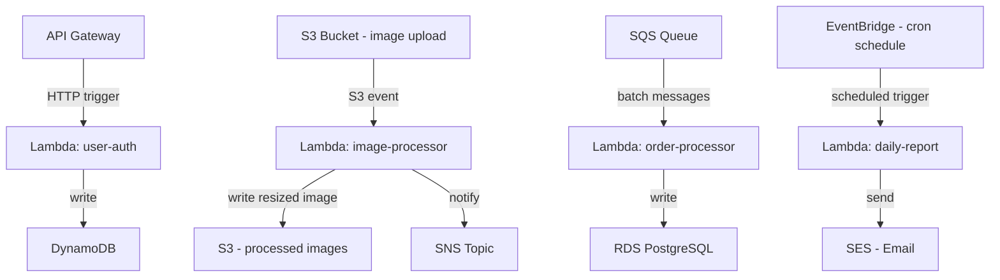

# ⚡ Serverless Architecture

> [!abstract] TL;DR
> Serverless means "run code without managing servers" — the provider handles provisioning, scaling, and availability. Functions scale to zero when idle (pay-per-execution), scale up to thousands of instances automatically, and execute in response to events. The trade-off: cold starts, 15-minute max timeout, and no persistent state. Best for event-driven async workloads, not long-running or latency-sensitive services.

## Intuition — Analogy First

Imagine electricity usage in a hotel room. You don't provision a dedicated power plant for your room — you flip a switch, electricity flows instantly, and you pay only for what you used. When you leave, the power stops; you're not billed for idle time.

Traditional servers = renting a dedicated generator that runs 24/7 whether you use it or not.

Serverless = hotel room electricity — infinite capacity on demand, zero cost when idle, billed per kilowatt-hour (per request execution).

The catch: the first time you flip the switch in a new room, there's a tiny delay while the circuit is initialised — that's the **cold start**. Once it's warm, it's instant.

## How It Works

**Execution model:**
1. An event triggers the function (HTTP request, S3 upload, SQS message, scheduled cron)
2. The provider (AWS Lambda) allocates a container (execution environment) for your function
3. Your function runs, processes the event, and returns a result
4. The container is kept "warm" briefly; if no new events arrive, it's destroyed (scale to zero)
5. On the next invocation, either a warm container handles it (fast) or a new one is initialised (cold start)

**Cold Start Problem:**
A cold start occurs when no warm execution environment exists. The provider must:
- Allocate a container
- Download your function package
- Initialise the runtime (JVM startup: 500ms–2s; Node.js: 100–200ms; Python: 100–300ms; compiled Go/Rust: <50ms)

Cold starts are most painful for:
- JVM-based languages (Java, Kotlin, Scala) — JVM startup dominates
- Large deployment packages (> 50MB) — download time matters
- Low-traffic functions that rarely get warm hits

Mitigations: Provisioned Concurrency (Lambda keeps N warm containers — pay for idle), lighter runtimes (Node.js/Python > JVM), smaller deployment packages.

**FaaS vs BaaS:**
- **FaaS (Function as a Service)** — you write the code, provider runs it. AWS Lambda, Google Cloud Functions, Azure Functions, Cloudflare Workers.
- **BaaS (Backend as a Service)** — fully managed backend capabilities: Firebase (auth + real-time DB), AWS Amplify, Supabase. No server code at all — frontend talks directly to managed services.

**AWS Lambda specifics:**
- Max timeout: 15 minutes
- Memory: 128MB – 10GB (CPU scales proportionally with memory)
- Concurrent executions: 1000 per account per region (soft limit, can be raised)
- Deployment package: 50MB zipped, 250MB unzipped (or use container images up to 10GB)
- Free tier: 1M requests/month + 400,000 GB-seconds compute

## Real-World Systems

| Company | Use Case |
|---|---|
| **Netflix** | Uses Lambda for encoding pipeline triggers — S3 upload → Lambda → kicks off media encoding jobs |
| **Airbnb** | Image processing pipeline: guest uploads photo → Lambda → resize/compress → CDN |
| **Capital One** | Migrated nightly batch processing jobs from EC2 cron servers to Lambda — reduced ops overhead |
| **Coca-Cola** | Vending machine telemetry — each vending machine event triggers Lambda, eliminating always-on servers for sporadic data |
| **Nordstrom** | Event-driven inventory updates — inventory change events trigger Lambda to update downstream systems |

## Trade-offs

| Dimension | Pros | Cons |
|---|---|---|
| **Cost** | Pay per execution — zero cost at zero traffic | Can be expensive at very high, sustained throughput (vs always-on EC2) |
| **Scaling** | Auto-scales to 1000s of concurrent executions automatically | Concurrency limits can cause throttling; scaling RDS connections is problematic |
| **Operations** | No server patching, OS management, capacity planning | Limited visibility into execution environment; debugging is harder |
| **Development speed** | Deploy a function in minutes; no infra code | Functions can become entangled; "Lambda monolith" anti-pattern |
| **Cold starts** | Non-issue for async/background workloads | Unacceptable for real-time, user-facing APIs requiring < 50ms latency |
| **State** | Forces stateless design (good discipline) | No persistent connections — bad for WebSockets, DB connection pools |
| **Timeout** | Encourages small, focused functions | 15-min max blocks long-running jobs (use Step Functions or ECS instead) |

## When to Use vs Avoid

**Use when:**
- Async/event-driven processing: image resizing, email sending, webhook handlers, stream processing
- Sporadic/unpredictable traffic: internal tools, reporting jobs, IoT telemetry
- Scheduled jobs (cron): nightly reports, cleanup tasks, data sync
- Glue code: connecting two services (S3 upload → transform → DynamoDB write)
- Rapid prototyping: deploy backend logic without infrastructure setup

**Avoid when:**
- Long-running jobs > 15 minutes (use ECS Fargate, Step Functions, or Kubernetes)
- Consistent high-throughput: sustained 10k+ RPS is often cheaper on EC2/K8s
- WebSocket or persistent connections (use dedicated servers or API Gateway WebSocket + DynamoDB)
- Low-latency requirements where cold starts are unacceptable (< 50ms P99)
- Workloads requiring large local storage or GPU (use EC2 with GPU instances)

## Common Pitfalls

1. **Lambda monolith** — putting all logic in one large Lambda function. Defeats the purpose. Split by domain/event type into focused functions.
2. **Ignoring concurrency limits for database connections** — Lambda can spawn 1000 concurrent instances, each opening a DB connection. RDS can handle ~100-500 connections. Solution: use RDS Proxy (connection pooling) or DynamoDB.
3. **Synchronous fan-out without async decoupling** — Lambda calling Lambda synchronously in a chain. One slow function blocks the chain and you pay for idle wait time. Use SQS/SNS between functions.
4. **Not setting reserved concurrency** — a runaway Lambda can consume all account concurrency, throttling other functions. Set reserved concurrency limits per function.
5. **Package size creep** — large node_modules or Python packages increase cold start times and S3 download time. Use Lambda Layers for shared dependencies.
6. **Treating Lambda like a microservice for stateful workloads** — no file system, no persistent connections, no shared memory between invocations. All state must be externalised (DynamoDB, ElastiCache, S3).

## Related Concepts

- [[_MOC_Application_Layer|↑ Section MOC]]
- [[Kubernetes_for_SD]] — the alternative for containerised workloads; use K8s for long-running services, Lambda for event-driven functions
- [[Event_Driven_Architecture]] — serverless functions are the natural compute layer for event-driven systems
- [[API_Gateway]] — the primary HTTP trigger for Lambda; pairs with Lambda to build REST/HTTP APIs
- [[Monolith_vs_Microservices]] — serverless is a third option on the spectrum: nano-services per function
- [[Background_Jobs]] — Lambda is a natural fit for background job execution

## Review Questions

1. **When would you choose Lambda over a containerised service in K8s? What are the deciding factors?**
   *Lambda for: sporadic traffic, event-driven processing, < 15-min jobs, rapid iteration. K8s for: sustained high traffic, long-running processes, WebSocket connections, latency-sensitive workloads, or when cold starts are unacceptable. Key factors: traffic pattern (bursty vs steady), latency requirements, job duration, DB connection patterns.*

2. **A user-facing API has P99 latency of 200ms. You're asked to migrate it to Lambda. What concerns would you raise?**
   *Cold start risk: infrequently called endpoints will have 200ms–1s cold starts, blowing the latency budget. Mitigations: Provisioned Concurrency (expensive), switch to lighter runtime (Node.js/Go), keep functions warm with synthetic pings. Also: no persistent DB connections — need RDS Proxy. Overall, K8s/ECS is a better fit for latency-sensitive APIs.*

3. **You have a Lambda function that processes messages from SQS. Traffic spikes from 10 msg/s to 10,000 msg/s. What happens, and how do you handle it?**
   *Lambda scales automatically, but may hit the account concurrency limit (default 1000). If DB is behind it (RDS), 1000 concurrent Lambdas will exhaust connection pool. Solutions: set reserved concurrency + SQS visibility timeout to control processing rate; use RDS Proxy for connection pooling; or switch to DynamoDB which handles high concurrency natively.*

## Sources

- [AWS Lambda Developer Guide](https://docs.aws.amazon.com/lambda/latest/dg/welcome.html)
- [AWS Lambda Power Tuning](https://github.com/alexcasalboni/aws-lambda-power-tuning)
- [Serverless Architectures — Martin Fowler](https://martinfowler.com/articles/serverless.html)
- [The Cold Start Problem — AWS re:Invent 2022](https://www.youtube.com/watch?v=oQFORsso2go)
- Cloud Native Patterns — Cornelia Davis

#SystemDesign #Serverless #FaaS #AWSLambda #EventDriven #Scaling #CloudArchitecture
