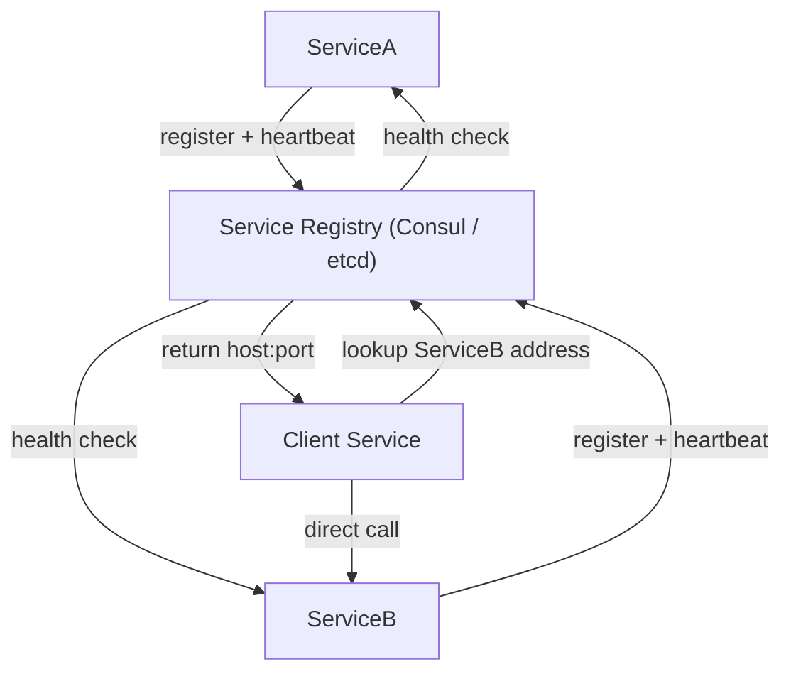

# 🔍 Service Discovery

> [!abstract] TL;DR
> **Service discovery** lets services in distributed systems dynamically register and locate each other without hardcoded addresses, using a registry like Consul or etcd that tracks health in real time.

## 🧠 Core Idea

In a **microservices or distributed system**, services need a way to **find and communicate with each other**.

**Service Discovery** provides a mechanism for services to:
- Register their location (name, address, port)
- Discover other services dynamically
- Handle scaling and failures transparently

> Goal: **Enable services to locate each other without hardcoding network addresses.**

---

## 📖 Definition

Service Discovery systems maintain a **registry** of available services, including:

- Service name  
- IP address  
- Port  
- Health status  

When a service starts, it **registers itself**.  
When it stops or fails, it is **removed from the registry**.

Other services query the registry to find where to send requests.

---

## 🏗️ Typical Architecture

```
Service Instance → Service Registry ← Client / Other Services
        ↑                ↓
   Health Checks     Discovery Requests
```

---

## ⚙️ Popular Service Discovery Tools

- **Consul**  
- **Etcd**  
- **Zookeeper**  

### Common Features
- Service registration
- Service lookup
- Built-in health checks
- Distributed key-value store

---

## 🩺 Health Checks

Health checks verify that registered services are still working.

- Often exposed via an **HTTP endpoint**
- Unhealthy services are removed from registry
- Prevents routing traffic to failed services

---

## 🗄️ Built-in Key-Value Stores

Both **Consul** and **Etcd** provide KV stores that can be used for:

- Configuration values  
- Shared metadata  
- Feature flags  

This avoids hardcoding configuration in services.

---

## 🎯 Why Service Discovery Matters

- Enables **dynamic scaling**
- Supports **fault tolerance**
- Removes hardcoded service endpoints
- Essential for **microservices architectures**
- Simplifies deployment in cloud environments

---

## ⚠️ Challenges

- Adds operational complexity  
- Requires high availability of the registry itself  
- Needs secure service-to-service communication  

---

## 🧠 Design Insight

```
Monolith → No discovery needed
Microservices → Service Discovery is essential
```

---

## 🖼️ Diagram



---

## 🔗 Related Topics

[[Microservices]]  
[[API Gateway]]  
[[Load Balancers]]  
[[Health Checks]]  
[[Distributed Systems]]

---

## 📚 Sources

- System Design Primer — Service Discovery  
  https://github.com/donnemartin/system-design-primer#Service-Discovery

- Wikipedia — Service-Oriented Architecture  
  https://en.wikipedia.org/wiki/Service-oriented_architecture

---

## Related Concepts

- [[_MOC_ApplicationLayer|↑ Section MOC]]
- [[Microservices]]
- [[Load Balancers]]
- [[Application Layer]]
- [[Horizontal Scaling]]
- [[Load Balancing Algorithms]]

---

## Review Questions

1. What problem does service discovery solve in a microservices environment?
2. What is the difference between client-side and server-side service discovery?
3. Name two popular tools used for service discovery and health checking.

---

## 🏷️ Tags

#SystemDesign #ServiceDiscovery #Microservices #DistributedSystems
