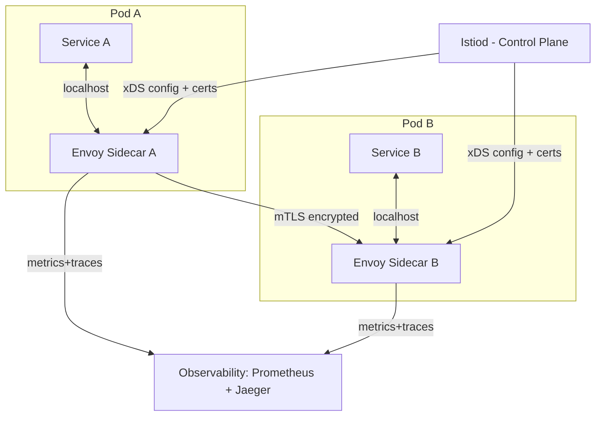

# 🕸️ Service Mesh

> [!abstract] TL;DR
> A service mesh is a dedicated infrastructure layer that handles all service-to-service communication in a microservices architecture. It injects lightweight proxy sidecars (Envoy) alongside every service pod, intercepting all network traffic to provide mutual TLS, load balancing, circuit breaking, retries, distributed tracing, and traffic shaping — without any changes to application code.

## Intuition — Analogy First

Imagine a large corporation where hundreds of employees (services) need to communicate constantly. Without structure, they'd each need to implement their own: security badges (auth/TLS), meeting room booking (load balancing), "I'll try again later" protocols (retries), and reporting to management (tracing). Chaos.

A service mesh is like hiring a dedicated **office manager** for every employee — the manager handles all the bureaucratic overhead (security checks, routing, reporting), letting the employee focus purely on their actual job. The employee never changes their behaviour; the manager invisibly handles everything around them.

The "mesh" part: every service's manager is connected and coordinated by a central operations team (control plane), so policies apply uniformly across the entire company.

## How It Works

A service mesh has two distinct planes:

**Data Plane** — the Envoy sidecar proxies injected into every pod. They intercept all inbound and outbound traffic transparently (via iptables rules in Kubernetes). Envoy handles:
- mTLS termination and certificate rotation
- L7 load balancing (HTTP/gRPC-aware, not just TCP)
- Circuit breaking and outlier detection
- Automatic retries with backoff
- Request/response tracing headers (Zipkin/Jaeger)
- Traffic shaping (canary weights, header-based routing)

**Control Plane** — Istiod (in Istio) is the brain. It:
- Distributes certificates to all sidecars (acts as CA)
- Pushes routing rules (VirtualService, DestinationRule) to sidecars via xDS API
- Aggregates metrics and traces from all sidecars
- Enforces AuthorizationPolicies (which services can talk to which)

**Traffic flow:** Service A calls Service B. The call hits Envoy A (sidecar) instead of going directly. Envoy A encrypts it with mTLS, applies retry/timeout policy, injects tracing headers, and forwards to Envoy B. Envoy B decrypts, applies AuthorizationPolicy (is A allowed to call B?), and hands the request to Service B — all transparent to both services.

**Traffic shaping example:** A canary deploy sends 90% of traffic to Service B v1 and 10% to v2 via a DestinationRule weight configuration pushed from Istiod to all Envoy sidecars.

## Real-World Systems

| Company | Use Case |
|---|---|
| **Lyft** | Built Envoy (2016) to solve microservices networking at scale — the foundation of modern service meshes |
| **Google** | Created Istio to operationalise Envoy; runs internal services on a service mesh equivalent |
| **Airbnb** | Uses Envoy for traffic management, circuit breaking, and observability across 1000+ services |
| **Uber** | Uses Envoy-based service mesh for mTLS and traffic shaping across polyglot microservices |
| **Twitter** | Finagle (their own RPC library) pioneered many service mesh concepts before Envoy existed |

## Trade-offs

| Dimension | Pros | Cons |
|---|---|---|
| **Security** | mTLS zero-trust by default, no app code changes | Certificate management complexity |
| **Observability** | Automatic distributed tracing, golden signals for every service | High cardinality metrics can be expensive to store |
| **Reliability** | Circuit breaking and retries handled centrally | Extra network hop per request (Envoy is in-process, ~1ms overhead) |
| **Ops overhead** | Uniform policy enforcement | Steep learning curve; Istio has hundreds of CRDs |
| **Debugging** | Traffic visible in mesh telemetry | Two-layer debugging: app layer + mesh layer |
| **Latency** | Negligible for most workloads (~0.1-1ms per hop) | Adds up in high-frequency internal calls |

## When to Use vs Avoid

**Use when:**
- You have 10+ microservices with complex inter-service communication
- Zero-trust security (mTLS) is a compliance requirement
- You need traffic shaping for canary deployments without deploying new load balancers
- Debugging distributed systems — the automatic tracing is invaluable
- Polyglot environment where implementing cross-cutting concerns in each language is unscalable

**Avoid when:**
- Small number of services (< 5-10) — operational overhead exceeds benefit
- Monolith or near-monolith architecture
- Latency-critical paths where every millisecond matters and you control the full stack
- Team lacks Kubernetes/Envoy expertise — the learning curve is real
- Simple internal services that don't need zero-trust security

## Common Pitfalls

1. **Treating the mesh as a magic fix** — mTLS only encrypts service-to-service traffic; you still need to secure your ingress, databases, and external APIs separately.
2. **Misconfigured retries causing amplification** — retry-on-failure at every hop multiplies load during outages. Always set retry budgets and circuit breakers together.
3. **Ignoring cold-start certificate distribution** — on pod startup, the sidecar needs to fetch a cert from Istiod before it can accept mTLS. This causes startup delays if Istiod is unavailable.
4. **Overlapping mesh + application-layer resilience** — if your app already implements retries and the mesh also retries, a single failure can trigger exponential retry storms.
5. **Not using `PeerAuthentication` in STRICT mode** — if mTLS is in PERMISSIVE mode (allows plaintext), you haven't actually achieved zero-trust; you've just added complexity.
6. **Sidecar resource overhead at scale** — each Envoy sidecar consumes ~50-100MB RAM. At 1000 pods, that's 50-100GB just for proxies.

## Related Concepts

- [[_MOC_Application_Layer|↑ Section MOC]]
- [[Sidecar_Pattern]] — the architectural pattern that service meshes are built on
- [[Microservices]] — the architecture that makes service meshes necessary
- [[Service_Discovery]] — meshes provide service discovery via DNS and xDS protocol
- [[Kubernetes_for_SD]] — service meshes are almost always deployed on Kubernetes
- [[API_Gateway]] — handles north-south traffic (client → cluster); mesh handles east-west (service → service)
- [[Circuit_Breaker]] — circuit breaking is a core feature provided by the data plane

## Review Questions

1. **What is the difference between the data plane and control plane in a service mesh, and what does each component do?**
   *Data plane = Envoy sidecars that handle actual traffic (mTLS, retries, tracing). Control plane = Istiod that distributes configuration and certificates to sidecars via xDS.*

2. **How does a service mesh differ from an API Gateway? When would you use both?**
   *API Gateway handles north-south traffic (external clients to internal services) — one entry point. Service mesh handles east-west traffic (internal service to service). Use both: API Gateway at the edge for auth/rate-limiting, mesh internally for mTLS and observability.*

3. **A team has 5 microservices. Should they adopt a service mesh? What factors drive the decision?**
   *Likely no — the operational overhead of running Istio for 5 services usually exceeds the benefit. Better to implement retries/timeouts in the application layer. Revisit when team/service count grows, or if compliance requires mTLS.*

## Sources

- [Envoy Proxy Architecture](https://www.envoyproxy.io/docs/envoy/latest/intro/arch_overview/intro/arch_overview)
- [Istio Architecture Docs](https://istio.io/latest/docs/ops/deployment/architecture/)
- [Lyft's Envoy blog post (2016)](https://eng.lyft.com/announcing-envoy-c-l7-proxy-and-communication-bus-92520b6c8191)
- [CNCF Service Mesh Landscape](https://landscape.cncf.io/card-mode?category=service-mesh)
- Designing Distributed Systems — Brendan Burns

#SystemDesign #ServiceMesh #Envoy #Istio #mTLS #Microservices #Infrastructure
