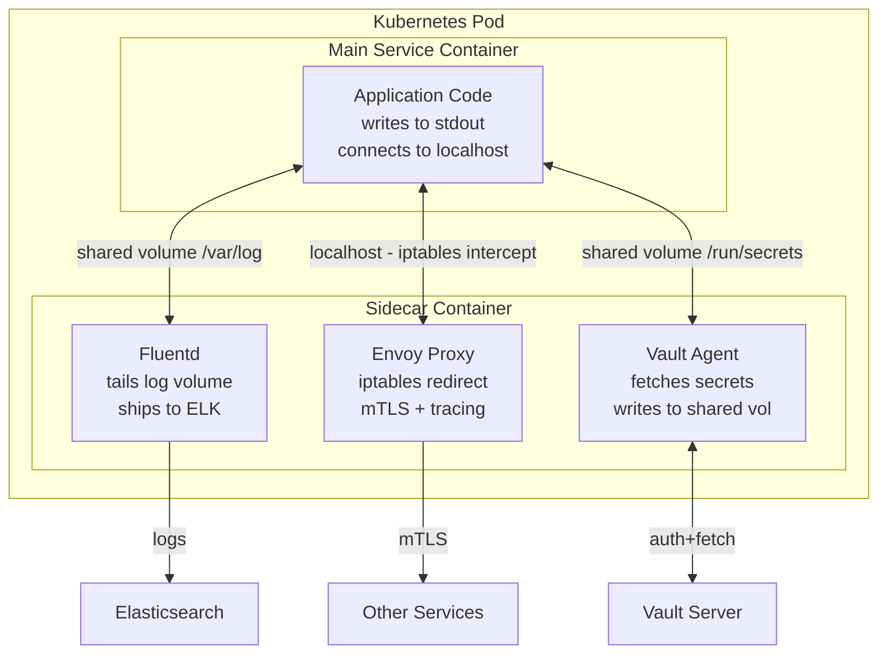

# 🏍️ Sidecar Pattern

> [!abstract] TL;DR
> The Sidecar pattern deploys a helper process alongside the main service in the same host or Kubernetes Pod, sharing the same network and filesystem. The sidecar handles cross-cutting operational concerns (logging, monitoring, proxying, config sync, certificate rotation) without any changes to the main service. The canonical example is the Envoy proxy sidecar in a service mesh — it intercepts all traffic transparently.

## Intuition — Analogy First

A **motorcycle sidecar** is the perfect metaphor (and where the name comes from). The driver (main service) focuses entirely on driving. The sidecar passenger (helper process) handles navigation, takes notes, manages the radio, watches for hazards — all the support functions that would distract the driver.

Key properties:
- The passenger shares the driver's journey (same network/filesystem namespace)
- Neither can exist without the other in this configuration — they're deployed as a unit
- The driver doesn't need to change how they drive — the sidecar simply adds capabilities
- You can attach any passenger to any motorcycle — the sidecar is reusable regardless of which team "drives"

This is the polyglot superpower: your Go service and your Java service can both get the same Python-based logging sidecar without any changes to their code.

## How It Works

In Kubernetes, a Sidecar is implemented as an additional container within the same Pod. Containers in a Pod share:
- **Network namespace** — they communicate via `localhost` and share the same IP address
- **IPC namespace** — inter-process communication
- **Volumes** — mounted filesystem paths

The sidecar intercepts or augments the main container's behaviour by sitting at the network or filesystem boundary.

**Common Sidecar Use Cases:**

**1. Proxy / Service Mesh (Envoy)**
Kubernetes injects Envoy as a sidecar automatically (via a MutatingAdmissionWebhook). iptables rules redirect all inbound/outbound traffic through Envoy. The main service never knows — it still connects to `localhost:8080` or external services by name, but Envoy transparently handles mTLS, retries, circuit breaking, and tracing.

**2. Log Shipping (Fluentd / Filebeat)**
Main service writes logs to a shared volume (or stdout). Fluentd sidecar tails the logs and ships them to Elasticsearch/Splunk/CloudWatch. No logging SDK needed in the main service — just write to stdout.

**3. Monitoring / Metrics (Prometheus Exporter)**
A sidecar exposes `/metrics` endpoint translating proprietary application metrics to Prometheus format. Useful for legacy apps that expose metrics in non-Prometheus formats (JMX, StatsD).

**4. Config/Secret Sync (Vault Agent)**
HashiCorp Vault Agent runs as a sidecar, authenticates to Vault, fetches secrets, and writes them to a shared in-memory volume. The main app reads secrets from the filesystem — no Vault SDK or API calls in application code.

**5. Certificate Rotation**
SPIFFE/SPIRE agent as a sidecar handles X.509 certificate rotation. Main service reads its cert from a mounted path; the sidecar refreshes it before expiry without any restart.

**Sidecar vs Init Container:**
Kubernetes also has Init Containers — they run to completion before the main container starts (setup tasks: DB migrations, config downloads). Sidecars run concurrently alongside the main container for the full lifecycle. Kubernetes 1.29+ introduced native Sidecar Container support (sidecars declared with `restartPolicy: Always` in the `initContainers` spec — they start before main containers and stay running throughout).

**Ambassador Pattern** — a specialised sidecar variant that acts as a proxy to external services, abstracting away service discovery, retries, and connection pooling for external dependencies (e.g., an ambassador sidecar that handles Redis Cluster topology changes transparently).

## Real-World Systems

| Company | Sidecar Usage |
|---|---|
| **Lyft** | Built Envoy as their internal sidecar proxy (2016); used as mTLS proxy + observability sidecar for every microservice |
| **Google** | Istio uses Envoy as the sidecar across Google's internal service infrastructure; Kubernetes itself was designed with the sidecar pattern in mind |
| **Datadog** | The Datadog Agent is deployed as a sidecar (or DaemonSet) to collect metrics, traces, and logs without modifying application code |
| **HashiCorp** | Vault Agent sidecar is the recommended way to deliver secrets to Kubernetes workloads — avoids embedding Vault SDK in every app |
| **AWS** | AWS Distro for OpenTelemetry runs as a sidecar collector, gathering traces/metrics from the main container and forwarding to X-Ray/CloudWatch |

## Trade-offs

| Dimension | Pros | Cons |
|---|---|---|
| **Separation of concerns** | Operational logic (logging, tracing) separate from business logic | Pod complexity — two containers to configure, monitor, and troubleshoot |
| **Polyglot support** | Same sidecar works for any language/framework | Cannot be used when containers can't share a network namespace (e.g., Windows containers on some platforms) |
| **Reusability** | One Envoy sidecar image serves all services | Version management — updating the sidecar requires rolling restart of all pods |
| **Transparency** | Main app code unchanged — zero intrusion | iptables-based interception can be opaque; debugging requires sidecar knowledge |
| **Resource overhead** | Minimal footprint for logging/config sidecars | Proxy sidecars (Envoy) add 50–100MB RAM per pod; latency overhead (~0.2ms) |
| **Deployment coupling** | Sidecar lifecycle tied to pod — always available | Main container crash restarts the pod, restarting the sidecar too |

## When to Use vs Avoid

**Use when:**
- Cross-cutting operational concerns (observability, security, config) need to be applied uniformly across polyglot services
- You want to add capabilities (logging, mTLS, metrics) to legacy services without modifying their code
- Your organisation standardises on a set of operational sidecars (every service gets Fluentd + Envoy + Vault Agent)
- Building a service mesh — sidecars are the fundamental unit of the data plane

**Avoid when:**
- Low resource environments where per-pod overhead is prohibitive (edge computing, IoT)
- Simple single-service deployments where the overhead of sidecar management isn't justified
- When the cross-cutting concern needs access to application internals (state, in-memory data) that can't be accessed via the network or filesystem interface — use a library instead
- Tight latency requirements where even 0.2ms proxy overhead matters (use library-based approaches like gRPC interceptors)

## Common Pitfalls

1. **Sidecar startup ordering** — Kubernetes doesn't guarantee sidecar starts before the main container. If the main app connects to a proxy sidecar (Envoy) before Envoy is ready, connections fail. Use `postStart` hooks, readiness probes, or native Sidecar Container feature (K8s 1.29+) to ensure ordering.
2. **Not scoping sidecar resource requests** — forgetting to set `resources.requests` and `limits` for the sidecar container means it competes with the main container for node resources. Always set limits for both containers.
3. **Sidecar image version sprawl** — if different teams pin different Envoy/Fluentd versions, you get a fleet of inconsistent sidecars. Use admission webhooks or a central sidecar injector to enforce versions.
4. **Logs written to sidecar vs main container stdout** — Kubernetes captures stdout of the main container as pod logs. If your Fluentd sidecar writes its own logs, they appear in pod logs alongside your app logs, creating noise. Configure Fluentd log verbosity carefully.
5. **Ambassador pattern confusion** — the Ambassador pattern (sidecar that proxies outbound traffic to external services) is often confused with Envoy's role in a service mesh. Ambassadors handle external service connections; Envoy handles internal service mesh traffic. Use both if needed.

## Related Concepts

- [[_MOC_Application_Layer|↑ Section MOC]]
- [[Service_Mesh]] — the service mesh is the most prominent and impactful application of the sidecar pattern at scale
- [[Kubernetes_for_SD]] — Pods are the Kubernetes primitive that enables the sidecar pattern (multi-container pods)
- [[Microservices]] — sidecar pattern solves the cross-cutting concerns problem that microservices create
- [[Service_Discovery]] — Envoy sidecars participate in service discovery via xDS API from the control plane

## Review Questions

1. **How does Envoy as a sidecar intercept traffic without the main application knowing? What Kubernetes mechanism enables this?**
   *Kubernetes injects an init container that installs iptables rules to redirect all inbound (port 15001) and outbound traffic through Envoy's listener ports. The main app connects normally to `service-b:8080` — the kernel silently redirects it through Envoy first. No application code change required.*

2. **What is the difference between a Sidecar pattern and an Init Container? Give an example use case for each.**
   *Init Container runs to completion before the main container starts — use for setup tasks like running DB migrations or downloading config. Sidecar runs concurrently with the main container for its entire lifecycle — use for ongoing concerns like log shipping, mTLS proxying, or secret rotation.*

3. **Your team runs 500 pods each with an Envoy sidecar using 80MB RAM. A proposal comes to replace the sidecar proxy with an in-process eBPF-based mesh. What trade-offs would you evaluate?**
   *Current cost: 500 × 80MB = 40GB RAM just for proxies. eBPF-based mesh (Cilium) reduces per-pod overhead but requires kernel version support and is harder to debug. Sidecar gives language-agnostic, easy-to-understand traffic control; eBPF is more efficient but more operational complexity. Evaluate: kernel version compatibility, team expertise, observed latency overhead, and whether 40GB represents meaningful cost in your infrastructure.*

## Sources

- [Sidecar Pattern — Microsoft Azure Architecture Patterns](https://docs.microsoft.com/en-us/azure/architecture/patterns/sidecar)
- [Kubernetes Sidecar Containers — KEP-753](https://github.com/kubernetes/enhancements/blob/master/keps/sig-node/753-sidecar-containers/README.md)
- [Envoy Proxy — Sidecar Architecture](https://www.envoyproxy.io/docs/envoy/latest/intro/deployment_types/service_to_service)
- [Ambassador Pattern — Cloud Design Patterns](https://docs.microsoft.com/en-us/azure/architecture/patterns/ambassador)
- Designing Distributed Systems — Brendan Burns (O'Reilly)

#SystemDesign #SidecarPattern #Envoy #Kubernetes #Microservices #ServiceMesh #Observability
