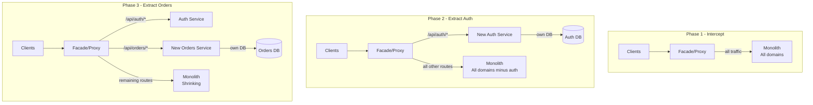

# 🌿 Strangler Fig Pattern

> [!abstract] TL;DR
> The Strangler Fig pattern migrates a legacy monolith to microservices incrementally — one domain at a time — without a risky "big bang" rewrite. A façade (API Gateway or reverse proxy) sits in front of both old and new systems, routing traffic to the new service for migrated domains while falling back to the monolith for everything else. The monolith slowly atrophies as more domains are extracted, until it can be switched off.

## Intuition — Analogy First

The **strangler fig** is a tropical vine that germinates in the canopy of an existing tree, sends roots down to the ground, and slowly wraps itself around the host tree. Over decades, the fig's roots completely envelop the original tree. When the host tree eventually dies and rots away, the strangler fig stands in its place — hollow inside where the original tree was, but fully self-supporting.

The analogy is precise:
- **Original tree = legacy monolith** — it supports the vine during the transition
- **Strangler fig = new microservices** — grows around the existing system, domain by domain
- **Fig's roots reaching the ground = new services going live** — each new service handles real traffic
- **Host tree dying = monolith being decommissioned** — it atrophies as routes are removed
- The key: **both systems coexist during migration** — you never go dark for a complete rewrite

Martin Fowler named and documented this pattern in 2004, inspired by seeing strangler figs in Australia.

## How It Works

The migration proceeds in three phases, repeated per domain:

**Phase 1 — Intercept:** Install a façade (API Gateway, Nginx, or a dedicated routing proxy) in front of the monolith. All traffic initially passes through to the monolith unchanged. This is a pure infrastructure change — no behaviour change.

**Phase 2 — Build and Route:** Identify one bounded domain (e.g., user authentication). Build a new standalone service for this domain. Configure the façade to route requests for `/api/auth/*` to the new service, while all other routes still go to the monolith. Deploy both systems simultaneously.

**Phase 3 — Atrophy:** The monolith's auth module is now receiving zero traffic. Remove auth code from the monolith (or disable it). Repeat Phase 2 for the next domain.

**Phase 4 — Decommission:** When all domains have been extracted, the monolith handles no traffic. Remove it. Remove the façade if no longer needed (or keep it as an API Gateway).

**Anti-Corruption Layer (ACL):**
When the new service needs data from the monolith (or vice versa) during the transition, an ACL translates between the old and new data models. This prevents the new service from inheriting the monolith's data model — a clean cut. Over time, the ACL is removed as the monolith is retired.

**Feature Toggles:**
Used to gradually shift traffic — start with 1% of requests to the new service, ramp to 10%, 50%, 100% as confidence grows. Works well with the façade routing layer.

**Data Migration:**
The hardest part. Options:
1. **Dual-write:** New service writes to both its own DB and the monolith's DB (for a transition period)
2. **Change Data Capture (CDC):** Stream changes from monolith DB to new service's DB via Debezium
3. **Sync service:** A temporary service that keeps both DBs in sync until the cutover

## Real-World Systems

| Company | Migration Story |
|---|---|
| **Amazon** | 2001–2010: migrated from a Perl/C++ monolith to services. The "two-pizza team" rule drove decomposition. Used internal façades (the SOA layer) to incrementally route traffic to new services. |
| **Booking.com** | Ongoing migration from a giant Perl monolith. Uses the strangler pattern — new features go into new services while old Perl code is incrementally retired. |
| **Airbnb** | Migrated from a Ruby on Rails monolith (Monorail) to SOA/microservices. Used Airflow and their own "SOA migration" infrastructure to incrementally route traffic. |
| **Etsy** | Maintains a PHP monolith ("Etsyweb") while extracting services. Actively avoids full rewrite — uses strangler approach for new domains. |
| **ThoughtWorks** | Documents client migrations using this pattern; Fowler's original paper came from observing real migrations at client sites. |

## Trade-offs

| Dimension | Pros | Cons |
|---|---|---|
| **Risk** | Incremental — rollback to monolith if new service fails | Running two systems simultaneously increases operational burden |
| **Business continuity** | No downtime — both systems live throughout migration | Feature development may slow during migration period |
| **Scope** | Work on one domain at a time — manageable scope | Migration can take years for large monoliths |
| **Learning** | Each extraction teaches the team before tackling the next domain | Maintaining two data stores in sync is complex |
| **Confidence** | Validate each service in production before extracting the next | The façade becomes a critical piece of infrastructure |
| **Flexibility** | Can pause/accelerate migration based on business priorities | Requires strong discipline — partial migrations can linger indefinitely |

## When to Use vs Avoid

**Use when:**
- You need to modernise a legacy monolith that's actively serving production traffic (you can't take it offline for a rewrite)
- The monolith is too large or risky to rewrite in one go (big bang rewrites fail ~80% of the time)
- Business continues to require feature development during migration — strangler lets both happen simultaneously
- The team needs to build confidence with new architecture before committing fully

**Avoid when (use a different migration strategy):**
- The monolith is so deeply coupled that there are no clear domain boundaries to extract one at a time — you need to untangle it first (modularise the monolith)
- The monolith uses a technology that's fundamentally incompatible with a façade (proprietary protocols, non-HTTP communication)
- The business can afford a clean-cut rewrite (greenfield system, small codebase, acceptable downtime window) — go direct to microservices
- The team lacks the discipline to commit to the incremental process — half-finished strangler migrations are worse than staying on the monolith

## Common Pitfalls

1. **Never decommissioning the monolith** — teams extract a few services and then stop. The monolith lives on indefinitely, "strangled" but not dead. Define a decommission date upfront for each extracted domain; treat the empty module as technical debt.
2. **Extracting the wrong domain first** — start with a domain that is: well-understood, low risk, low coupling to other domains, and not in active heavy development. Authentication, notifications, and reporting are common good first candidates.
3. **Shared database** — new service writes to the monolith's DB "temporarily." This creates permanent coupling. Insist on the new service owning its own data store from day one, with a time-bounded dual-write or CDC sync.
4. **Façade becoming a bottleneck** — if the façade is a single Nginx instance with hand-edited config, it becomes a fragile deployment blocker. Use a proper API Gateway (Kong, AWS API Gateway) with infrastructure-as-code routing rules.
5. **Copying the monolith's bad design** — new services that replicate the monolith's data model, naming conventions, or tight coupling. Use the Anti-Corruption Layer to ensure the new service has a clean design, even if it must translate to/from the old model.
6. **No clear ownership of migration work** — strangler migrations fail when they're treated as background work with no dedicated team. Assign an explicit migration team with clear sprint commitments.

## Related Concepts

- [[_MOC_Application_Layer|↑ Section MOC]]
- [[Monolith_vs_Microservices]] — the strategic context: when to migrate and why
- [[Microservices]] — the target architecture of the strangler migration
- [[API_Gateway]] — the typical façade implementation for HTTP-based services
- [[BFF_Pattern]] — often implemented alongside the strangler façade for client-specific routing

## Review Questions

1. **A team is migrating a 10-year-old e-commerce monolith with 500,000 lines of code to microservices. They're debating starting with the payments domain. Would you advise this? Why or why not?**
   *Generally a poor choice for first extraction. Payments is high-risk (financial data, PCI compliance), high-coupling (touches orders, users, inventory), and mistakes have real business consequences. Start with lower-risk domains: notifications, search, reporting, or user preferences. Extract payments only after the team has built confidence with the pattern and tooling on lower-stakes domains.*

2. **What is the purpose of an Anti-Corruption Layer in a strangler migration, and when can you remove it?**
   *The ACL translates between the monolith's data model and the new service's clean domain model, preventing the new service from inheriting legacy naming/structure. It sits between the new service and any integration point with the old system. Remove it when the monolith no longer exists (or the integrated module is fully decommissioned) and the new service's model is the only model in use.*

3. **How does dual-write work during data migration, and what consistency problem does it introduce?**
   *Dual-write: the new service writes to both its own DB and the monolith's DB for a transition period. Consistency problem: the two writes are not atomic — if the write to the new service DB succeeds but the monolith DB write fails (or vice versa), the systems are out of sync. Mitigations: write to the monolith first (safer rollback), use CDC (Debezium) to sync from monolith to new DB without dual-write risk, or accept brief inconsistency with a reconciliation job.*

## Sources

- [StranglerFigApplication — Martin Fowler (2004)](https://martinfowler.com/bliki/StranglerFigApplication.html)
- [Monolith Decomposition Patterns — Sam Newman](https://www.youtube.com/watch?v=9I9GdSQ1bbM)
- Building Microservices, 2nd Ed. — Sam Newman (O'Reilly), Chapter 3
- [Booking.com's Migration Story — QCon](https://www.infoq.com/presentations/booking-monolith-microservices/)
- [Strangler Fig in Practice — ThoughtWorks Technology Radar](https://www.thoughtworks.com/radar/techniques/strangler-fig-application)

#SystemDesign #StranglerFig #Migration #Microservices #Monolith #LegacyModernisation #Architecture
