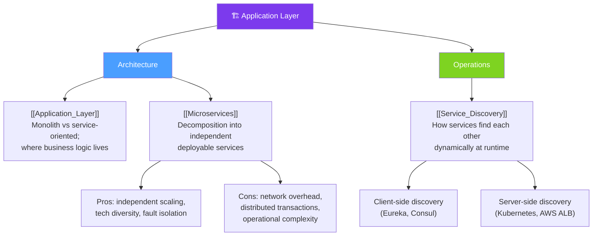

# 🏗 Application Layer — Map of Content

> [!abstract] What This Section Covers
> The application layer is where business logic lives. This section covers how that layer is structured architecturally — from monoliths to microservices — the trade-offs of decomposing a system into independent services, and the critical operational problem of how services discover and communicate with each other in a dynamic, containerised environment.

## Concept Map

## Learning Path

1. [[Application_Layer]] — Overview of how application tier is structured, where it sits in the stack, and responsibilities
2. [[Microservices]] — Decomposition principles, trade-offs vs monolith, inter-service communication, and failure isolation
3. [[Service_Discovery]] — Client-side vs server-side discovery, Consul, Eureka, Kubernetes DNS, and health-check integration

## All Notes at a Glance

| Note | Summary | Difficulty |
|------|---------|------------|
| [[Application_Layer]] | Defines the application tier and its architectural patterns from monolith to SOA | Beginner |
| [[Microservices]] | Microservice architecture: benefits, costs, communication patterns, and failure modes | Intermediate |
| [[Service_Discovery]] | How services register and find each other dynamically at runtime | Intermediate |

## Key Questions This Section Answers

- What is the application layer and what sits above and below it in the stack?
- What are the architectural trade-offs between a monolith and microservices?
- When should you choose microservices over a monolith (and when is a monolith the right choice)?
- How do microservices communicate — synchronous REST/gRPC vs asynchronous messaging?
- How does service discovery work in Kubernetes (DNS-based) vs Consul (registry-based)?
- What is the difference between client-side and server-side service discovery?
- How does the Circuit Breaker pattern protect a microservice from cascading failures?
- What is a service mesh and when does it become necessary?

## Related Sections

- [[_MOC_SystemDesign_Master|↑ System Design Master MOC]]
- [[_MOC_LoadBalancers|← Load Balancers]]
- [[_MOC_API_Gateway|→ API Gateway]]
- [[_MOC_EventDriven|→ Event-Driven Architecture]]

#MOC #SystemDesign #ApplicationLayer
