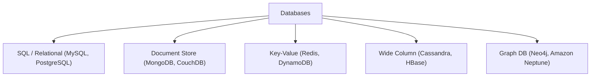

# 🗄️ Databases

> [!abstract] TL;DR
> Choosing the right database is critical — SQL, NoSQL, Key-Value, Graph, and Wide Column databases are each optimized for different access patterns, consistency needs, and scale requirements.

## 🧠 Core Idea

Choosing the **right database** is one of the most important decisions in system design.  
The database directly affects a system’s **performance, scalability, data integrity, and long-term maintainability**.

> Goal: **Store and retrieve data efficiently while supporting system growth.**

---

## 📖 Definition

A **Database** is a structured system for storing, managing, and retrieving data.  
Different database technologies are optimized for different workloads and access patterns.

---

## 🎯 Why Picking the Right Database Matters

### ⚡ Performance
- Databases have different read/write characteristics  
- Wrong choice can lead to slow queries and high latency  
- Impacts overall user experience  

---

### 📈 Scalability
- As data grows, the database must scale  
- Some databases scale **vertically** (bigger machine)  
- Others scale **horizontally** (distributed clusters)  

---

### 🧩 Data Modeling
- Different databases support different data models:
  - Relational (tables)
  - Document (JSON-like)
  - Key-Value
  - Graph  
- Right model keeps data organized and consistent  

---

### 🔒 Data Integrity & Security
- Some databases enforce:
  - Constraints
  - Transactions
  - ACID compliance  
- Others trade strict consistency for availability  

---

### 🛠️ Support & Maintenance
- Strong community = better tooling & documentation  
- Easier debugging and long-term reliability  

---

## 🧬 Major Database Categories

| Type | Examples | Best For |
|------|----------|----------|
| Relational (SQL) | MySQL, PostgreSQL | Structured data, transactions |
| Document (NoSQL) | MongoDB, CouchDB | Flexible JSON data |
| Key-Value | Redis, DynamoDB | Caching, fast lookups |
| Columnar | Cassandra, HBase | Large-scale writes |
| Graph | Neo4j | Relationship-heavy data |

---

## ⚖️ Trade-off Summary

```
Strong Consistency → Relational Databases
High Scalability → NoSQL Databases
Flexible Schema → Document Stores
Ultra-fast Access → Key-Value Stores
```

---

## 🧠 Design Considerations

- Data access patterns (read-heavy vs write-heavy)
- Consistency requirements
- Query complexity
- Expected data growth
- Budget and operational overhead

---

## 🏗️ Databases in System Design

Databases connect directly with:

[[Application Layer]]  
[[Microservices]]  
[[Database Replication]]  
[[Database Sharding]]  
[[Caching]]  
[[Consistency Patterns]]

---

## 🖼️ Diagram



---

## 📚 Source

- Database Selection in System Design (YouTube)  
  https://www.youtube.com/watch?v=kKjm4ehYiMs

---

## Related Concepts

- [[_MOC_Databases|↑ Section MOC]]
- [[SQL vs NoSQL]]
- [[Database Replication]]
- [[Database Sharding]]
- [[Caching]]
- [[Key-Value Store]]

---

## Review Questions

1. What are the four main categories of NoSQL databases?
2. When would you choose a relational database over a NoSQL database?
3. What is the CAP theorem and why is it relevant to database selection?

---

## 🏷️ Tags

#SystemDesign #Databases #DataLayer #Scalability #Performance
