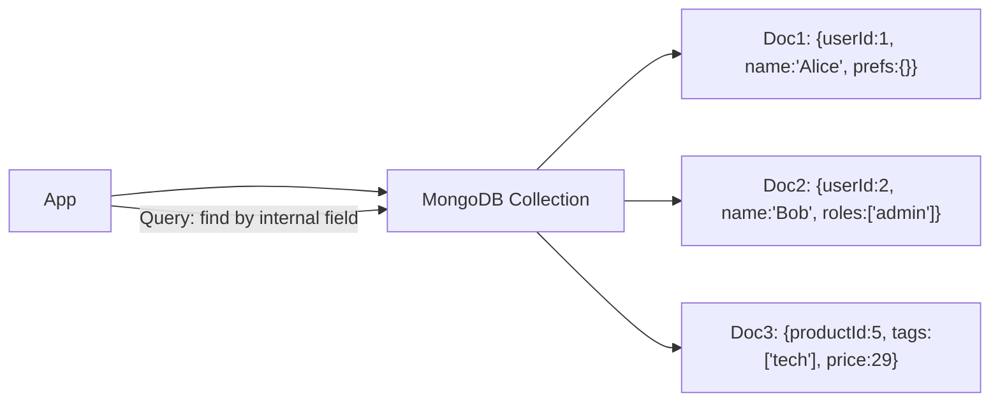

# 📄 Document Store

> [!abstract] TL;DR
> A **document store** saves data as self-contained JSON/BSON documents with flexible schemas, enabling rich queries on internal fields without rigid table structures or fixed schemas.

## 🧠 Core Idea

A **Document Store** is a type of database centered around **documents** such as:

- JSON  
- XML  
- BSON  
- Binary documents  

Each document contains **all information for a given object**, making document stores highly flexible and schema-friendly.

> Goal: **Store and query semi-structured data efficiently without rigid schemas.**

---

## 📖 Definition

In a document-oriented database:

- Data is stored as **self-contained documents**
- Each document can have **different fields**
- Documents are grouped into **collections**
- Queries can be made on **internal document fields**

---

## ⚙️ Example Document

```json
{
  "userId": 123,
  "name": "Karan",
  "email": "karan@example.com",
  "preferences": {
    "theme": "dark",
    "notifications": true
  }
}
```

No fixed schema is required — another user document may have different fields.

---

## 🗂️ Organization Models

Documents may be organized by:

- Collections  
- Tags  
- Metadata  
- Directories  

Even within the same collection, documents can have **completely different structures**.

---

## 🔍 Query Capabilities

Unlike simple key-value stores, document stores allow:

- Querying by internal fields  
- Indexing on document attributes  
- Filtering and aggregation  

This blurs the line between **Key-Value Stores** and **Relational Databases**.

---

## 🌍 Popular Document Stores

- MongoDB  
- CouchDB  
- Firebase Firestore  
- Amazon DocumentDB  

---

## ✅ Advantages

- Flexible schema design  
- Natural fit for JSON-based applications  
- Easy horizontal scaling  
- Faster development cycles  

---

## ⚠️ Disadvantages

- Weaker transactional guarantees vs SQL  
- Potential data duplication  
- Complex joins handled at application layer  

---

## 🧠 Design Insight

```
Highly flexible data → Document Store
Strong relations & transactions → Relational DB
Ultra-fast simple lookups → Key-Value Store
```

---

## 🖼️ Diagram



---

## 🔗 Related Topics

[[Databases]]  
[[Key-Value Store]]  
[[NoSQL Databases]]  
[[Database Sharding]]  
[[Scalability]]

---

## 📚 Source

- Wikipedia — Document-Oriented Database  
  https://en.wikipedia.org/wiki/Document-oriented_database

---

## Related Concepts

- [[_MOC_Databases|↑ Section MOC]]
- [[Databases]]
- [[SQL vs NoSQL]]
- [[Key-Value Store]]
- [[Wide Column Store]]
- [[Database Sharding]]

---

## Review Questions

1. How does a document store differ from a relational database in terms of schema?
2. Why are document stores well-suited for content management and user profile workloads?
3. What is a potential disadvantage of storing denormalized data in documents?

---

## 🏷️ Tags

#SystemDesign #DocumentStore #NoSQL #Databases #DataModeling
