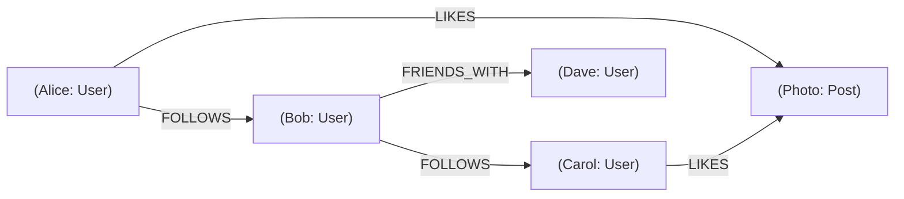

# 🕸️ Graph Databases

> [!abstract] TL;DR
> A **graph database** stores data as nodes and edges, enabling highly efficient traversal of complex relationships that would require expensive recursive joins in a relational database.

## 🧠 Core Idea

A **Graph Database** stores data as **nodes** and **relationships (edges)**.

- **Node** → Represents an entity or record  
- **Edge (Arc)** → Represents a relationship between nodes  

Graph databases are optimized for **complex, highly connected data models**.

> Goal: **Efficiently query and traverse deep relationships.**

---

## 📖 Definition

In a graph database:

```
(Node) --[Relationship]--> (Node)
```

Example:

```
(Karan) --[FOLLOWS]--> (User123)
(Karan) --[LIKES]--> (Photo567)
```

This structure makes relationship queries extremely fast compared to relational joins.

---

## 🎯 Why Graph Databases Matter

- Handle **many-to-many relationships** naturally  
- Excellent for **relationship-heavy queries**  
- Avoid expensive SQL joins  
- Enable real-time traversal of connected data  

---

## 🌍 Popular Graph Databases

- **Neo4j**  
- **Amazon Neptune**  
- **ArangoDB**  
- **TigerGraph**  

---

## 🚀 Common Use Cases

- Social networks (friends, followers)  
- Recommendation engines  
- Fraud detection  
- Knowledge graphs  
- Network topology mapping  

---

## ⚙️ Example Query Use Case

**Find all friends-of-friends of a user:**

Graph DB → Single traversal query  
Relational DB → Multiple recursive joins  

Graph databases excel here.

---

## ✅ Advantages

- High performance for connected data  
- Natural data modeling for relationships  
- Flexible schema  
- Efficient graph traversals  

---

## ⚠️ Disadvantages

- Relatively newer technology  
- Smaller ecosystem than SQL databases  
- Limited tooling in some environments  
- Often accessed via REST or graph query APIs  

---

## 🧠 Design Insight

```
Highly connected data → Graph Database
Structured transactional data → Relational DB
Large-scale writes → Wide Column Store
Fast lookups → Key-Value Store
```

---

## 🖼️ Diagram



---

## 🔗 Related Topics

[[Databases]]  
[[Document Store]]  
[[Wide Column Store]]  
[[NoSQL Databases]]  
[[Recommendation Systems]]

---

## 📚 Sources

- Wikipedia — Graph Database  
  https://en.wikipedia.org/wiki/Graph_database

- YouTube — Graph Databases Explained  
  https://www.youtube.com/watch?v=qI_g07C_Q5I

---

## Related Concepts

- [[_MOC_Databases|↑ Section MOC]]
- [[Databases]]
- [[SQL vs NoSQL]]
- [[Document Store]]
- [[Key-Value Store]]
- [[Wide Column Store]]

---

## Review Questions

1. What are nodes and edges in a graph database, and what do they represent?
2. Why is a graph database more efficient than a relational database for traversing highly connected data?
3. Name two real-world use cases where graph databases excel.

---

## 🏷️ Tags

#SystemDesign #GraphDatabase #NoSQL #Databases #Relationships
