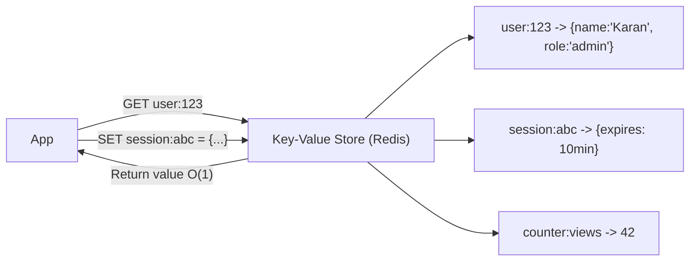

# 🗂️ Key-Value Store

> [!abstract] TL;DR
> A **key-value store** maps unique keys to values with O(1) reads and writes, making it ideal for caching, session management, and any workload requiring ultra-fast simple lookups.

## 🧠 Core Idea

A **Key-Value Store** is a type of database where data is stored as **key → value** pairs.

It provides:
- **O(1) reads and writes**
- **High performance**
- **Simple data model**

Key-value stores are often backed by **memory or SSD**, making them ideal for **fast access** and **rapidly changing data**.

> Goal: **Extremely fast data access with minimal overhead.**

---

## 📖 Definition

In a key-value database:
- Each **key** uniquely identifies a **value**
- Values can be strings, JSON objects, blobs, or metadata
- Some stores maintain keys in **lexicographic order** for efficient range queries

---

## ⚙️ How It Works

```
Key → Value
"user:123" → {name: "Karan", role: "admin"}
"session:abc" → {expires: 10min}
```

Retrieval is direct:
```
GET(key) → value
```

---

## 🎯 Why Key-Value Stores Matter

- Extremely fast lookups  
- Simple data model  
- Easy horizontal scaling  
- Ideal for caching layers  
- Handles high request throughput  

---

## 🧩 Common Use Cases

- In-memory cache layers  
- User session storage  
- Feature flags  
- Real-time counters  
- Shopping cart data  

---

## 🌍 Popular Key-Value Stores

- Redis  
- Memcached  
- Amazon DynamoDB  
- Riak  
- etcd (also used for service discovery)  

---

## ✅ Advantages

- O(1) read/write operations  
- High throughput  
- Easy to distribute across nodes  
- Flexible value storage  

---

## ⚠️ Disadvantages

- Limited query capabilities  
- No complex joins or relations  
- Additional logic pushed to application layer  
- Harder to enforce data relationships  

> If advanced querying is required, complexity shifts to the **application layer**.

---

## 🧠 Design Insight

```
Need ultra-fast simple lookups → Key-Value Store
Need complex queries & relations → Relational Database
```

---

## 🖼️ Diagram



---

## 🔗 Related Topics

[[Databases]]  
[[Caching]]  
[[NoSQL Databases]]  
[[Database Replication]]  
[[Scalability]]

---

## 📚 Sources

- Wikipedia — Key-Value Database  
  https://en.wikipedia.org/wiki/Key%E2%80%93value_database

- StackOverflow — Disadvantages of Key-Value Stores  
  https://stackoverflow.com/questions/4056093/what-are-the-disadvantages-of-using-a-key-value-table-over-nullable-columns-or

---

## Related Concepts

- [[_MOC_Databases|↑ Section MOC]]
- [[Databases]]
- [[Caching]]
- [[Application Caching]]
- [[Database Caching]]
- [[SQL vs NoSQL]]

---

## Review Questions

1. What is the time complexity of a GET or SET operation in a key-value store?
2. Name two popular key-value stores and one typical use case for each.
3. What is a major limitation of key-value stores compared to relational databases?

---

## 🏷️ Tags

#SystemDesign #KeyValueStore #NoSQL #Databases #Performance
