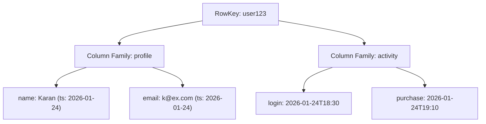

# 🧱 Wide Column Store

> [!abstract] TL;DR
> A **wide column store** organizes data as column families under row keys, excelling at massive write-heavy workloads and time-series data at petabyte scale with built-in versioning.

## 🧠 Core Idea

A **Wide Column Store** is a NoSQL database where the **basic unit of data is a column** (name/value pair).  
Columns are grouped into **column families**, which are roughly analogous to SQL tables.

This model is designed for **massive-scale data storage** with **high write throughput** and **efficient range queries**.

> Goal: **Store huge volumes of structured data across distributed nodes efficiently.**

---

## 📖 Definition

In a wide column database:

- A **column** = (name, value, timestamp)  
- Columns are grouped into **column families**  
- Column families are grouped under a **row key**  
- Each row can have **millions of columns**  
- Values include **timestamps** for versioning & conflict resolution  

```
Row Key → Column Family → Columns (name:value:timestamp)
```

---

## 🏗️ Data Model Visualization

```
RowKey: user123
  ├── profile:name = "Karan"
  ├── profile:email = "karan@example.com"
  ├── activity:login = "2026-01-24T18:30"
  ├── activity:purchase = "2026-01-24T19:10"
```

Columns with the same **row key** form a **row**, but rows do **not need uniform schemas**.

---

## ⚙️ Key Characteristics

- Schema is flexible per row  
- Optimized for **write-heavy workloads**  
- Supports **range scans**  
- Stores keys in **lexicographic order**  
- Built-in **timestamp-based versioning**  

---

## 🌍 Popular Wide Column Stores

- **Google Bigtable** (original design)  
- **Apache HBase** (Hadoop ecosystem)  
- **Apache Cassandra** (originally from Facebook)  

---

## 🚀 Why Wide Column Stores Matter

- Handle petabytes of data  
- Designed for distributed storage  
- Excellent for time-series data  
- Efficient retrieval of key ranges  
- Fault-tolerant via replication  

---

## 🎯 Common Use Cases

- Event logging systems  
- IoT time-series data  
- Recommendation engines  
- Large-scale analytics pipelines  
- Social media activity feeds  

---

## ⚠️ Disadvantages

- Complex data modeling  
- Limited ad-hoc querying vs SQL  
- Joins handled in application layer  
- Operational complexity  

---

## 🧠 Design Insight

```
Massive write-heavy datasets → Wide Column Store
Flexible JSON data → Document Store
Simple fast lookups → Key-Value Store
Strong relations → Relational DB
```

---

## 🖼️ Diagram



---

## 🔗 Related Topics

[[Databases]]  
[[Document Store]]  
[[Key-Value Store]]  
[[Database Replication]]  
[[Database Sharding]]  
[[Big Data Architecture]]

---

## 📚 Source

- Google Bigtable Paper  
  https://www.read.seas.harvard.edu/~kohler/class/cs239-w08/chang06bigtable.pdf

---

## Related Concepts

- [[_MOC_Databases|↑ Section MOC]]
- [[Databases]]
- [[SQL vs NoSQL]]
- [[Key-Value Store]]
- [[Database Sharding]]
- [[Database Replication]]

---

## Review Questions

1. How do wide-column stores differ from relational databases in terms of schema flexibility?
2. Why are wide-column stores particularly effective for time-series or IoT data?
3. What is a column family, and how does it group related data in a wide-column store?

---

## 🏷️ Tags

#SystemDesign #WideColumnStore #NoSQL #BigData #Databases
