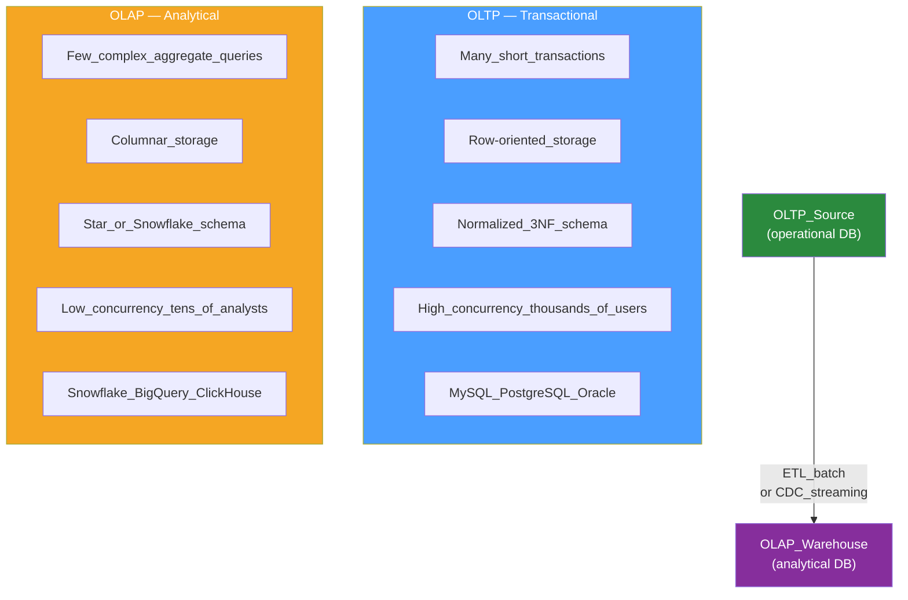

# 📊 OLTP vs OLAP

> [!abstract] TL;DR
> OLTP (Online Transaction Processing) handles many small, fast transactions against normalized data in **row-oriented** storage. OLAP (Online Analytical Processing) runs few complex analytical queries over large datasets in **columnar** storage. They have opposite optimization targets — and most production systems need both, connected by an [[ETL_vs_ELT|ETL]] or CDC data pipeline.

## Intuition — analogy FIRST

Think of a restaurant. The **OLTP system** is the cash register taking orders and updating inventory in real time — fast, per-transaction, one row at a time. The **OLAP system** is the restaurant owner reviewing a spreadsheet at month-end: total sales by menu item, average order size by weekday, revenue trend by region — complex, full-history scans.

The register is optimized for one transaction at a time. The spreadsheet is optimized for reading everything at once. You need both — and you absolutely do not want the month-end report query freezing the register during Saturday dinner service. The data pipeline between them is the bridge.

---

## How It Works

### OLTP — Online Transaction Processing

Designed for operational, user-facing workloads: processing transactions in real time.

| Property | OLTP Value |
|----------|-----------|
| Query type | Many short transactions (INSERT, UPDATE, point SELECT by PK) |
| Data shape | Normalized tables (3NF) — minimal redundancy, referential integrity |
| Storage format | **Row-oriented** — entire row stored contiguously on disk |
| Concurrency | Thousands of simultaneous users |
| Response time | Sub-millisecond to milliseconds |
| ACID | Full ACID guarantees |
| Examples | MySQL, PostgreSQL, Oracle, SQL Server, CockroachDB |

**Row storage layout:**
```
Page 1: [id=1, name=Alice, price=29.99, qty=3]
         [id=2, name=Bob,   price=14.99, qty=7]
```
Reading one full row is a single sequential read. But `SELECT AVG(price)` must read every row to extract just the price column — it pulls in `id`, `name`, and `qty` unnecessarily.

---

### OLAP — Online Analytical Processing

Designed for analytical workloads: business intelligence, data science, and reporting.

| Property | OLAP Value |
|----------|-----------|
| Query type | Few complex queries (aggregations, GROUP BY, multi-table JOINs on billions of rows) |
| Data shape | Denormalized — star or snowflake schema; fact table + dimension tables |
| Storage format | **Columnar** — each column stored in its own segment/file |
| Concurrency | Tens of simultaneous analysts |
| Response time | Seconds to minutes |
| Consistency | Eventual — ETL lag is acceptable |
| Examples | Snowflake, BigQuery, Amazon Redshift, ClickHouse, DuckDB, Apache Druid |

**Columnar storage layout:**
```
id_col:    [1, 2, 3, 4, 5, ...]
price_col: [29.99, 14.99, 9.99, 49.99, ...]
qty_col:   [3, 7, 1, 2, 8, ...]
```
`SELECT AVG(price)` reads **only the price column** — id and qty are never touched.

---

### OLTP vs OLAP Side-by-Side



---

### Why Columnar Storage is 10–100x Faster for Analytics

1. **Only needed columns are read** — `SELECT SUM(revenue)` reads 1 of 50 columns; row store reads all 50
2. **Excellent compression** — Sorted similar values compress extremely well (run-length encoding, dictionary encoding, Zstandard)
3. **SIMD vectorized execution** — CPU processes 8–16 values per clock cycle on a dense numeric column
4. **Late materialization** — Filters applied per-column before rows are reconstructed; most rows never assembled

**Concrete comparison on 1 billion row orders table:**
```
Row store:    SELECT AVG(price) → reads all 50 columns × 1B rows = 400 GB
Columnar:     SELECT AVG(price) → reads only price column × 1B rows = 8 GB
                                                              → ~50× less I/O
```

---

### Star Schema (Standard OLAP Data Model)

```
Fact Table: orders_fact
  order_id | date_key | product_key | customer_key | revenue | quantity | discount

Dimension Tables:
  date_dim:     date_key → year, quarter, month, day_of_week, is_holiday
  product_dim:  product_key → name, category, brand, cost
  customer_dim: customer_key → name, country, region, segment
```

Queries join the small fact table to small dimension tables. With columnar storage, only the projected columns of each table are scanned. `GROUP BY` on `product_dim.category` reads only that one dimension column.

---

### HTAP — Hybrid Transactional/Analytical Processing

Some databases aim to serve both workloads from one system:

| System | Approach |
|--------|----------|
| **TiDB** | Separate row-store engine (TiKV) + columnar engine (TiFlash); optimizer routes queries automatically |
| **SingleStore** | In-memory row store for OLTP + disk-resident columnar store for analytics |
| **Google Spanner** | Interleaved OLAP columnar layer (Spanner + BigQuery Omni) alongside OLTP |
| **DuckDB** | Embedded columnar OLAP engine that queries Postgres/Parquet files directly — zero ETL for small-scale analytics |

HTAP is compelling but harder to tune and scale than dedicated specialized systems. Use it when ETL pipeline latency is unacceptable.

---

## Real-World Systems

- **Uber** — MySQL for ride and driver OLTP; Hive + Presto on Hadoop for analytical queries ("average surge multiplier by city and hour across all trips this quarter")
- **Airbnb** — MySQL for booking OLTP; Apache Druid for real-time OLAP on event streams from Kafka; Hive for batch historical analysis
- **Shopify** — MySQL for transactional merchant data; Snowflake for merchant analytics dashboards; Kafka CDC pipeline bridges them
- **Netflix** — Cassandra and MySQL for OLTP; Apache Iceberg tables on S3 + Apache Spark for petabyte-scale analytics and ML feature engineering
- **Twitter / X** — MySQL for tweet storage; Vertica (later BigQuery) for engagement analytics; Kafka as the bridge

---

## Trade-offs

| Aspect | OLTP | OLAP |
|--------|:----:|:----:|
| Write throughput | Very High | Low (batch loads preferred) |
| Analytical read throughput | Poor | Excellent |
| Storage format | Row-oriented | Columnar |
| Schema | Normalized (joins at query time) | Denormalized (joins pre-computed) |
| Consistency | Strong ACID | Eventual (ETL lag acceptable) |
| Query latency | Sub-ms | Seconds to minutes |
| Horizontal scalability | Hard (sharding required) | Native (cloud warehouses auto-scale) |
| Cost at scale | Linear with transactions | Compute/storage separated (pay per query) |

---

## When to Use vs Avoid

**Use OLTP when:**
- Serving user-facing features: login, orders, payments, real-time feeds
- You need strong consistency and ACID transactions
- Queries are point lookups by primary key or small bounded range scans

**Use OLAP ([[Data_Warehouse|data warehouse]]) when:**
- Business intelligence, dashboards, or ad-hoc reporting over historical data
- Aggregating across millions or billions of rows
- Data science, ML training, feature engineering

**Build an ETL / CDC pipeline when:**
- Both workloads exist (almost always the case at > startup scale)
- Analytical queries are visibly impacting production OLTP performance
- `EXPLAIN` reveals full table scans on 100M+ row tables for reporting queries

**Avoid premature OLAP adoption when:**
- Your dataset is < 10M rows — PostgreSQL with proper indexes handles analytics fine
- You have no data engineering bandwidth to maintain an ETL pipeline

---

## Common Pitfalls

1. **Running analytics directly on the OLTP database** — Long GROUP BY queries hold buffer pool pages, compete with OLTP cache, and spike latency for end users; move them to a read replica or warehouse
2. **Premature complexity** — Adding Snowflake and a CDC pipeline for a 500K-row table adds infrastructure cost and operational risk with no benefit; Postgres handles it
3. **Ignoring ETL lag in dashboards** — OLAP data is typically 15 minutes to 24 hours behind OLTP; never label OLAP-backed dashboards as "real-time" without noting data freshness
4. **Wide unpartitioned fact tables** — Putting 200 metrics in one fact table without partition pruning forces full scans; partition by date and cluster by common GROUP BY keys
5. **Not coordinating OLAP schema evolution with OLTP changes** — A new column in the OLTP source is silently dropped by the ETL job until someone notices the missing metric; schema changes must be coordinated across both systems

---

## Related Concepts

- [[_MOC_Databases|↑ Section MOC]]
- [[Databases]] — Foundation: row-oriented OLTP databases and the NoSQL alternatives
- [[Write_Ahead_Log]] — CDC pipelines read the WAL to stream OLTP changes to OLAP systems with low latency and no polling overhead

---

## Review Questions

1. Why does columnar storage outperform row storage for `SELECT AVG(price) FROM orders` on a 1-billion-row table? Walk through the exact data access pattern difference at the storage level.
2. What is a star schema? How does it differ from a normalized 3NF OLTP schema, and why is it better for OLAP queries?
3. Your product team complains that the nightly report (runs a complex `GROUP BY` across 500M rows) causes the production MySQL database to slow down significantly at midnight, affecting paying users. What architectural change would you propose, and what would the data pipeline look like?

---

## Sources

- Martin Kleppmann, *Designing Data-Intensive Applications*, Chapter 3 — Column-Oriented Storage
- Snowflake: The Snowflake Elastic Data Warehouse (SIGMOD 2016) — https://dl.acm.org/doi/10.1145/2882903.2903741
- ClickHouse Documentation: Why Columnar — https://clickhouse.com/docs/en/intro

#SystemDesign #Databases #OLTP #OLAP #DataWarehouse #ColumnarStorage #Analytics #StarSchema
