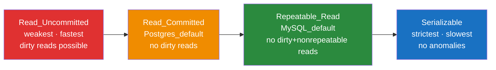

# 🔐 ACID and Transactions

> [!abstract] TL;DR
> ACID guarantees that database transactions are **Atomic** (all-or-nothing), **Consistent** (invariants hold), **Isolated** (concurrent transactions appear serial), and **Durable** (committed data survives crashes). Isolation levels let you trade safety for performance — and picking the wrong level causes hard-to-reproduce, data-corrupting bugs.

## Intuition — analogy FIRST

Think of a bank ATM withdrawal: you press "withdraw $200" and the machine should either dispense the cash AND debit your account — or do neither. No partial states allowed. Now imagine two people withdrawing from the same account simultaneously. The bank needs rules for how they interact without corrupting your balance.

ACID is exactly those rules for databases. Each letter addresses a different failure mode. The hardest part — the one that haunts distributed systems interviews — is **Isolation**, because it comes with configurable trade-offs.

---

## How It Works

### The Four Properties

**A — Atomicity**
Every operation in a transaction either all succeeds or the entire transaction rolls back. No partial updates. Implemented via a transaction log (undo log): if the transaction fails mid-way, all changes are reversed.

> Example: Transfer $500 from A to B. Deduct from A, credit to B. If the credit fails, the deduct is rolled back.

**C — Consistency**
A transaction moves the database from one **valid state** to another. All schema constraints, cascades, and triggers are enforced. "Valid" is defined by your schema rules (e.g., account balance ≥ 0, foreign keys intact).

**I — Isolation**
Concurrent transactions behave as if they ran one-at-a-time. This is the most complex property and the one with configurable trade-offs via **isolation levels**.

**D — Durability**
Once a transaction commits, the data persists — even if the server crashes immediately after. Implemented via [[Write_Ahead_Log]] (WAL): changes are flushed to a sequential log on disk before the commit is acknowledged.

---

### Concurrency Anomalies (Phenomena)

Three things that can go wrong when transactions run concurrently:

| Phenomenon | What Happens | Example |
|-----------|-------------|---------|
| **Dirty Read** | T2 reads data written by T1 that hasn't committed yet — if T1 rolls back, T2 read data that never existed | T1 deducts inventory, T2 reads "0 left", T1 rolls back — T2 wrongly shows "sold out" |
| **Non-Repeatable Read** | T2 reads the same row twice; T1 commits an update in between — T2 sees different values for the same row | T2 reads price=100, T1 updates price=150 and commits, T2 reads price=150 — same query, different result |
| **Phantom Read** | T2 executes the same range query twice; T1 inserts/deletes rows in between — T2 sees different row counts | T2 counts "3 active orders", T1 inserts a 4th, T2 counts "4 active orders" in the same transaction |

---

### Isolation Levels

Four levels from weakest to strictest, each preventing more anomalies at the cost of concurrency:

| Isolation Level | Dirty Read | Non-Repeatable Read | Phantom Read | Performance |
|----------------|:----------:|:-------------------:|:------------:|:-----------:|
| Read Uncommitted | ✅ possible | ✅ possible | ✅ possible | Fastest |
| Read Committed | ❌ prevented | ✅ possible | ✅ possible | Fast |
| Repeatable Read | ❌ prevented | ❌ prevented | ✅ possible | Moderate |
| Serializable | ❌ prevented | ❌ prevented | ❌ prevented | Slowest |

> **Postgres default:** Read Committed. **MySQL InnoDB default:** Repeatable Read (with gap locks to also block most phantoms).

---

### Isolation Level Spectrum

---

### Two-Phase Locking (2PL)

One mechanism to achieve higher isolation levels:

1. **Growing phase** — acquire all needed locks; release none
2. **Shrinking phase** — release locks; acquire none

This prevents cycles that lead to anomalies but causes lock contention. Deadlocks are detected and resolved by aborting one transaction.

---

### Optimistic vs Pessimistic Concurrency

| Approach | Mechanism | When Conflict Is Detected | Best For |
|----------|-----------|--------------------------|----------|
| **Pessimistic** | Lock rows upfront before reading/writing | Before the operation | High-contention data (bank accounts, inventory) |
| **Optimistic** | No locks; check for conflicting writes at commit time | At commit | Low-contention data (user profile edits, document drafts) |

Optimistic locking requires **retry logic** on the caller — if the commit-time check fails, the entire transaction must be retried.

---

## Real-World Systems

- **Banking / Fintech** — Serializable isolation for account transfers; Atomicity prevents partial debits from ever persisting
- **PostgreSQL** — Default Read Committed; set `ISOLATION LEVEL SERIALIZABLE` explicitly for critical financial paths
- **MySQL InnoDB** — Default Repeatable Read; uses gap locks to prevent most phantom reads even at this level
- **E-commerce order placement** — Read Committed is usually sufficient; inventory decrements use `SELECT FOR UPDATE` (pessimistic lock on the specific row)
- **High-frequency trading** — Serializable + optimistic retry loops to handle the race for last shares

---

## Trade-offs

| Isolation Level | Consistency Guarantee | Max Throughput | Typical Latency | Recommended For |
|----------------|:--------------------:|:--------------:|:---------------:|-----------------|
| Read Uncommitted | Very Low | Very High | Very Low | Approximate analytics only |
| Read Committed | Medium | High | Low | Most web applications |
| Repeatable Read | High | Medium | Medium | Multi-step reads requiring consistent view |
| Serializable | Very High | Low | High | Financial transactions, critical inventory |

---

## When to Use vs Avoid

**Use Serializable when:**
- Money transfers where the correctness of T1 depends on T2 not having changed data
- Inventory deduction when selling the last item
- Any "check then act" pattern (read a value, make a decision, write based on the decision)

**Read Committed is sufficient when:**
- Standard CRUD web application endpoints
- Dashboard reads where slightly stale data is acceptable
- High-throughput APIs where lock contention would bottleneck performance

**Never use Read Uncommitted** for anything where data correctness matters — dirty reads lead to real, non-deterministic bugs.

---

## Common Pitfalls

1. **Assuming ACID means no race conditions** — Isolation level still matters; Read Committed allows non-repeatable reads that cause business logic errors
2. **Forgetting to commit or rollback** — Pooled connections carry open transactions forward; always wrap in try/finally
3. **Long-running transactions** — Hold locks for minutes; cascade into timeouts and lock contention across the system
4. **Optimistic locking without retry logic** — Commit-time conflict exceptions must be caught and the entire operation retried by the caller
5. **Treating NoSQL as ACID** — Many NoSQL databases offer document-level atomicity only; multi-document transactions are not guaranteed unless explicitly supported (MongoDB 4.0+)

---

## Related Concepts

- [[_MOC_Databases|↑ Section MOC]]
- [[MVCC]] — How Postgres implements Isolation without locking readers (multi-version concurrency control)
- [[Write_Ahead_Log]] — How Durability (the D in ACID) is implemented via a sequential on-disk log
- [[Database_Sharding]] — [[Distributed_Transactions|Distributed transactions]] across shards make ACID guarantees dramatically harder
- [[Databases]] — The broader database landscape and when ACID properties matter

---

## Review Questions

1. What is the difference between a dirty read, a non-repeatable read, and a phantom read? Give a concrete real-world example of each.
2. Postgres defaults to Read Committed and MySQL InnoDB defaults to Repeatable Read. What concurrency anomaly can occur in Postgres (by default) that MySQL prevents?
3. A bank transfer deducts $500 from Account A and credits $500 to Account B in a single transaction. Which ACID property ensures the deduct can never persist without the credit? Which property ensures the completed transfer survives an immediate server crash?

---

## Sources

- Martin Kleppmann, *Designing Data-Intensive Applications*, Chapter 7 — Transactions
- PostgreSQL Documentation: Transaction Isolation — https://www.postgresql.org/docs/current/transaction-iso.html
- MySQL Documentation: InnoDB Transaction Model — https://dev.mysql.com/doc/refman/8.0/en/innodb-transaction-model.html

#SystemDesign #Databases #ACID #Transactions #Concurrency #IsolationLevels
