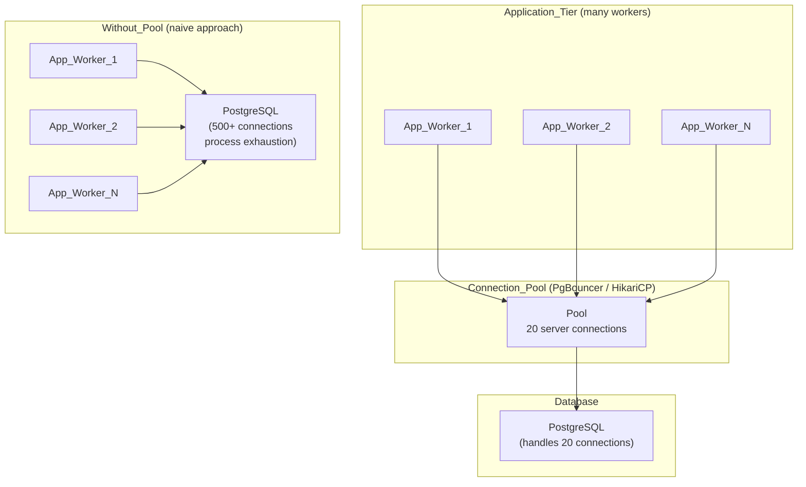

# 🔌 Connection Pooling

> [!abstract] TL;DR
> Opening a new database connection per request is expensive — TCP handshake, authentication, and a backend OS process per connection. A connection pool maintains a fixed set of reusable connections that many application workers share. Without pooling, a mid-scale web app easily overwhelms PostgreSQL. With PgBouncer in transaction mode, thousands of app workers share ~20 database connections.

## Intuition — analogy FIRST

Imagine a taxi city where, without a dispatch service, each customer calls a factory to **custom-build a taxi** for their trip, uses it once, then has it destroyed. This is obviously wasteful. A **taxi fleet** (connection pool) keeps a fixed number of taxis ready: customers grab one, take their trip, and return it to the fleet. The same 20 taxis can serve 10,000 trips per hour.

Your connection pool is the dispatch service: a fixed number of pre-warmed database connections serve far more application requests than the database could handle with one-connection-per-request.

---

## How It Works

### Why Database Connections Are Expensive

Every PostgreSQL connection requires:
- **TCP 3-way handshake** — at least one network round trip
- **TLS negotiation** — additional round trips for encrypted connections
- **Authentication** — credential validation, session setup
- **Backend OS process** — PostgreSQL forks a new process per connection (~5–10 MB RSS each; not a thread)
- **Memory initialization** — shared memory segments, lock manager entries

At 500 concurrent connections to a single Postgres instance: ~2.5–5 GB of memory just for idle backend processes. Postgres degrades noticeably above ~100–200 active connections due to lock manager contention, context switching overhead, and shared memory pressure.

---

### Connection Pool Architecture



---

### Pool Sizing — The HikariCP Formula

HikariCP (default connection pool in Spring Boot) recommends:

```
pool_size = num_cores × 2 + effective_spindles
```

For a 4-core Postgres server with SSDs (1 effective spindle):
```
pool_size = 4 × 2 + 1 = 9
```

This feels surprisingly small — but Postgres is I/O-bound, not CPU-bound for most queries. 9 connections allows 9 queries to be in-flight simultaneously while the CPU handles them with near-zero context-switching overhead. Oversizing the pool causes more context switching than the database can handle and makes throughput worse.

> Most production systems stabilize between 10–50 connections per Postgres primary.

---

### PgBouncer: Proxy-Level Pooling for PostgreSQL

PgBouncer is a lightweight standalone proxy that sits between your app and Postgres. It maintains a small pool of actual server connections and multiplexes app connections onto them.

**Three pooling modes:**

| Mode | Connection Returned to Pool | Limitation |
|------|:---------------------------:|------------|
| **Session** | When the client disconnects | 1-to-1 mapping; minimal pooling benefit |
| **Transaction** | After each `COMMIT` / `ROLLBACK` | Cannot use session-level `SET`, advisory locks, `LISTEN/NOTIFY` |
| **Statement** | After each SQL statement | Breaks multi-statement transactions entirely |

**Transaction mode** is the sweet spot for web applications. A Django app with 500 gunicorn workers can share 20 Postgres connections because workers spend most of their time waiting on network I/O, not holding an active database connection.

---

### Client-Side vs Proxy Pooling

| Type | Examples | Deployed Where | Best For |
|------|----------|---------------|----------|
| **Client-side** | HikariCP, c3p0, DBCP2 | Inside the application process | Single-process apps; zero extra infrastructure |
| **Proxy pooler** | PgBouncer, Pgpool-II, AWS RDS Proxy | Separate sidecar or dedicated host | Multiple app servers; serverless functions; microservices |

For **serverless / Lambda functions**: each invocation cannot maintain a persistent connection. PgBouncer or RDS Proxy is mandatory — without it, each cold-start opens and holds a connection, exhausting the Postgres connection limit in seconds under load.

---

## Real-World Systems

- **Instagram** — Thousands of Django workers connecting to PostgreSQL via PgBouncer in transaction mode; ~100 Postgres backend processes serving the entire Python backend
- **Spring Boot / HikariCP** — Default pool since Spring Boot 2.0; `spring.datasource.hikari.maximum-pool-size = 10` is the recommended starting point for most services
- **AWS RDS Proxy** — Managed PgBouncer-equivalent for Aurora and RDS; maintains a warm connection pool, transparently reconnects through failover, and multiplexes Lambda invocations
- **Supabase** — Exposes two connection strings: direct (port 5432, no pooling) and pooled (port 6543, PgBouncer transaction mode); always use pooled for serverless
- **Heroku Postgres** — Hobby/standard plans cap at 25 Postgres connections; PgBouncer is effectively mandatory for any real application

---

## Trade-offs

| Aspect | Benefit | Cost |
|--------|---------|------|
| Connection reuse | Eliminates per-request TCP + auth overhead (often 5–20 ms per connection) | Pool must be correctly sized; too small = queue buildup |
| DB memory savings | 20 backend processes vs 500 = 2.5 GB saved | PgBouncer adds one extra network hop (~0.1 ms) |
| Failover handling | Pool can reconnect silently after DB primary changes | In-flight transactions fail at failover; app must retry |
| Transaction mode | Maximum multiplexing (1000 workers on 20 connections) | Session-level features (`SET`, advisory locks) unavailable |
| Serverless support | Prevents connection exhaustion from ephemeral workers | Requires separate deployment and monitoring of PgBouncer |

---

## When to Use vs Avoid

**Always use a connection pool when:**
- More than one application process connects to the same database
- Using short-lived request handlers (HTTP servers, serverless functions, batch workers)
- Postgres connection count is growing above 50 concurrent

**Use PgBouncer transaction mode for web apps, but switch to session mode when using:**
- `SET` / `RESET` configuration parameters per-request (session-specific, lost when connection returns to pool)
- PostgreSQL **advisory locks** (`pg_advisory_lock`) — bound to the session, not the transaction
- `LISTEN` / `NOTIFY` — requires a persistent, long-lived session
- Server-side prepared statements (requires `pgbouncer.pool_mode` workaround or switch to session mode)

---

## Common Pitfalls

1. **Connection leaks** — A code path that acquires a connection but fails to release it (missing `finally` block or `using` statement in C#/Java); the pool fills up and all subsequent requests queue then timeout
2. **Pool too large** — Setting `max_pool_size=500` thinking "more is better"; causes Postgres to exhaust memory and context-switch overhead overwhelms the CPU; throughput collapses
3. **Pool too small** — Under traffic spikes, requests queue behind an undersized pool; tail latency (P99) spikes dramatically even if median latency is fine
4. **Session-level features in transaction mode** — Using `SET search_path = myschema` at the start of every request; each transaction may run on a different server connection, breaking the `SET` silently
5. **No connection health check** — After a Postgres restart, stale connections in the pool return errors until they fail-fast; configure `connectionTestQuery` or `keepaliveTime` to detect and replace broken connections

---

## Related Concepts

- [[_MOC_Databases|↑ Section MOC]]
- [[Databases]] — Foundation: why database connections exist and what they cost
- [[Database_Replication]] — During failover (primary changes), the connection pool must handle reconnection; PgBouncer handles this transparently
- [[ACID_and_Transactions]] — Transaction mode in PgBouncer defines when a connection is returned to the pool; misunderstanding this boundary breaks multi-statement transactions

---

## Review Questions

1. Why does PostgreSQL degrade significantly above ~200 concurrent connections even when each connection is doing nothing (idle)? What resource is being consumed?
2. Explain the difference between PgBouncer session mode and transaction mode. Give a concrete example of a PostgreSQL feature that works in session mode but breaks silently in transaction mode.
3. A production application uses PgBouncer in transaction mode and a developer adds `SET search_path = myschema` at the start of every request to scope queries to a schema. After deployment, queries randomly fail with "table not found". What is happening and how do you fix it?

---

## Sources

- HikariCP — About Pool Sizing — https://github.com/brettwooldridge/HikariCP/wiki/About-Pool-Sizing
- PgBouncer Documentation — https://www.pgbouncer.org/features.html
- AWS RDS Proxy Documentation — https://docs.aws.amazon.com/AmazonRDS/latest/UserGuide/rds-proxy.html

#SystemDesign #Databases #ConnectionPooling #PgBouncer #HikariCP #Performance #PostgreSQL
