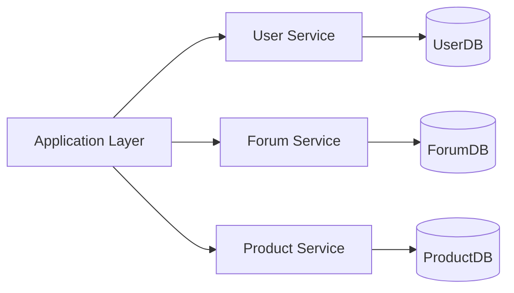

# 🧩 Database Federation (Functional Partitioning)

> [!abstract] TL;DR
> **Federation** splits a monolithic database into specialized databases per business domain, reducing per-database load, enabling independent scaling, and improving cache locality.

## 🧠 Core Idea

**Federation**, also known as **Functional Partitioning**, is the practice of **splitting databases by function or domain** rather than keeping a single monolithic database.

> Goal: **Reduce database load by dividing responsibilities across specialized databases.**

---

## 📖 Definition

Instead of one large database handling everything, federation separates data by business function.

### Example:

```
User Database      → Stores user accounts & profiles
Forum Database     → Stores posts & comments
Product Database  → Stores product catalog
```

Each database serves a **specific function**, reducing overall load per database.

---

## 🎯 Why Federation Matters

- Reduces read/write traffic per database  
- Minimizes replication lag  
- Smaller databases fit more data in memory  
- Improves cache locality → more cache hits  
- Enables parallel writes (no single write master)  
- Increases overall system throughput  

---

## 🏗️ How Federation Works

```
Application Layer
   ├── User Service → User DB
   ├── Forum Service → Forum DB
   └── Product Service → Product DB
```

Each service interacts only with its dedicated database.

---

## 🚀 Advantages

- Independentiled load distribution  
- Independent scaling per function  
- Improved performance  
- Easier schema management  
- Reduced operational risk  

---

## ⚠️ Disadvantages

- Cross-database queries become complex  
- Requires careful domain modeling  
- Data consistency across databases needs handling  
- More database instances to manage  

---

## 🧠 Federation vs Sharding

| Aspect | Federation | Sharding |
|--------|------------|----------|
| Partition Basis | By function/domain | By data ranges or keys |
| Database Type | Separate databases | Same schema across shards |
| Query Complexity | Cross-domain joins | Cross-shard queries |
| Primary Benefit | Functional separation | Horizontal data scaling |

---

## 🖼️ Diagram



---

## 🔗 Related Topics

[[Databases]]  
[[Database Sharding]]  
[[Database Replication]]  
[[Microservices]]  
[[Scalability]]

---

## Related Concepts

- [[_MOC_Databases|↑ Section MOC]]
- [[Databases]]
- [[Database Sharding]]
- [[Database Replication]]
- [[Microservices]]
- [[SQL vs NoSQL]]

---

## Review Questions

1. How does database federation reduce load on a single database?
2. What is a key disadvantage of federation when queries span multiple data stores?
3. How does federation relate to the microservices pattern of database-per-service?

---

## 🏷️ Tags

#SystemDesign #Federation #Databases #Scalability #Performance
