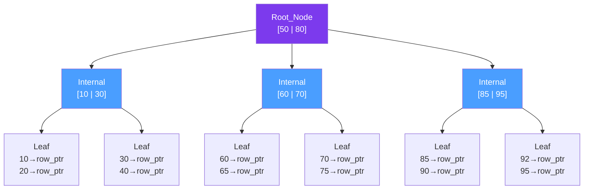

# 📑 Database Indexes

> [!abstract] TL;DR
> An index is a separate data structure that speeds up reads by avoiding full table scans — but every index slows down writes and costs storage. Choosing the right index type, column order (leftmost prefix), and selectivity is the single most impactful performance lever available in an RDBMS.

## Intuition — analogy FIRST

A database table without an index is like a 1,000-page textbook with no index section — to find every mention of "B-tree" you must read every single page. With the index in the back, you jump directly to the right pages in milliseconds.

But maintaining that index has a cost: every time the textbook is revised, the index must be updated too. This is the fundamental trade-off — **indexes accelerate reads at the expense of write overhead and disk space**.

---

## How It Works

### B-Tree Index (Default)

The default index type in PostgreSQL, MySQL, and virtually every RDBMS. A balanced tree where internal nodes hold separator keys and leaf nodes hold actual key values plus pointers to table rows (row page/offset tuples).

- **O(log n)** lookup for both equality and range queries
- Supports: `=`, `<`, `>`, `<=`, `>=`, `BETWEEN`, `ORDER BY`, `LIKE 'prefix%'`
- Self-balancing — tree height stays `log₂(n)` as the table grows



---

### Hash Index

- **O(1)** equality lookup — faster than B-tree for exact matches
- **Cannot do range queries or sorting** (hash function destroys order)
- PostgreSQL: available as a heap index; Redis is conceptually a giant distributed hash index
- Use case: exact-match lookups where ranges are never needed (e.g., session tokens, UUID primary keys)

---

### Composite Index and the Leftmost Prefix Rule

A composite index on `(a, b, c)` is physically sorted first by `a`, then `b` within each `a`, then `c` within each `(a, b)`. The index is only traversable from the **leftmost column**:

| Query | Index `(a, b, c)` Used? |
|-------|:-----------------------:|
| `WHERE a = 1` | ✅ Yes |
| `WHERE a = 1 AND b = 2` | ✅ Yes |
| `WHERE a = 1 AND b = 2 AND c = 3` | ✅ Yes (full index scan) |
| `WHERE b = 2` | ❌ No (`a` skipped) |
| `WHERE c = 3` | ❌ No (`a`, `b` skipped) |
| `WHERE a = 1 AND c = 3` | ⚠️ Partial — uses `a` only, filters `c` in-memory |
| `WHERE a = 1 ORDER BY b` | ✅ Yes — sort is free from the index |

> Rule: put the most selective column and the most frequently queried column first.

---

### Covering Index (Index-Only Scan)

A covering index **includes all columns** a query needs — so the database never needs to fetch the actual table row. Eliminates the heap access entirely.

```sql
-- Query: SELECT email FROM users WHERE user_id = 42
-- Without covering index: B-tree lookup on user_id → heap fetch for email column
-- With covering index:
CREATE INDEX idx_users_covering ON users(user_id, email);
-- → Entire answer found in the index itself, zero table page reads
```

PostgreSQL calls this an **index-only scan**; you can verify it with `EXPLAIN ANALYZE`.

---

### Partial Index

Index only the rows matching a condition — a much smaller, faster index:

```sql
-- Only index active orders (95% of table might be 'completed' — no need to index them)
CREATE INDEX idx_active_orders ON orders(created_at) WHERE status = 'active';
```

Benefits: smaller index, faster inserts on non-matching rows, fits in buffer cache more easily.

---

### Index Selectivity

**Selectivity** = `COUNT(DISTINCT column) / COUNT(*)`. Higher selectivity → more useful index.

| Column Example | Selectivity | Worth Indexing? |
|---------------|:-----------:|:---------------:|
| `user_id` (UUID) | ~1.0 | ✅ Excellent |
| `email` (unique) | ~1.0 | ✅ Excellent |
| `created_at` | High | ✅ Good |
| `country` (200 values) | Medium | ✅ Sometimes |
| `status` ('active'/'inactive') | Very Low | ❌ Partial index instead |
| `is_deleted` (boolean) | ~0.001 | ❌ Planner will ignore it |

---

### Reading Query Plans: EXPLAIN ANALYZE

```sql
EXPLAIN ANALYZE SELECT * FROM orders WHERE customer_id = 42 ORDER BY created_at DESC LIMIT 10;
```

Key output to look for:
- `Index Scan` — using an index (good for selective queries)
- `Seq Scan` — reading the full table (bad on large tables)
- `Index Only Scan` — covering index in use (best case)
- `Bitmap Heap Scan` — compromise: uses index for multiple rows, then fetches pages in bulk

---

## Real-World Systems

- **Social media feed** — Index `(user_id, created_at DESC)` on posts table; serves "show all posts by user X sorted by recency" in a single index scan
- **E-commerce orders** — Composite index `(customer_id, created_at)` covers the common query "show customer X's orders from the last 30 days"
- **User authentication** — Unique B-tree index on `email`; O(log n) lookup for every login attempt across 100M users
- **Soft-delete patterns** — Partial index `WHERE deleted_at IS NULL` keeps the index small by excluding deleted rows permanently
- **Analytics counts** — Covering index on `(status, created_at)` makes `SELECT COUNT(*) WHERE status='completed' AND created_at > X` an index-only scan

---

## Trade-offs

| Factor | Benefit | Cost |
|--------|---------|------|
| Read latency | O(log n) vs O(n) full table scan | Additional storage per index |
| Write latency | — | Every INSERT / UPDATE / DELETE must update all indexes on that table |
| Memory | Hot indexes fit in buffer pool | Each index competes for buffer cache space |
| Composite index | One index covers multiple query patterns | Column order must match actual query patterns |
| Partial index | Small, focused, fast | Only helps queries that match the WHERE predicate |
| Covering index | Eliminates heap fetch entirely | More columns in the index = larger index size |

---

## When to Use vs Avoid

**Create an index when:**
- Column appears in `WHERE`, `JOIN ON`, `ORDER BY`, or `GROUP BY` frequently
- Column has high selectivity (many distinct values)
- The table is read-heavy and query latency is measurable

**Avoid or drop an index when:**
- Table is extremely write-heavy (high-frequency INSERT/UPDATE/DELETE) and read latency is acceptable
- Column has very low selectivity (boolean flags, tiny enum sets)
- The table is small (< ~10,000 rows — full scans are fast and indexes add noise)
- `pg_stat_user_indexes.idx_scan` shows the index has never been used in production

---

## Common Pitfalls

1. **Wrong column order in composite index** — `(b, a)` vs `(a, b)` can make the index completely useless for your query patterns; always verify with EXPLAIN
2. **Never checking the query plan** — Guessing that an index is being used without running `EXPLAIN ANALYZE` is the root cause of most "we added an index and it didn't help" complaints
3. **Over-indexing write-heavy tables** — 10 indexes on a high-write table can reduce write throughput by 50%+
4. **Missing covering index on the hot read path** — Adding one extra projected column to the index eliminates heap fetches and can cut query time in half
5. **Index on a low-selectivity column** — `WHERE is_active = true` when 99% of rows are active — the planner correctly ignores the index; use a partial index on the 1% inactive rows if that's what you query

---

## Related Concepts

- [[_MOC_Databases|↑ Section MOC]]
- [[SQL_Tuning]] — EXPLAIN, query plan analysis, partitioning, and broader RDBMS performance techniques
- [[ACID_and_Transactions]] — Index updates must happen atomically within transactions; indexes participate in locking
- [[Database_Sharding]] — Indexes exist per shard; cross-shard queries cannot use a single index
- [[Databases]] — The broader database foundation

---

## Review Questions

1. Given a composite index on `(user_id, status, created_at)`, which of these queries use the index efficiently: `WHERE user_id = 5`, `WHERE status = 'active'`, `WHERE user_id = 5 AND created_at > '2025-01-01'`? Explain each.
2. What is a covering index and why does it eliminate heap fetches? Give a concrete SQL example showing when it applies.
3. A table has 10M rows with a boolean `is_premium` column where 2% of rows are premium. A teammate wants to add a B-tree index on `is_premium`. When is this a good idea and when would you suggest a partial index instead?

---

## Sources

- PostgreSQL Documentation: Indexes — https://www.postgresql.org/docs/current/indexes.html
- Use The Index, Luke — B-tree deep dive — https://use-the-index-luke.com/
- High Performance MySQL, Chapter 5 — Indexing for High Performance

#SystemDesign #Databases #Indexes #Performance #QueryOptimization #BTree #CompositeIndex
