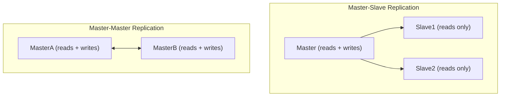

# 🔁 Database Replication

> [!abstract] TL;DR
> **Database replication** copies data across nodes — master-slave scales reads, master-master enables high-availability writes — improving fault tolerance and overall read throughput.

## 🧠 Core Idea

**Replication** is the process of **copying data from one database to another**.

It is primarily used to improve:

- **Availability**  
- **Scalability**  
- **Fault tolerance**  

> Goal: **Ensure data remains accessible even if a database node fails.**

---

## 📖 Definition

In replication, one database node writes data, and other nodes maintain **copies of that data**.

This allows:
- Continued operation during failures  
- Distribution of read traffic  
- Faster query performance  

---

## 🧩 Types of Replication

### 👑 Master-Slave Replication

#### 🧠 Concept
- **Master** handles **reads and writes**
- **Slaves** replicate data from master
- Slaves handle **read-only** queries

```
Client → Master → Slaves (replicated copies)
```

#### ⚙️ Behavior
- Writes go only to master  
- Reads can go to slaves  
- Slaves may replicate further in tree-like fashion  

#### 🛑 Failure Handling
- If master fails → system continues in **read-only mode**
- A slave can be **promoted to master**

#### ✅ Advantages
- Easy to implement  
- Scales read traffic  
- Clear write authority  

#### ❌ Disadvantages
- Write bottleneck at master  
- Failover promotion required  

---

### 👥 Master-Master Replication

#### 🧠 Concept
- **Both masters** handle **reads and writes**
- Masters coordinate to sync writes

```
Client → Master A ↔ Master B
```

#### ⚙️ Behavior
- Any master accepts writes  
- Data is replicated bidirectionally  

#### 🛑 Failure Handling
- If one master fails → other continues full operations  

#### ✅ Advantages
- No single write bottleneck  
- High availability for both reads and writes  

#### ❌ Disadvantages
- Conflict resolution required  
- More complex to implement  

---

## ⚖️ Comparison

| Aspect | Master-Slave | Master-Master |
|--------|--------------|---------------|
| Write Nodes | One | Multiple |
| Read Scalability | High | High |
| Write Scalability | Limited | Higher |
| Conflict Handling | None | Required |
| Complexity | Low | Medium |
| Failover Simplicity | Medium | High |

---

## 🧠 Design Insight

```
Read-heavy systems → Master-Slave
Write-heavy + High availability → Master-Master
```

Most real-world architectures start with **master-slave**, then evolve to more complex setups if needed.

---

## 🖼️ Diagram



---

## 🔗 Related Topics

[[Databases]]  
[[Database Sharding]]  
[[Consistency Patterns]]  
[[High Availability]]  
[[Caching]]

---

## Related Concepts

- [[_MOC_Databases|↑ Section MOC]]
- [[Databases]]
- [[Database Sharding]]
- [[Database Federation]]
- [[SQL Tuning]]
- [[Caching]]

---

## Review Questions

1. What is the difference between master-slave and master-master replication?
2. How does replication improve read throughput and availability?
3. What is replication lag, and what consistency issues can it cause?

---

## 🏷️ Tags

#SystemDesign #Replication #Databases #Scalability #Availability
