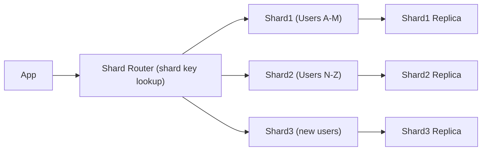

# 🧩 Database Sharding

> [!abstract] TL;DR
> **Sharding** distributes data across multiple database instances using a shard key, enabling horizontal scaling for massive datasets by reducing per-database load and allowing parallel writes.

## 🧠 Core Idea

**Sharding** is the process of **distributing data across multiple databases (shards)**, where each shard manages **only a subset of the total data**.

> Goal: **Scale databases horizontally to handle massive data and traffic.**

---

## 📖 Definition

Instead of storing all data in a single database, sharding splits the dataset:

```
Shard 1 → Users A–M  
Shard 2 → Users N–Z  
Shard 3 → New users  
```

As the dataset grows, **new shards are added** to the cluster.

---

## 🎯 Why Sharding Matters

- Reduces read and write traffic per database  
- Enables **parallel writes**  
- Improves query performance  
- Prevents single database bottlenecks  
- Allows horizontal database scaling  

---

## 🏗️ How Sharding Works

```
Application → Shard Router → Appropriate Database Shard
```

The application (or middleware) decides which shard contains the required data based on a **shard key**.

---

## 🔑 Shard Key

A shard key determines data distribution.

Examples:
- User ID  
- Region  
- Email hash  

Choosing a good shard key ensures:
- Even data distribution  
- Balanced traffic  

---

## 🚀 Advantages

- High write throughput  
- Reduced index size → faster queries  
- More cache hits  
- No single master for serializing writes  
- Fault isolation (one shard down ≠ total outage)  

---

## ⚠️ Disadvantages

- Complex application logic  
- Cross-shard queries are expensive  
- Rebalancing shards is operationally heavy  
- Requires replication to prevent data loss  

---

## 🔁 Sharding + Replication

In production systems:

```
Each Shard → Has Replicas → For Availability
```

Sharding handles **scalability**, replication handles **availability**.

---

## 🧠 Design Insight

```
Growing dataset → Add Shards
High availability needed → Add Replicas
```

Both are usually combined in real-world architectures.

---

## 🖼️ Diagram



---

## 🔗 Related Topics

[[Databases]]  
[[Database Replication]]  
[[Caching]]  
[[Scalability]]  
[[High Availability]]

---

## 📚 Sources

- HighScalability — Database Sharding  
  https://highscalability.com/an-unorthodox-approach-to-database-design-the-coming-of-the/

- Wikipedia — Shard (Database Architecture)  
  https://en.wikipedia.org/wiki/Shard_(database_architecture)

---

## Related Concepts

- [[_MOC_Databases|↑ Section MOC]]
- [[Databases]]
- [[Database Replication]]
- [[Database Federation]]
- [[Denormalization]]
- [[SQL Tuning]]

---

## Review Questions

1. What is a shard key, and why is choosing the right one critical?
2. How does sharding differ from replication in terms of what problem it solves?
3. What is a hot shard problem and how can it be mitigated?

---

## 🏷️ Tags

#SystemDesign #Sharding #Databases #Scalability #Performance
