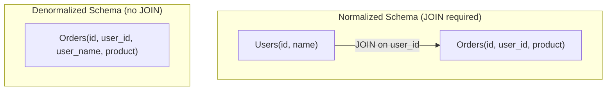

# 🧮 Denormalization

> [!abstract] TL;DR
> **Denormalization** intentionally stores redundant data to eliminate expensive JOINs, trading write speed and storage for dramatically faster reads — especially useful in distributed systems.

## 🧠 Core Idea

**Denormalization** is a database optimization technique that **improves read performance** by **introducing redundant data**, at the cost of **slower writes and increased storage**.

> Goal: **Reduce expensive joins and speed up read-heavy workloads.**

---

## 📖 Definition

In a normalized database, data is split into multiple related tables to avoid redundancy.

In **denormalization**, **redundant copies of data** are intentionally stored in multiple tables to:

- Avoid costly JOIN operations  
- Speed up query response times  

---

## ⚙️ Example

### Normalized Form
```
Users(user_id, name)
Orders(order_id, user_id, product)
```

Fetching user + order requires a JOIN.

### Denormalized Form
```
Orders(order_id, user_id, user_name, product)
```

Now reads need **no JOIN** → faster queries.

---

## 🎯 Why Denormalization Matters

- Improves read performance  
- Reduces complex joins  
- Helps in read-heavy systems  
- Simplifies query logic  

---

## 🏗️ Materialized Views

Some RDBMS support **materialized views** that automate denormalization:

- PostgreSQL  
- Oracle  

Materialized views:
- Store precomputed query results  
- Keep redundant data consistent  
- Automatically refresh when base data changes  

---

## 🌍 Denormalization in Distributed Systems

When data is distributed using:

- [[Database Sharding]]  
- [[Database Federation]]  

Joins across data centers become complex and slow.

👉 **Denormalization avoids cross-database joins**, simplifying distributed architectures.

---

## 🚀 Advantages

- Faster read queries  
- Reduced join complexity  
- Better performance for reporting and analytics  

---

## ⚠️ Disadvantages

- Slower writes (multiple copies updated)  
- Increased storage usage  
- Risk of data inconsistency  
- More complex update logic  

---

## 🧠 Design Insight

```
Read-heavy workload → Denormalize
Write-heavy workload → Normalize
Distributed databases → Prefer denormalization
```

---

## 🖼️ Diagram



---

## 🔗 Related Topics

[[Databases]]  
[[Database Sharding]]  
[[Database Federation]]  
[[Caching]]  
[[Performance Optimization]]

---

## 📚 Source

- Wikipedia — Denormalization  
  https://en.wikipedia.org/wiki/Denormalization

---

## Related Concepts

- [[_MOC_Databases|↑ Section MOC]]
- [[Databases]]
- [[Database Sharding]]
- [[Database Federation]]
- [[SQL Tuning]]
- [[Database Replication]]

---

## Review Questions

1. What trade-off does denormalization make between read and write performance?
2. In what type of workload is denormalization most beneficial?
3. How does denormalization help in distributed database architectures?

---

## 🏷️ Tags

#SystemDesign #Denormalization #Databases #Performance #DataModeling
