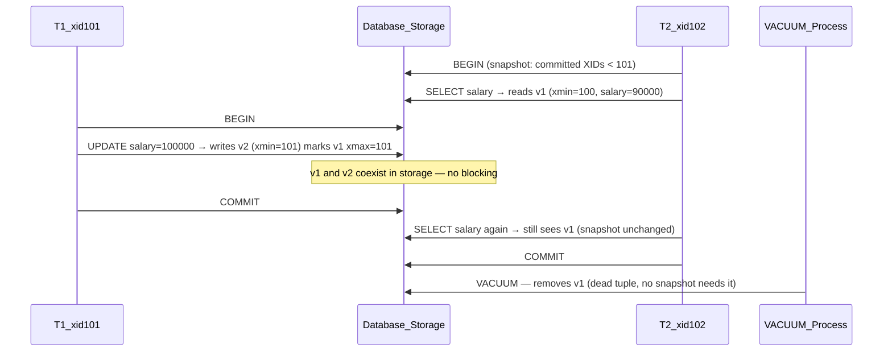

# 🔄 MVCC — Multi-Version Concurrency Control

> [!abstract] TL;DR
> MVCC keeps **multiple versions of every row** simultaneously so readers never block writers and writers never block readers. Each transaction sees a **consistent snapshot** of the database as it was at a specific moment. No shared read locks needed. Used by PostgreSQL, MySQL InnoDB, CockroachDB, and Oracle — it is the mechanism that makes modern database concurrency fast.

## Intuition — analogy FIRST

Imagine a library that photocopies books on demand. Under the old locking system, you had to check out the original — nobody else could read it while you had it. Under MVCC, when you want chapter 7, the librarian hands you a **photocopy taken at the exact moment you asked**. Someone else can simultaneously revise the original. Your copy remains consistent for as long as you're reading. When you return it and nobody else needs the old version, the librarian shreds the outdated copy (VACUUM).

MVCC is that photocopier. Readers get their own timestamped snapshot. Writers evolve the original. No reader ever waits for a writer. No writer ever waits for a reader.

---

## How It Works

### The Core Mechanism

Instead of locking a row during a read, the database keeps **multiple versions of each row**, each tagged with transaction metadata:

| Field | Meaning |
|-------|---------|
| `xmin` | Transaction ID (XID) that **created** this row version |
| `xmax` | XID that **deleted or updated** this row version; 0 if still current |

A transaction is allowed to see a row version if:
- `xmin` was committed **before** the transaction's snapshot was taken, AND
- `xmax` is either 0 (no deletion) OR was committed **after** the snapshot

```
Scenario: T1 (XID=101) updates a row, T2 (XID=102) reads concurrently

Version 1: (salary=90000,  xmin=100, xmax=101)  ← old; xmax set when T1 updated
Version 2: (salary=100000, xmin=101, xmax=0)    ← new; created by T1 (XID=101)

T2's snapshot says "XIDs ≥ 101 are in-progress" → T2 sees Version 1 (salary=90000)
After T1 commits and T2's snapshot is released → Version 1 becomes a dead tuple
```

---

### PostgreSQL Implementation Step-by-Step

1. **Transaction start** — Postgres assigns a monotonically increasing XID and takes a **snapshot** recording which XIDs are currently in-progress
2. **UPDATE semantics** — An UPDATE does NOT modify the row in place; it writes a **new row version** (xmin = current XID) and marks the old version with `xmax = current XID`
3. **Visibility check** — For each row version the planner encounters, apply the visibility formula using the snapshot
4. **VACUUM** — A background process that physically removes dead row versions (tuples where `xmax` is committed and no active snapshot needs them)
5. **VACUUM FREEZE** — Marks old rows as frozen to prevent 32-bit XID wraparound (after ~2 billion transactions, XIDs wrap around and Postgres loses data visibility)

---

### MVCC Timeline: Concurrent Read and Write



---

### How Isolation Levels Use Snapshots

MVCC enables both Read Committed and Repeatable Read **without read locks** — purely by controlling when the snapshot is taken:

| Isolation Level | Snapshot Taken | What T2 Sees if T1 Commits Mid-Transaction |
|----------------|:--------------:|:---:|
| **Read Committed** | Fresh snapshot per **statement** | Latest committed value on next query |
| **Repeatable Read** | Once at **transaction start** | Same value it saw at the beginning |
| **Serializable (SSI)** | Transaction start + conflict detection | Consistent; aborts if a serialization cycle is detected |

---

### Write-Write Conflicts Are Still Locked

MVCC only eliminates **read-write** conflicts. When two transactions try to update the **same row**:
1. First writer acquires a row-level lock
2. Second writer blocks until the first commits or rolls back
3. At Repeatable Read / Serializable: second writer gets an error (`ERROR: could not serialize access`) and must retry

---

## Real-World Systems

- **PostgreSQL** — Full MVCC; you can inspect `xmin`/`xmax` directly: `SELECT xmin, xmax, salary FROM employees`
- **MySQL InnoDB** — MVCC via undo log segments stored separately from the clustered index; read views taken at statement or transaction start depending on isolation level
- **CockroachDB** — Distributed MVCC using **timestamps** (from a hybrid logical clock) instead of integer XIDs; every key-value pair is versioned with a timestamp
- **Oracle** — Original commercial MVCC implementation (predates PostgreSQL); uses a rollback/undo tablespace to reconstruct old row versions on demand
- **TiDB** — MVCC over RocksDB; each key stored as `(key, timestamp)` → `value`; timestamps from a central TiPD clock

---

## Trade-offs

| Aspect | Benefit | Cost |
|--------|---------|------|
| Reader-writer concurrency | Reads never block writes; writes never block reads | Storage bloat: dead tuples accumulate until VACUUM runs |
| Consistent snapshots | Long-running transactions see a perfectly consistent view | Long transactions pin old row versions, preventing VACUUM cleanup → table bloat |
| No read locks | Very high read throughput | Write-write conflicts still require row-level locks |
| Point-in-time read | Free snapshot isolation at any isolation level | VACUUM must run regularly; falling behind has disk consequences |

---

## When to Use vs Avoid

MVCC is built into PostgreSQL and MySQL InnoDB — it is not optional. What you must actively manage:

**Watch for table bloat:** Run `SELECT schemaname, tablename, n_dead_tup FROM pg_stat_user_tables ORDER BY n_dead_tup DESC` regularly.

**Avoid long-running transactions** — A transaction open for 30 minutes prevents VACUUM from cleaning every row version created in that window. This is the single most common cause of unexpected PostgreSQL table bloat in production.

**Configure autovacuum aggressively on high-write tables:**
```sql
ALTER TABLE orders SET (autovacuum_vacuum_scale_factor = 0.01);
-- Trigger vacuum when 1% of rows are dead (default 20%)
```

**XID wraparound is existential:** If autovacuum falls behind by ~2 billion transactions, PostgreSQL will shut down to prevent data corruption. Monitor `pg_database.datfrozenxid`.

---

## Common Pitfalls

1. **Disabling autovacuum** — Turning it off on "busy tables" causes unbounded bloat; tune it instead of disabling
2. **Long transactions blocking VACUUM** — A forgotten open transaction in a background job pins every dead tuple created after it started; monitor `pg_stat_activity` for idle-in-transaction sessions
3. **XID wraparound emergency** — If you ignore the warning signs, Postgres eventually refuses to run any new transactions; recovery requires `VACUUM FREEZE` on every table
4. **Assuming MVCC = Serializable** — MVCC alone gives Repeatable Read semantics; write skew anomalies are still possible at that level; use Serializable Snapshot Isolation (SSI) in Postgres for true serializability
5. **Confusing MVCC with replication** — MVCC manages concurrent access on one node; replication moves data to other nodes; they are orthogonal mechanisms

---

## Related Concepts

- [[_MOC_Databases|↑ Section MOC]]
- [[ACID_and_Transactions]] — MVCC is the primary mechanism implementing the **I** (Isolation) in ACID for PostgreSQL
- [[Write_Ahead_Log]] — WAL and MVCC are complementary: WAL provides Durability (D), MVCC provides Isolation (I)
- [[Databases]] — Broader database context and where MVCC fits

---

## Review Questions

1. Why does MVCC allow reads to proceed without locking? What data does each row version carry that makes this possible?
2. What is a "dead tuple" in PostgreSQL, what process is responsible for removing them, and what happens if that process falls significantly behind?
3. A developer opens a transaction at 9 AM to generate a long compliance report, forgets about it, and commits at 5 PM. The `orders` table receives ~10,000 updates per hour. What specific problem has this caused and how would you diagnose it?

---

## Sources

- PostgreSQL Documentation: MVCC Introduction — https://www.postgresql.org/docs/current/mvcc-intro.html
- The Internals of PostgreSQL — Chapter 5: MVCC — https://www.interdb.jp/pg/pgsql05.html
- Martin Kleppmann, *Designing Data-Intensive Applications*, Chapter 7 — Transactions (Snapshot Isolation section)

#SystemDesign #Databases #MVCC #Concurrency #Postgres #TransactionIsolation #Snapshots
