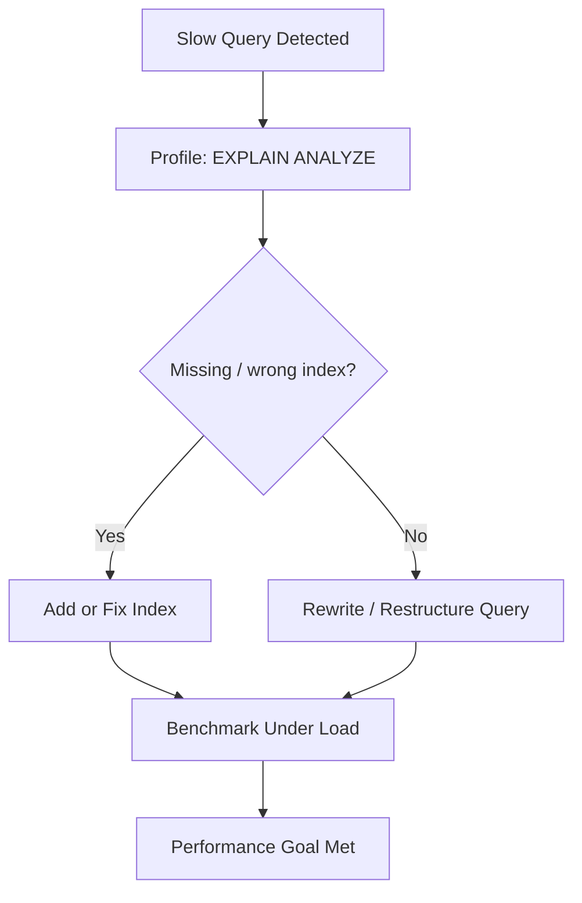

# ⚙️ SQL Tuning

> [!abstract] TL;DR
> **SQL tuning** diagnoses and improves query performance through benchmarking, profiling, indexing, and query optimization — often more cost-effective than scaling hardware or sharding.

## 🧠 Core Idea

**SQL Tuning** is the process of **diagnosing and improving SQL query performance** so that database operations meet required performance standards.

> Goal: **Reduce query execution time, improve throughput, and eliminate bottlenecks.**

Because databases often become the **primary system bottleneck**, SQL tuning is a critical part of system design.

---

## 📖 Definition

SQL tuning involves:

- Analyzing slow SQL queries  
- Identifying inefficiencies in execution plans  
- Optimizing indexes, joins, and query structure  
- Ensuring databases use resources effectively  

It is a broad discipline supported by dedicated tools and extensive research.

---

## 🎯 Why SQL Tuning Matters

- Databases handle core business data  
- Poor queries degrade entire system performance  
- Efficient queries reduce hardware costs  
- Faster queries improve user experience  

---

## 🧪 Core Techniques

### 🔹 Benchmarking

**Benchmarking** simulates high-load scenarios to measure database performance.

- Identifies performance limits  
- Reveals system behavior under stress  

**Example Tools:**
- Apache Benchmark (`ab`)  
- JMeter  
- sysbench  

---

### 🔹 Profiling

**Profiling** tracks real query execution to find slow operations.

- Enables detection of slow queries  
- Helps understand execution plans  

**Example Tools:**
- Slow Query Log (MySQL/PostgreSQL)  
- EXPLAIN / EXPLAIN ANALYZE  
- Oracle SQL Trace  

---

## 🔍 Common Optimization Areas

- Proper indexing  
- Avoiding full table scans  
- Optimizing JOIN operations  
- Query rewriting  
- Partitioning large tables  
- Caching frequent results  

---

## ⚠️ Typical Bottlenecks

- Missing or incorrect indexes  
- Large result sets  
- Inefficient joins  
- Poor schema design  
- Lock contention  

---

## 🧠 Design Insight

```
Before scaling hardware → Tune SQL queries
Before adding caching → Optimize query plans
Before sharding → Fix database design
```

SQL tuning often saves more cost than scaling infrastructure.

---

## 🖼️ Diagram



---

## 🔗 Related Topics

[[Databases]]  
[[Denormalization]]  
[[Database Indexing]]  
[[Caching]]  
[[Performance Optimization]]

---

## 📚 Sources

- Oracle — Introduction to SQL Tuning  
  https://docs.oracle.com/en/database/oracle/oracle-database/26/tgsql/introduction-to-sql-tuning.html#GUID-B653E5F3-F078-4BBC-9516-B892960046A2

- Towards Data Science — Query Optimization in PostgreSQL  
  https://towardsdatascience.com/query-optimization-for-mere-humans-in-postgresql-875ab864390a/

---

## Related Concepts

- [[_MOC_Databases|↑ Section MOC]]
- [[Databases]]
- [[Denormalization]]
- [[Database Replication]]
- [[Database Sharding]]
- [[Database Caching]]

---

## Review Questions

1. What does the EXPLAIN or EXPLAIN ANALYZE command reveal about a query?
2. Why can adding too many indexes hurt write performance?
3. What is a covering index, and when does it eliminate the need to access the main table?

---

## 🏷️ Tags

#SystemDesign #SQLTuning #Databases #Performance #Optimization
